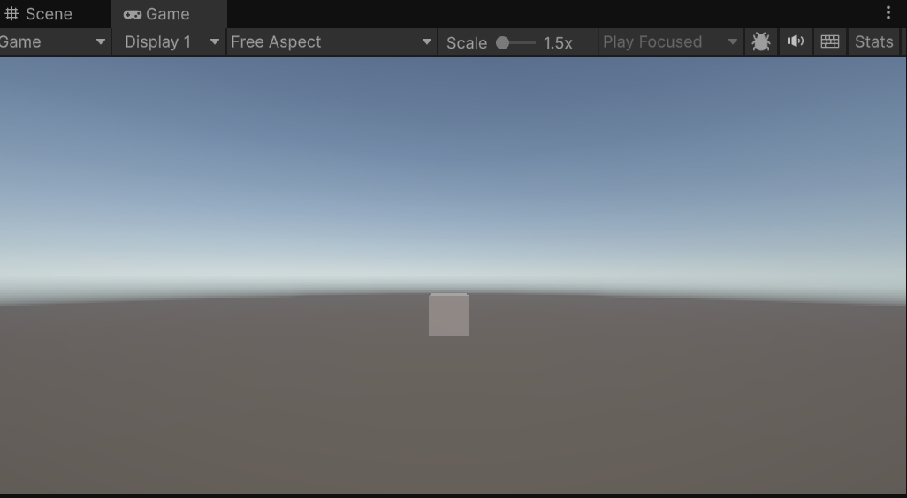
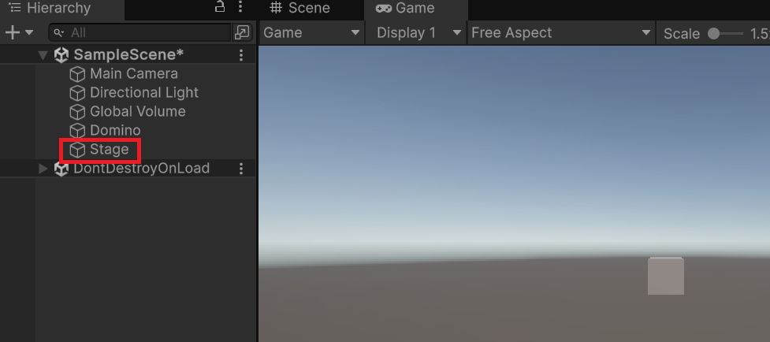

# GameObject の生成と操作

Unity では、スクリプトからゲームオブジェクトを生成し、プロパティを通じて操作できます。このページでは、コードでゲームオブジェクトを作る基本的な方法を学びます。

## 学習目標

- `GameObject.CreatePrimitive()` を使ってゲームオブジェクトをコードから生成できる
- 戻り値と変数を使って生成したオブジェクトを参照できる
- メンバーアクセス演算子（`.`）を使ってオブジェクトのプロパティを操作できる

## 前提知識

- [Start メソッドとスクリプトの仕組み](/unity-csharp-learning/unity/start-method/) を読んでいること

---

## 1. 基本形状のゲームオブジェクトを生成する

Unity には立方体や球体などの基本形状が用意されており、スクリプトから簡単に生成できます。

**`GameObject.CreatePrimitive`** — 基本形状のゲームオブジェクトを生成します。<!-- [公式ドキュメント]() -->

**書式：GameObject.CreatePrimitive メソッド**
```csharp
public static GameObject CreatePrimitive(PrimitiveType type);
```

| パラメータ | 型 | 説明 |
|---|---|---|
| `type` | `PrimitiveType` | 作成する形状（`Cube`, `Sphere`, `Capsule` など） |

```csharp
using UnityEngine;

public class Domino : MonoBehaviour
{
    private void Start()
    {
        GameObject.CreatePrimitive(PrimitiveType.Cube);
    }
}
```



このコードを実行すると、画面中央（原点）に立方体が生成されます。

---

## 2. 生成したオブジェクトを変数で受け取る

`CreatePrimitive()` は生成したゲームオブジェクトを処理の結果（**戻り値**）として返します。あとからこのオブジェクトを操作するには、**変数（variable）** に保存しておく必要があります。

変数とは、値を一時的に保存しておける名前付きの記憶領域です。名前を付けることで、後から「あの変数」と指定して呼び出せるようになります。

変数を使うには**宣言**する必要があります。詳細な構文は C# 基礎の変数ページで扱いますが、ここでは次のように書くものと覚えてください。

```csharp
var 変数名 = 初期値;
```

変数名は以下のルールに従えば自由に決められます。

- 数字から始められない
- アンダースコア `_` 以外の記号は使えない
- 他の変数名や予約語（`var`・`if` など）と重複できない
- 保存する内容がわかりやすい名前にするべき

```csharp
var stage = GameObject.CreatePrimitive(PrimitiveType.Cube);
```

上記は `CreatePrimitive()` で作成した立方体を `stage` という変数に受け取っています。以降 `stage` という名前でこの立方体を識別できます。

---

## 3. メンバーアクセス演算子（`.`）でプロパティを操作する

変数に保存したゲームオブジェクトのプロパティや機能（**メンバー**）にアクセスするには、`.`（ドット）を使います。

```csharp
ゲームオブジェクト.メンバー
```

---

## 4. name プロパティでオブジェクトに名前をつける

**`Object.name`** — ゲームオブジェクトの名前を取得・設定します。<!-- [公式ドキュメント]() -->

**書式：Object.name プロパティ**
```csharp
public string name { get; set; }
```

Hierarchy ビューで何のオブジェクトかわかるよう、わかりやすい名前を付けましょう。

```csharp
using UnityEngine;

public class Domino : MonoBehaviour
{
    private void Start()
    {
        var stage = GameObject.CreatePrimitive(PrimitiveType.Cube);
        stage.name = "Stage";
    }
}
```



---

## まとめ

- `GameObject.CreatePrimitive(PrimitiveType.Cube)` で立方体を生成できる
- 生成したオブジェクトは `var` で変数に受け取って参照する
- `.`（ドット）を使ってオブジェクトのプロパティにアクセスできる
- `name` プロパティで Hierarchy ビューに表示される名前を設定できる

---

## 理解度チェック

1. 変数に戻り値を受け取らずにオブジェクトを操作することはできますか？
2. `stage.name = "Stage"` の `.`（ドット）は何を意味しますか？
3. 次のコードを実行すると Hierarchy ビューにどう表示されますか？

   ```csharp
   var obj = GameObject.CreatePrimitive(PrimitiveType.Sphere);
   obj.name = "Ball";
   ```

<details markdown="1">
<summary>解答を見る</summary>

1. できない。変数に受け取らないと、生成後にそのオブジェクトを参照する方法がなくなる。
2. `stage` という変数が指すオブジェクトの `name` メンバーにアクセスすることを意味する。
3. Hierarchy ビューに `Ball` という名前の球体が表示される。

</details>

---

## 次のステップ

[Transform でオブジェクトの位置・サイズ・回転を操作する](/unity-csharp-learning/unity/transform/) では、生成したオブジェクトを自在に配置・変形する方法を学びます。
