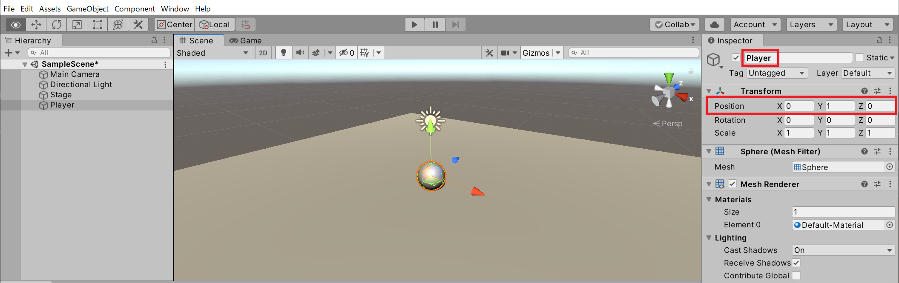
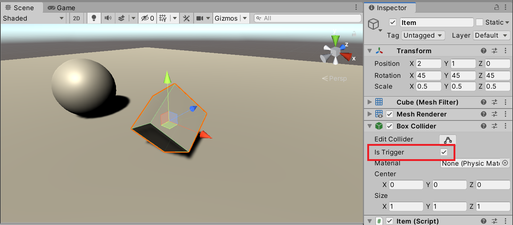

# チュートリアル: アイテム収集

方向キーで動く球体（プレイヤー）が、フィールドに配置されたアイテムに触れると回収（削除）されるゲームを実装します。これまでに学んだ **Rigidbody・AddForce・Collider・Prefab** を組み合わせて、インタラクティブなゲームの基本構造を作ります。

## 学習目標

- Rigidbody と AddForce でプレイヤーを操作できる
- `OnTriggerEnter` でアイテムの回収を検知できる
- プレハブを使って複数のアイテムを配置できる
- `Transform.Rotate` で継続的な回転アニメーションを実装できる

## 前提知識

- [Rigidbody で力を加える](/unity-csharp-learning/unity/rigidbody-force/) を読んでいること
- [Collider とトリガー判定](/unity-csharp-learning/unity/collider-trigger/) を読んでいること
- [プレハブ（Prefab）](/unity-csharp-learning/unity/prefab-basics/) を読んでいること

---

## 1. シーンを準備する

### ステージ（地面）を作る

1. メニューバーから **GameObject → 3D Object → Cube** を追加し、名前を `Stage` にする
2. Inspector で Transform を設定する

| プロパティ | 値 |
|---|---|
| Position | X=0, Y=0, Z=0 |
| Scale | X=10, Y=0.5, Z=10 |

### プレイヤーを作る

1. **GameObject → 3D Object → Sphere** を追加し、名前を `Player` にする
2. Position を `X=0, Y=0.75, Z=0` に設定する（ステージの上面に乗せる）
3. Inspector の **Add Component → Physics → Rigidbody** で Rigidbody を追加する



---

## 2. プレイヤーを動かす

Player GameObject に `Player` スクリプトを作成してアタッチします。

```csharp
// Player.cs
using UnityEngine;
using UnityEngine.InputSystem;

public class Player : MonoBehaviour
{
    private Rigidbody _rigidbody;

    private void Start()
    {
        _rigidbody = GetComponent<Rigidbody>();
    }

    private void Update()
    {
        var move = Vector3.zero;

        if (Keyboard.current.rightArrowKey.isPressed) move.x += 1f;
        if (Keyboard.current.leftArrowKey.isPressed)  move.x -= 1f;
        if (Keyboard.current.upArrowKey.isPressed)    move.z += 1f;
        if (Keyboard.current.downArrowKey.isPressed)  move.z -= 1f;

        _rigidbody.AddForce(move);
    }
}
```

Play ボタンを押して方向キーで球体が動くことを確認しましょう。

---

## 3. アイテムを作る

### アイテムの形を設定する

1. **GameObject → 3D Object → Cube** を追加し、名前を `Item` にする
2. Inspector で Transform を設定する

| プロパティ | 値 |
|---|---|
| Position | X=2, Y=0.75, Z=2 |
| Rotation | X=45, Y=45, Z=45 |
| Scale | X=0.5, Y=0.5, Z=0.5 |

### アイテムを回転させる

Item GameObject に `Item` スクリプトを作成してアタッチします。`Transform.Rotate()` は現在の向きに回転量を加算するメソッドです。Update 内で繰り返し呼ぶことで継続的な回転アニメーションになります。

```csharp
// Item.cs
using UnityEngine;

public class Item : MonoBehaviour
{
    private void Update()
    {
        transform.Rotate(0, 1f, 0, Space.World);
    }
}
```

`Space.World` を指定すると、オブジェクト自身の傾きに関わらず世界座標の Y 軸を中心に回転します。

### Is Trigger をオンにする

Item GameObject の **Box Collider** コンポーネントを開き、**Is Trigger** にチェックを入れます。これで Player が Item に触れてもぶつかって弾かれず、交差を検知できるようになります。



---

## 4. アイテムをプレハブ化する

Hierarchy ビューの `Item` を Project ビューの Assets フォルダーにドラッグ & ドロップして、プレハブとして保存します。


プレハブを保存したら、Project ビューの `Item` プレハブを Scene ビューにドラッグ & ドロップして複数配置します。


---

## 5. アイテムを回収する

Player スクリプトに `OnTriggerEnter` を追加して、アイテムへの接触時に削除します。

```csharp
// Player.cs
using UnityEngine;
using UnityEngine.InputSystem;

public class Player : MonoBehaviour
{
    private Rigidbody _rigidbody;

    private void Start()
    {
        _rigidbody = GetComponent<Rigidbody>();
    }

    private void Update()
    {
        var move = Vector3.zero;

        if (Keyboard.current.rightArrowKey.isPressed) move.x += 1f;
        if (Keyboard.current.leftArrowKey.isPressed)  move.x -= 1f;
        if (Keyboard.current.upArrowKey.isPressed)    move.z += 1f;
        if (Keyboard.current.downArrowKey.isPressed)  move.z -= 1f;

        _rigidbody.AddForce(move);
    }

    private void OnTriggerEnter(Collider other)
    {
        if (other.gameObject.CompareTag("Item"))
        {
            Destroy(other.gameObject);
        }
    }
}
```

`CompareTag("Item")` は、触れた相手の**タグ**が `"Item"` かどうかを調べます。これにより、Is Trigger がオンの別のオブジェクト（例: ゴールゾーンなど）を誤って削除することを防げます。

> **タグの設定**: Item プレハブを選択し、Inspector 上部の **Tag** ドロップダウンから **Add Tag...** で `Item` タグを追加し、Item プレハブに設定してください。

<video controls src="./video.mp4"></video>

---

## 完成コード

<details markdown="1">
<summary>Player.cs（完成版）</summary>

```csharp
using UnityEngine;
using UnityEngine.InputSystem;

public class Player : MonoBehaviour
{
    private Rigidbody _rigidbody;

    private void Start()
    {
        _rigidbody = GetComponent<Rigidbody>();
    }

    private void Update()
    {
        var move = Vector3.zero;

        if (Keyboard.current.rightArrowKey.isPressed) move.x += 1f;
        if (Keyboard.current.leftArrowKey.isPressed)  move.x -= 1f;
        if (Keyboard.current.upArrowKey.isPressed)    move.z += 1f;
        if (Keyboard.current.downArrowKey.isPressed)  move.z -= 1f;

        _rigidbody.AddForce(move);
    }

    private void OnTriggerEnter(Collider other)
    {
        if (other.gameObject.CompareTag("Item"))
        {
            Destroy(other.gameObject);
        }
    }
}
```

</details>

<details markdown="1">
<summary>Item.cs（完成版）</summary>

```csharp
using UnityEngine;

public class Item : MonoBehaviour
{
    private void Update()
    {
        transform.Rotate(0, 1f, 0, Space.World);
    }
}
```

</details>

---

## 課題

### 課題 1: アイテムに得点を追加する

アイテムを回収するたびに得点が加算されるようにしましょう。

ヒント: Player スクリプトにスコアフィールドを追加し、`OnTriggerEnter` の中でカウントアップします。`Debug.Log` でスコアを表示してみましょう。

<details markdown="1">
<summary>解答を見る</summary>

```csharp
private int _score = 0;

private void OnTriggerEnter(Collider other)
{
    if (other.gameObject.CompareTag("Item"))
    {
        Destroy(other.gameObject);
        _score++;
        Debug.Log($"スコア: {_score}");
    }
}
```

</details>

---

### 課題 2: アイテムごとに得点を変える

アイテムによって得点が異なるようにしてみましょう。

ヒント: `Item.cs` に `[SerializeField] public int point = 1;` フィールドを追加し、`Player.cs` の `OnTriggerEnter` 内で `other.GetComponent<Item>().point` を読み取ります。

<details markdown="1">
<summary>解答を見る</summary>

```csharp
// Item.cs に追加
[SerializeField] public int point = 1;
```

```csharp
// Player.cs の OnTriggerEnter
private void OnTriggerEnter(Collider other)
{
    if (other.gameObject.CompareTag("Item"))
    {
        var item = other.GetComponent<Item>();
        _score += item.point;
        Debug.Log($"スコア: {_score}");
        Destroy(other.gameObject);
    }
}
```

</details>

---

### 課題 3: 制限時間を設ける

`Time.time` を使って制限時間を実装しましょう。一定時間が経過したらゲームを停止して最終スコアを表示します。

ヒント: `[SerializeField] private float _timeLimit = 30f;` と `private float _startTime;` を組み合わせます。`Start` で `_startTime = Time.time;` を記録し、`Update` で `Time.time - _startTime` が `_timeLimit` を超えたら `Debug.Log` でスコアを表示して `enabled = false;` でスクリプトを止めます。

---

### 課題 4（発展）: 別種類のアイテムを追加する

色の異なる別の Item プレハブを作り、触れると残り時間が増えるアイテムを実装してみましょう。

---

## まとめ

- `GetComponent<Rigidbody>()` を Start でキャッシュし、`AddForce` で物理移動を実装した
- `Transform.Rotate()` を Update で繰り返し呼ぶことで継続的な回転アニメーションを作れる
- Is Trigger + `OnTriggerEnter` でアイテム回収のような「交差検知」を実装できる
- `CompareTag` で相手の種類を識別することで誤動作を防げる
- プレハブを使うと同種のオブジェクトを効率よく配置・管理できる

---

## 理解度チェック

1. `_rigidbody = GetComponent<Rigidbody>()` を `Update` ではなく `Start` に書く理由は何ですか？
2. `CompareTag("Item")` を使わずに `Destroy(other.gameObject)` だけ書いた場合、何が問題になりますか？
3. アイテムを 20 個に増やしたいとき、プレハブを使うメリットは何ですか？

<details markdown="1">
<summary>解答を見る</summary>

1. `GetComponent` はコストのかかる処理であり、毎フレーム呼ぶとパフォーマンスへの影響が積み重なるため。`Start` で一度だけ取得してフィールドに保持する。
2. Is Trigger がオンのオブジェクトすべてに触れると削除してしまう。ゴールゾーンや罠ゾーンなども削除されてしまう可能性がある。
3. プレハブを1か所変更するだけで20個すべてに変更が反映される。個別に修正する必要がなく、変更漏れが起きない。

</details>

---

## 次のステップ

[UnityEngine.Random で乱数を生成する](/unity-csharp-learning/unity/random-basics/) では、ゲームでよく使う乱数生成の基本を学びます。
