# Layout Group による自動配置

メニューのボタンや一覧の項目は、1つずつ位置を入力するよりも、自動で並べたほうが調整しやすくなります。3つの Image を横・縦・格子状に並べ、**Layout Group** が子の配置を管理する仕組みを学びます。スクリプトは使いません。

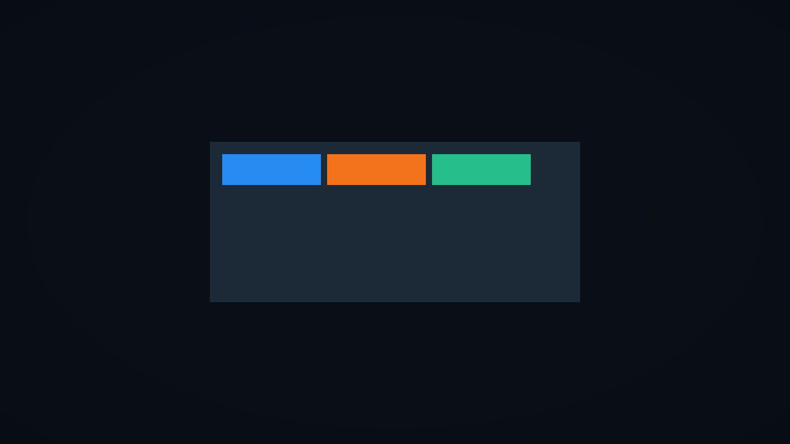

## 学習目標

- Horizontal / Vertical / Grid Layout Group を使い分けられる
- Padding、Spacing、子のサイズを設定できる
- Layout Element で希望サイズを指定できる
- Content Size Fitter で親の高さを内容に合わせられる

## 前提知識

- [RectTransform — アンカーとピボット](/unity-csharp-learning/unity/rect-transform/) を読んでいること
- [Canvas Scaler と画面サイズへの対応](/unity-csharp-learning/unity/canvas-scaler/) を読んでいること

---

## 1. 親のパネルと3項目を作る

新しいシーンを `SampleUILayoutGroup` として用意します。前のページの Corner、Strip、Bar は使いません。

Image の追加と色の変更は [Image の「画像を使わず、背景を表示する」](/unity-csharp-learning/unity/ui-image/#3-画像を使わず背景を表示する) で説明した操作を使います。親子関係は [RectTransform の「右上に固定する」](/unity-csharp-learning/unity/rect-transform/#3-右上に固定する--アンカーを重ねる)、Canvas Scaler は [前のページの「基準解像度を設定する」](/unity-csharp-learning/unity/canvas-scaler/#3-基準解像度を設定する) を参照してください。

1. **GameObject → UI (Canvas) → Image** から Image を追加し、名前を `MenuPanel` にする
2. **Image → Color** の **Hexadecimal** に `1F2938` を入力する
3. Rect Transform の **Width** を `600`、**Height** を `260` に変更する。アンカーとピボットは初期値の中央のまま。Pos X / Y が0以外なら0に戻す
4. `Canvas` を選び、Canvas Scaler の **UI Scale Mode = Scale With Screen Size**、**Reference Resolution = 1280×720**、**Match = 0.5** にする

MenuPanel の矩形は次の状態になります。

| 項目 | X | Y |
|---|---|---|
| Anchors Min / Max | 0.5 | 0.5 |
| Pivot | 0.5 | 0.5 |
| Pos | 0 | 0 |
| Width / Height | 600 | 260 |

次に、`MenuPanel` を選択して同じ Image メニューから子を3つ追加します。1つ追加するたびに名前と色を変え、次を追加する前に MenuPanel を選び直してください。子を選んだまま追加すると、その子の下に新しい Image が入ることがあります。

| 子の名前 | Color の Hexadecimal | Width | Height |
|---|---|---|---|
| ItemA | `268CF2`（青） | 160 | 50 |
| ItemB | `F2731A`（オレンジ） | 160 | 50 |
| ItemC | `26BF8C`（緑） | 160 | 50 |

Hierarchy で MenuPanel の左の三角を開き、ItemA、ItemB、ItemC が同じ深さで、この順に並んでいることを確認します。Layout Group が管理するのは**直接の子**なので、この親子関係が必要です。

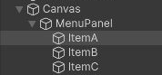

子のアンカー・ピボット・位置は初期値のまま使います。この段階では3項目が中央で重なっていてかまいません。後で Layout Group が位置を決めます。

---

## 2. Layout Element で子の希望サイズを指定する

**Layout Element** は、そのオブジェクトがレイアウトに要求する最小サイズ、希望サイズ、伸びる割合などを指定します。自分で位置を並べるコンポーネントではありません。

**書式：[Layout Element コンポーネント](https://docs.unity3d.com/Packages/com.unity.ugui@2.0/manual/script-LayoutElement.html)**
```csharp
public class LayoutElement : UIBehaviour, ILayoutElement, ILayoutIgnorer
```

Hierarchy で `ItemA` を選択し、Inspector 下部の **Add Component** をクリックします。検索欄に `Layout Element` と入力し、検索結果の **Layout Element** をクリックしてください。スクリプトを新しく作る操作ではなく、Unity に用意されているコンポーネントを追加する操作です。

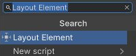

追加された Layout Element の **Preferred Width** と **Preferred Height** のチェックをオンにし、右の数値欄にそれぞれ `160` と `50` を入力します。チェックは「この項目を Layout Element で指定する」という意味です。チェックしていない欄には値を入力する必要がありません。

ItemB と ItemC にも同じコンポーネントを追加し、同じ2項目を設定してください。設定後は次の状態になります。Preferred の2項目以外は初期値です。

| 項目 | チェック | 値 |
|---|---|---|
| Ignore Layout | オフ | — |
| Min Width / Min Height | オフ | — |
| Preferred Width | オン | 160 |
| Preferred Height | オン | 50 |
| Flexible Width / Flexible Height | オフ | — |
| Layout Priority | — | 1 |

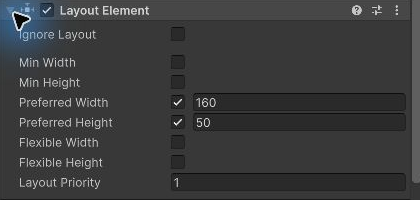

**Preferred** は「確保したいサイズ」です。親の空き領域が十分なら、このサイズが使われます。スペースが不足すると、最小サイズなどの条件に従って小さくなる場合があるため、必ず固定される値としては扱わないでください。

---

## 3. Horizontal Layout Group で横に並べる

**書式：[Horizontal Layout Group コンポーネント](https://docs.unity3d.com/Packages/com.unity.ugui@2.0/manual/script-HorizontalLayoutGroup.html)**
```csharp
public class HorizontalLayoutGroup : HorizontalOrVerticalLayoutGroup
```

**Horizontal Layout Group** は、直接の子を横方向に並べるコンポーネントです。親の `MenuPanel` を選び、**Add Component** の検索欄に `Horizontal Layout Group` と入力して、検索結果をクリックします。子の ItemA ではなく、親に追加する点に注意してください。

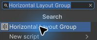

まず **Padding** の左の三角を開きます。Padding は親の端から項目までの余白で、Left / Right / Top / Bottom に `20` を入力してください。**Spacing** は隣り合う項目の間隔です。ここには `10` を入力します。

子のサイズもこのコンポーネントで管理するため、**Control Child Size** の Width / Height をオンにします。一方、**Child Force Expand** は余った空間に子を広げる設定です。160×50の希望サイズで比べるので、Width / Height をオフにしてください。

設定後の状態は次のとおりです。**Child Alignment** は初期値の **Upper Left**（左上寄せ）を使います。

| 項目 | 設定 |
|---|---|
| Padding | Left / Right / Top / Bottom をすべて20 |
| Spacing | 10 |
| Child Alignment | Upper Left |
| Reverse Arrangement | オフ |
| Control Child Size | Width / Height ともにオン |
| Use Child Scale | Width / Height ともにオフ |
| Child Force Expand | Width / Height ともにオフ |

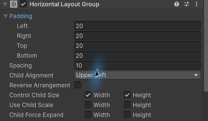

| 設定 | 役割 |
|---|---|
| Padding | 親の端と項目の間の余白 |
| Spacing | 隣り合う項目の間隔 |
| Child Alignment | 余った空間の中で、項目全体をどこに寄せるか |
| Control Child Size | 子のサイズを、希望サイズなどから Layout Group が決めるか |
| Child Force Expand | 余った空間を子へ割り当て、広げるか |

**Reverse Arrangement** は子の並び順を反転する設定、**Use Child Scale** は子の Scale を配置計算に含める設定です。どちらも初期値のオフを使います。

この例は、希望サイズ160×50の項目を、左上に寄せて間隔10で並べます。右側や下側に余った空間が残るのは、Child Force Expand をオフにしているためです。

項目の順序は **Hierarchy の兄弟順**です。ItemA、ItemB、ItemC の順に並んでいることを確認してください。

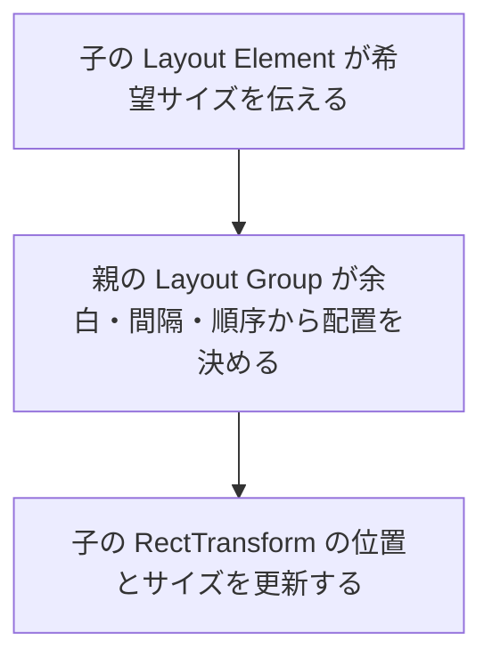

子の Rect Transform の位置やサイズに、Layout Group が制御していることを示す表示が出ます。自動配置を使っている間は、子の Pos X などを手で調整する代わりに、親の Padding / Spacing や子の Layout Element を変更してください。

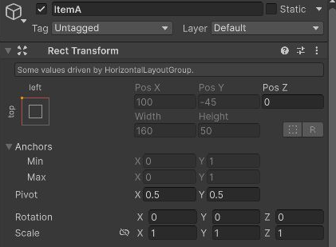

RectTransform の [Game ビューの解像度を登録する](/unity-csharp-learning/unity/rect-transform/#game-ビューの解像度を登録する) で登録した **Sample UI 1280x720** を Game ビューで選び、Play ボタンを押します。冒頭の画像のように、青・オレンジ・緑が横に並ぶことを確認したら、再生を停止してください。

---

## 4. Vertical Layout Group で縦に並べる

**書式：[Vertical Layout Group コンポーネント](https://docs.unity3d.com/Packages/com.unity.ugui@2.0/manual/script-VerticalLayoutGroup.html)**
```csharp
public class VerticalLayoutGroup : HorizontalOrVerticalLayoutGroup
```

**Vertical Layout Group** は、子を縦方向に並べるコンポーネントです。横並びから縦並びに切り替えるため、先に Horizontal Layout Group を外します。コンポーネントを外すと、そのコンポーネントの設定も失われます。子の Image や Layout Element は残ります。

再生を停止して `MenuPanel` を選択し、**Horizontal Layout Group** の見出し右端の **⋮** をクリックしてください。表示されたメニューの **Remove Component** を選ぶと、Inspector から Horizontal Layout Group が消えます。

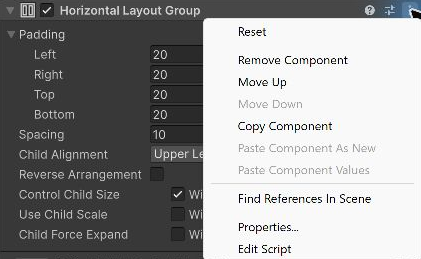

続けて **Add Component** で `Vertical Layout Group` を検索し、追加します。横並びと同じく Padding の4辺を `20`、Spacing を `10` にし、Control Child Size をオン、Child Force Expand をオフにしてください。新しく追加したコンポーネントなので、前の設定は引き継がれません。

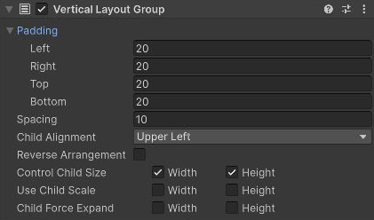

Play ボタンを押して、次のように縦に並ぶことを確認します。


項目の高さは50、間隔は10なので、隣の項目の上端までは60離れます。横並びのときと同じ希望サイズを使い、並べる方向だけを変えています。

---

## 5. Content Size Fitter で親の高さを合わせる

縦に並べても、親の高さ260には下側の空きが残ります。項目の高さと間隔に合わせて親の高さを決めたい場合は、**Content Size Fitter** を使います。

**書式：[Content Size Fitter コンポーネント](https://docs.unity3d.com/Packages/com.unity.ugui@2.0/manual/script-ContentSizeFitter.html)**
```csharp
public class ContentSizeFitter : UIBehaviour, ILayoutSelfController
```

再生を停止し、`MenuPanel` の Rect Transform の **Pivot Y** を `1`、続いて **Pos Y** を `130` にします。高さ260のときの上端の位置を保つため、中央から130上へピボットを置く設定です。前のページで学んだとおり、ピボットはサイズ変更の基準になります。

MenuPanel を選択したまま、**Add Component** で `Content Size Fitter` を検索して追加します。**Horizontal Fit** と **Vertical Fit** は、それぞれ横・縦のサイズをどう決めるかを選ぶ項目です。

| 選択肢 | 決め方 |
|---|---|
| Unconstrained | Fitter はその方向のサイズを変更しない |
| Min Size | レイアウトが要求する最小サイズに合わせる |
| Preferred Size | レイアウトが要求する希望サイズに合わせる |

幅600は保ちたいので、**Horizontal Fit** は初期値の **Unconstrained** のままにします。高さを項目に合わせるため、**Vertical Fit** のドロップダウンから **Preferred Size** を選んでください。

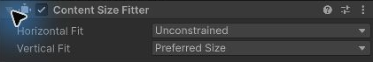

この希望サイズは、同じ MenuPanel にある Vertical Layout Group が、子の高さ・間隔・余白から計算します。Play ボタンを押し、親の高さが縮まったことを確かめます。

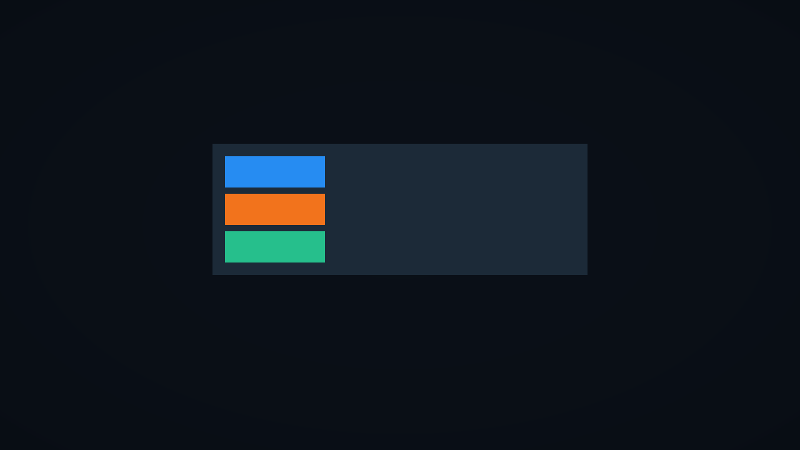

この構成の希望する高さは、**上の余白20 + 3項目 × 高さ50 + 2箇所 × 間隔10 + 下の余白20 = 210** です。親の Height は210になり、幅は600のままです。Pivot Y = 1 なので、高さを変えても上端は保たれます。

Layout Group は **子のサイズと位置**を管理し、同じ親に付けた Content Size Fitter は **親自身の高さ**を管理しています。管理する矩形が違うことを確認してください。

> 💡 **ポイント**: Layout Group がサイズを管理している子に Content Size Fitter を追加すると、同じ RectTransform のサイズを2つの仕組みが決めようとして競合します。この例では、Fitter は子の ItemA などには追加しません。

---

## 6. Grid Layout Group で格子状に並べる

**書式：[Grid Layout Group コンポーネント](https://docs.unity3d.com/Packages/com.unity.ugui@2.0/manual/script-GridLayoutGroup.html)**
```csharp
public class GridLayoutGroup : LayoutGroup
```

Grid Layout Group は、項目を同じ大きさのセルに並べます。Horizontal / Vertical Layout Group と異なり、子の Preferred Width / Height より **Cell Size** が優先されます。

再生を停止し、前の節で説明した **⋮ → Remove Component** で、MenuPanel の **Content Size Fitter** と **Vertical Layout Group** を外します。Rect Transform の **Pivot** を `(0.5, 0.5)`、**Pos** を `(0, 0)`、**Width** を `600`、**Height** を `260` に戻してください。

**Add Component** で `Grid Layout Group` を検索して追加します。Padding は端の余白なので4辺に `20`、**Cell Size** は1項目の幅・高さなので X に `160`、Y に `60`、Spacing は横・縦の隙間なので X / Y に `10` を入力します。

**Start Corner** は並べ始める角、**Start Axis** は先に埋める方向です。初期値の **Upper Left**、**Horizontal** なら、左上から横に埋めてから次の行へ進みます。折り返す位置を決めるため、**Constraint** のドロップダウンから **Fixed Column Count**（列数を固定）を選び、表示された **Constraint Count** に `3` を入力してください。

設定後の状態は次のとおりです。

| 項目 | 設定 |
|---|---|
| Padding | 4辺とも20 |
| Cell Size | X = 160、Y = 60 |
| Spacing | X = 10、Y = 10 |
| Start Corner | Upper Left |
| Start Axis | Horizontal |
| Child Alignment | Upper Left |
| Constraint | Fixed Column Count |
| Constraint Count | 3 |

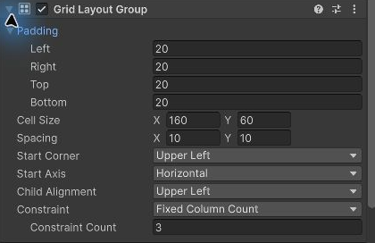

4番目の項目を追加して、折り返しを確かめましょう。停止中に **MenuPanel** を選択し、Image を追加して名前を `ItemD` にします。Image の Color の Hexadecimal に紫の `9966CC` を入力してください。新しく追加した ItemD が、Hierarchy の MenuPanel の子の最後にあることを確認して、Play ボタンを押します。

ItemD の位置とサイズは Grid Layout Group が決めるので、Rect Transform の Width / Height を手で設定する必要はありません。Grid は Cell Size を使うため、ItemD に Layout Element を追加する必要もありません。

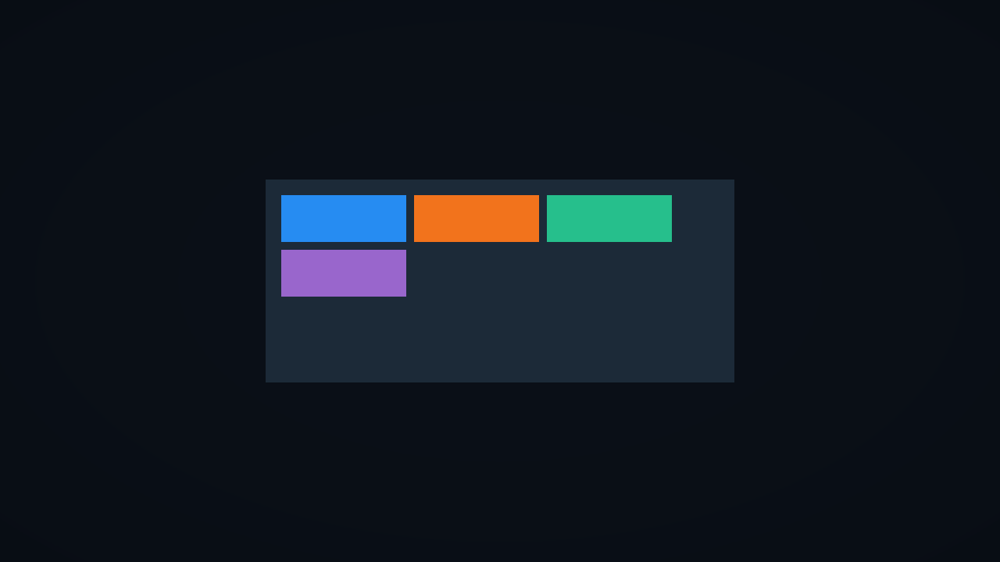

列数を3に固定したので、4番目の項目は次の行へ移ります。各項目は、Layout Element の Preferred Height = 50 が残っていても、Cell Size の160×60になります。

---

## 動作確認

Game ビューを **Fixed Resolution の1280×720** にして、**Gizmos** をオフにします。各節の構成で Play ボタンを押し、次を確認してください。

| 構成 | 項目のサイズ | 確認する配置 |
|---|---|---|
| Horizontal | 160×50 | 親の左上から、青・オレンジ・緑が間隔10で横に並ぶ |
| Vertical | 160×50 | 親の左上から、同じ順で間隔10で縦に並ぶ |
| Vertical + Fitter | 160×50 | 親の幅600・高さ210。上下の余白が20になる |
| Grid、4項目 | 160×60 | 3列で折り返し、紫が2行目の左端に来る |

Horizontal と Vertical は、左・上の余白が20になります。右・下の余白は、親の大きさによって余った空間も含みます。Grid の隣のセルまでは、横170・縦70離れます。

この構成では Console にログは出しません。確認後は再生を停止し、シーンを保存してください。

## よくあるミス

### 項目が想定より大きくなる

Horizontal / Vertical Layout Group の **Child Force Expand** がオンだと、余った空間を項目へ割り当てます。この例では Width / Height ともにオフにします。

### 項目が0に近いサイズになる

**Control Child Size** がオンなら、子の RectTransform の Width / Height の手入力ではなく、Layout Element の **Preferred Width / Height** のチェックと値を確認してください。

Grid の節で追加した ItemD は、Source Image が None で、Layout Element もありません。そのまま Horizontal / Vertical Layout Group で Control Child Size をオンにすると、希望する幅・高さは0になります。Vertical と Content Size Fitter で4項目を並べた場合、親の高さは **`20 + 3 × 50 + 0 + 3 × 10 + 20 = 220`** です。

ItemD も ItemA〜ItemC と同じサイズにするには、[Layout Element で子の希望サイズを指定する](#2-layout-element-で子の希望サイズを指定する) の操作で Preferred Width を `160`、Preferred Height を `50` に指定します。4項目とも希望する高さが50なら、親の高さは270になります。

### 順番や折り返しが違う

Hierarchy の兄弟順、Grid の **Start Corner / Start Axis / Constraint** を確認します。1つの親に複数の Layout Group を残さず、切り替える前に前のコンポーネントを外してください。

## まとめ

- Layout Group は親に付け、直接の子の位置とサイズを管理する
- Padding は端の余白、Spacing は項目間の間隔
- Horizontal / Vertical では Layout Element で希望サイズを指定できる
- Grid は Cell Size で同じ大きさのセルに並べる
- Content Size Fitter は自分のサイズを内容に合わせる

## 理解度チェック

1. Padding と Spacing は、それぞれ何の間隔ですか？
2. この例の Vertical Layout Group で、4項目すべての Layout Element に Preferred Height = 50 を指定したとき、希望する高さはいくつですか？
3. Grid の Cell Size が160×60、子の Preferred Height が50なら、子の高さはいくつになりますか？

<details markdown="1">
<summary>解答を見る</summary>

1. Padding は親の端と項目の余白、Spacing は項目どうしの間隔です。
2. 4項目とも希望する高さが50なので、`20 + 4 × 50 + 3 × 10 + 20 = 270` です。
3. 60です。Grid Layout Group は Cell Size を使います。

</details>

## 次のステップ

[Unity UI とボタン操作](/unity-csharp-learning/unity/unity-ui/) の Button を、このページで使った Image の代わりに並べてみましょう。ボタンの配置とクリック時の処理を組み合わせて、メニュー画面に応用できます。

## 参考

- [Auto Layout — レイアウトの要求とサイズの決定](https://docs.unity3d.com/Packages/com.unity.ugui@2.0/manual/UIAutoLayout.html)
