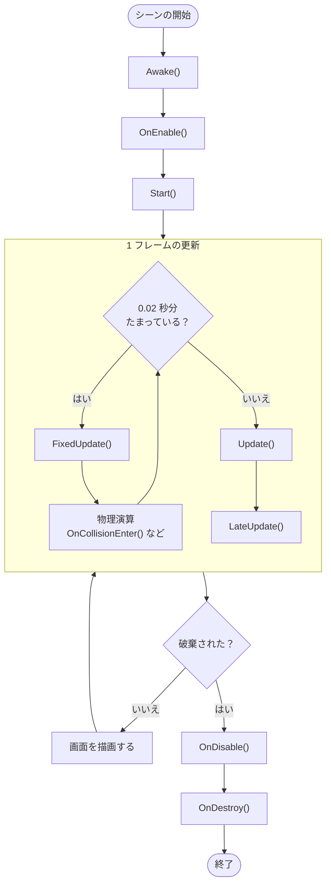

# 補足: Unity のメッセージと実行順序

`Start` と `Update` のように、Unity が決まったタイミングで呼び出すメソッドは、ほかにもあります。このページでは、`Awake`、`FixedUpdate`、`LateUpdate`、`OnDestroy` などの主なメソッドを並べ、どの順序で呼ばれるのかを俯瞰します。それぞれの詳しい使い方は、後のページで扱います。

## 学習目標

このページを読み終えると、以下のことができるようになります。

- Unity の「メッセージ」が何を指すのかを説明できる
- 主なメッセージが呼ばれる順序を説明できる
- `FixedUpdate` が 1 フレームに 0 回から複数回呼ばれる理由を説明できる

## 前提知識

- [Update メソッドと連続実行](/unity-csharp-learning/unity/update-basics/) を読んでいること

---

## 1. メッセージとは

`Start` や `Update` のように、Unity が決まったタイミングで呼び出す `MonoBehaviour` のメソッドを、Unity では**メッセージ**と呼びます。スクリプトリファレンスの [MonoBehaviour](https://docs.unity3d.com/ScriptReference/MonoBehaviour.html) のページでは、「Messages」の欄に並んでいます。

メッセージは、C# の言語の機能ではなく、Unity の仕組みです。Unity は、スクリプトに決まった名前のメソッドがあるかを調べ、あればそのタイミングで呼び出します。`MonoBehaviour` のメソッドをオーバーライドしているわけではないので、`override` は書きません。`private` のメソッドでも呼ばれます。

> 💡 **用語について**: 「メッセージ」は Unity 固有の呼び方で、文脈によって呼び方が揺れやすい用語です。Unity のマニュアルでは「イベント関数（event functions）」と呼ばれています。一般的なプログラミングの用語でいえば、何かが起きたときに呼び出される**イベントハンドラー**（コールバック）にあたります。ただし、C# の `event` キーワードを使った [イベント](/unity-csharp-learning/csharp/events/) とは別の仕組みです。また、`Debug.Log` で Console に出力する「メッセージ」とも関係ありません。このサイトでは「メッセージ」と呼びます。

---

## 2. 主なメッセージと実行順序

主なメッセージを、呼ばれる順に並べると次のようになります。

| メッセージ | 呼ばれるタイミング | 主な用途 | 詳しく扱うページ |
|---|---|---|---|
| [`Awake`](https://docs.unity3d.com/ScriptReference/MonoBehaviour.Awake.html) | ゲームオブジェクトが最初に有効になったとき（シーンの開始時など）に 1 回。スクリプトが無効でも呼ばれる | 自分自身の初期化 | このページ |
| [`OnEnable`](https://docs.unity3d.com/ScriptReference/MonoBehaviour.OnEnable.html) | `Awake` の後と、スクリプトが有効になるたび | 有効になったときの準備 | このページ |
| [`Start`](https://docs.unity3d.com/ScriptReference/MonoBehaviour.Start.html) | 最初のフレームの更新の前に 1 回。スクリプトが有効なときだけ | ほかのオブジェクトを使う初期化 | [Start メソッドとスクリプト](/unity-csharp-learning/unity/start-method/) |
| [`FixedUpdate`](https://docs.unity3d.com/ScriptReference/MonoBehaviour.FixedUpdate.html) | 一定の間隔（既定は 0.02 秒）。1 フレームに 0 回のことも、複数回のこともある | 物理演算（Rigidbody に力を加えるなど） | [Rigidbody で力を加える](/unity-csharp-learning/unity/rigidbody-force/) |
| [`OnCollisionEnter`](https://docs.unity3d.com/ScriptReference/MonoBehaviour.OnCollisionEnter.html) / [`OnTriggerEnter`](https://docs.unity3d.com/ScriptReference/MonoBehaviour.OnTriggerEnter.html) | 物理演算で、接触や交差が見つかったとき | 衝突の検知 | [Collider — 衝突とトリガー判定](/unity-csharp-learning/unity/collider-trigger/) |
| [`Update`](https://docs.unity3d.com/ScriptReference/MonoBehaviour.Update.html) | 毎フレーム 1 回 | 入力の処理、物理演算を使わない移動 | [Update メソッドと連続実行](/unity-csharp-learning/unity/update-basics/) |
| [`LateUpdate`](https://docs.unity3d.com/ScriptReference/MonoBehaviour.LateUpdate.html) | すべての `Update` が終わった後、毎フレーム 1 回 | カメラの追従など | このページ |
| [`OnDisable`](https://docs.unity3d.com/ScriptReference/MonoBehaviour.OnDisable.html) | スクリプトが無効になったとき。破棄される前にも呼ばれる | `OnEnable` で準備したものの片付け | このページ |
| [`OnDestroy`](https://docs.unity3d.com/ScriptReference/MonoBehaviour.OnDestroy.html) | ゲームオブジェクトやスクリプトが破棄されるとき | 後片付け | このページ |

1 つのゲームオブジェクトから見た流れを図にすると、次のようになります。



[Update メソッドと連続実行](/unity-csharp-learning/unity/update-basics/) の図の「`Update()` → 画面を描画する」に、物理演算の `FixedUpdate` と、`Update` の後の `LateUpdate` が加わった形です。「0.02 秒分たまっている？」は、前回の物理演算から、物理演算 1 回分の時間（既定は 0.02 秒）以上たったかどうかを表します。この繰り返しについては 4 節で説明します。

ゲームオブジェクトが破棄されたときは、そのフレームの描画の前に `OnDisable` と `OnDestroy` が呼ばれ、それ以降は描画されません。Play を止めたときや、シーンを切り替えたときにも、ゲームオブジェクトは破棄され、`OnDisable` と `OnDestroy` が呼ばれます。

> 💡 **ポイント**: コルーチンの `yield return null` は、`Update` の後に再開します。コルーチンは [コルーチンの基本](/unity-csharp-learning/unity/coroutines/) で扱います。

ここに挙げたのは主なメッセージだけです。描画の前後に呼ばれるものなどを含めた完全な順序は、Unity マニュアルの [Event function execution order](https://docs.unity3d.com/Manual/execution-order.html) にまとめられています。

---

## 3. スクリプトで実行順序を確かめる

各メッセージで `Debug.Log` を呼び、Console に出力される順序を確かめます。

メニューバーの **GameObject → Create Empty** を選択し、空のゲームオブジェクトを作成します。Inspector ビューの **Add Component → New script** から `MessageSample` という名前のスクリプトを作成してアタッチし、次のように書き換えます。

```csharp
using UnityEngine;

public class MessageSample : MonoBehaviour
{
    private int _frame; // Update が呼ばれた回数

    private void Awake()
    {
        Debug.Log("Awake");
    }

    private void OnEnable()
    {
        Debug.Log("OnEnable");
    }

    private void Start()
    {
        Debug.Log("Start");
    }

    private void FixedUpdate()
    {
        Debug.Log("FixedUpdate");
    }

    private void Update()
    {
        _frame++;
        Debug.Log($"Update {_frame}");
    }

    private void LateUpdate()
    {
        Debug.Log($"LateUpdate {_frame}");

        if (_frame == 3)
        {
            Destroy(gameObject); // 3 フレーム目の最後に、このゲームオブジェクトを破棄する
        }
    }

    private void OnDisable()
    {
        Debug.Log("OnDisable");
    }

    private void OnDestroy()
    {
        Debug.Log("OnDestroy");
    }
}
```

`_frame` は `Update` が呼ばれた回数を数えるフィールドです。ログが流れ続けないように、3 フレーム目の `LateUpdate` で `Destroy(gameObject)` を呼び、ゲームオブジェクトを破棄しています。`Destroy` は [Collider — 衝突とトリガー判定](/unity-csharp-learning/unity/collider-trigger/) で詳しく扱います。

Console ビューの **Collapse** がオフになっていることを確認してから、Play ボタンを押してください。オンのままだと、同じ内容の行が 1 行にまとめられ、`FixedUpdate` が何回呼ばれたのかがわからなくなります。

実行結果の例を示します。`FixedUpdate` の行の数と位置は、実行するたびに変わります。

```
Awake
OnEnable
Start
FixedUpdate
Update 1
LateUpdate 1
Update 2
LateUpdate 2
FixedUpdate
Update 3
LateUpdate 3
OnDisable
OnDestroy
```

`FixedUpdate` 以外の行は、いつもこの順序で出力されます。`Awake`、`OnEnable`、`Start` が 1 回ずつ呼ばれ、各フレームでは `Update` の後に `LateUpdate` が呼ばれます。破棄されると、`OnDisable`、`OnDestroy` の順に呼ばれます。

---

## 4. FixedUpdate が呼ばれる回数

`FixedUpdate` の行の数が変わるのは、物理演算が、画面の描画とは別の決まった間隔で進むからです。

物理演算は、既定では 0.02 秒（1 秒間に 50 回）ずつ時間を進めます。Unity は、フレームの最初に、前回の物理演算からたまった時間を調べ、0.02 秒が 1 回分以上たまっていれば `FixedUpdate` を呼んで物理演算を 1 回進めます。これを、たまった時間が 0.02 秒より少なくなるまで繰り返してから、`Update` に進みます。

| フレームレート | 1 フレームの時間 | 1 フレームあたりの `FixedUpdate`（目安） |
|---|---|---|
| 25 fps | 0.04 秒 | 2 回 |
| 50 fps | 0.02 秒 | 1 回 |
| 100 fps | 0.01 秒 | 2 フレームに 1 回（0 回のフレームがある） |

実際のフレームレートは一定ではないので、同じ環境でもフレームごとに回数が変わります。物理演算の間隔は変えることもできます。間隔の値の読み方と変え方は、[Time クラスと時間制御](/unity-csharp-learning/unity/time-basics/) で扱います。

フレームレートに関係なく、物理演算 1 回の直前に必ず 1 回呼ばれるのが `FixedUpdate` です。そのため、Rigidbody に力を加えるような物理演算の処理は `FixedUpdate` に書きます。`Update` に書くと、物理演算 1 回あたりに加わる力がフレームレートによって変わってしまいます。具体的な例は [Rigidbody で力を加える](/unity-csharp-learning/unity/rigidbody-force/) で扱います。

一方、キーを押した瞬間の判定のように、フレームごとに 1 回だけ調べたい処理は `Update` に書きます。`FixedUpdate` は呼ばれないフレームがあるので、そこで調べると取りこぼすことがあります。入力の判定は [Input System で入力操作](/unity-csharp-learning/unity/input-system/) で扱います。

---

## 5. Awake と Start、Update と LateUpdate

どちらも 1 回だけ呼ばれる `Awake` と `Start`、どちらも毎フレーム呼ばれる `Update` と `LateUpdate` は、似ていて使い分けに迷いやすい組です。

- **`Awake` と `Start`**: シーンにあるすべてのゲームオブジェクトの `Awake` が終わってから、`Start` が呼ばれます。自分自身の準備は `Awake` に、ほかのゲームオブジェクトが準備した値を使う処理は `Start` に書くと、相手の準備が終わる前に使ってしまうことを防げます。
- **`Update` と `LateUpdate`**: すべてのゲームオブジェクトの `Update` が終わってから、`LateUpdate` が呼ばれます。プレイヤーを追いかけるカメラのように、ほかのゲームオブジェクトが動き終わった後の位置を使う処理は、`LateUpdate` に書きます。`Update` に書くと、プレイヤーの `Update` より先に呼ばれたフレームでは、移動前の位置を追いかけてしまいます。

---

## よくあるミス

### メソッドの名前を間違えて呼ばれない

Unity はメッセージを名前で探すので、`update` や `Fixedupdate` のように大文字と小文字を 1 文字でも間違えると、そのメソッドは呼ばれません。ふつうのメソッドとして定義されただけになるので、コンパイルエラーにも警告にもなりません。

スクリプトが動かないときは、まずメソッドの名前がスクリプトリファレンスの表記と完全に一致しているかを確認してください。

---

## ワンポイントアドバイス

同じメッセージがゲームオブジェクトごとに呼ばれる順序（ゲームオブジェクト A の `Update` と B の `Update` のどちらが先か）は、決まっていません。A の `Update` が B の `Update` より先に呼ばれることを前提にしたコードは書かないでください。順序が必要なときは、この節の `Awake` と `Start`、`Update` と `LateUpdate` のように、メッセージを分けて順序を作ります。

---

## まとめ

- Unity が決まったタイミングで呼び出す `MonoBehaviour` のメソッドを**メッセージ**と呼ぶ。Unity 固有の呼び方で、マニュアルでは「イベント関数」、一般的にはイベントハンドラーにあたる
- 主なメッセージは `Awake` → `OnEnable` → `Start` → 毎フレームの（`FixedUpdate` → ）`Update` → `LateUpdate` → `OnDisable` → `OnDestroy` の順に呼ばれる
- `FixedUpdate` は物理演算の間隔（既定 0.02 秒）で呼ばれるので、1 フレームに 0 回のことも複数回のこともある。物理演算の処理は `FixedUpdate` に書く
- メッセージは名前で呼び出されるので、名前を間違えるとエラーにならずに呼ばれなくなる

---

## 理解度チェック

1. `Awake` と `Start` は、どちらも 1 回だけ呼ばれます。呼ばれる順序と、スクリプトが無効のときの違いを説明してください。
2. Fixed Timestep が既定の 0.02 秒で、フレームレートが 25fps のとき、1 フレームあたり `FixedUpdate` はおよそ何回呼ばれますか？
3. 次のスクリプトをゲームオブジェクトにアタッチして Play ボタンを押しても、Console に何も表示されません。理由を説明してください。

   ```csharp
   using UnityEngine;

   public class MessageSample : MonoBehaviour
   {
       private void update()
       {
           Debug.Log("Update");
       }
   }
   ```

<details markdown="1">
<summary>解答を見る</summary>

1. `Awake` が先に呼ばれ、シーンにあるすべての `Awake` が終わってから `Start` が呼ばれる。`Awake` はスクリプトが無効でも呼ばれるが、`Start` はスクリプトが有効なときだけ呼ばれる。
2. およそ 2 回。1 フレームが 0.04 秒なので、0.02 秒の物理演算が 2 回分たまる。
3. メソッドの名前が `Update` ではなく `update`（小文字）になっているため。Unity はメッセージを名前で探すので、このメソッドは呼ばれない。ふつうのメソッドとしては正しいので、エラーにもならない。

</details>

---

## 次のステップ

[Input System で入力操作](/unity-csharp-learning/unity/input-system/) では、キーボード入力を受け取ってオブジェクトを操作する方法を学びます。
