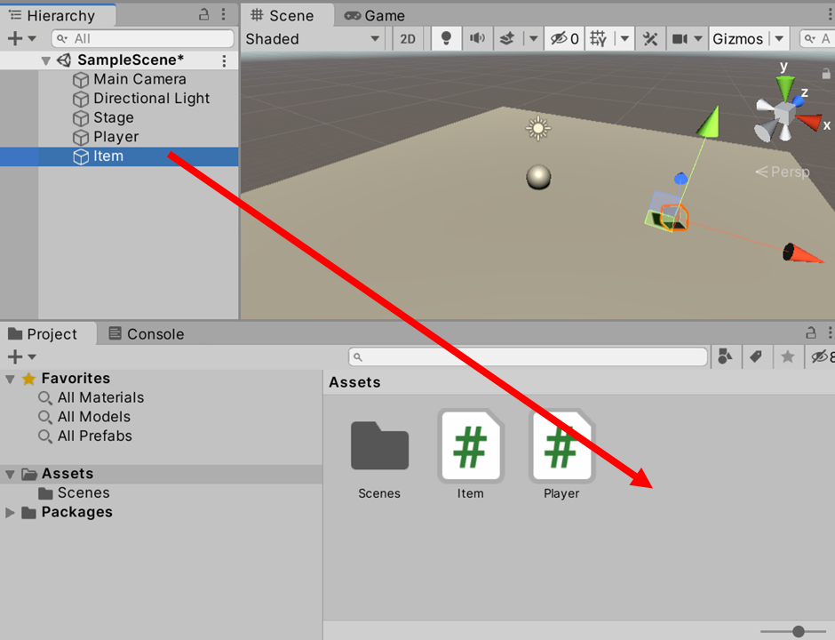
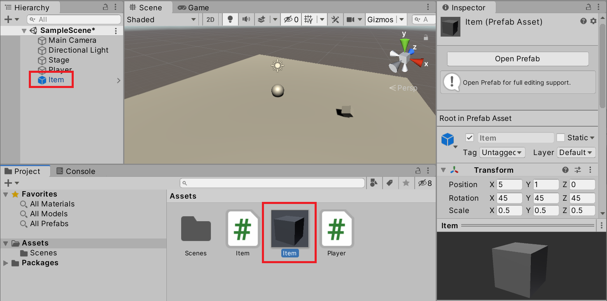
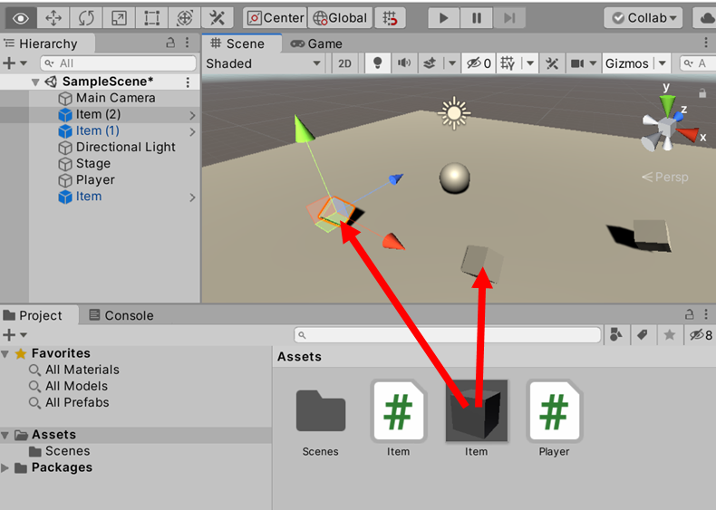

# プレハブ（Prefab）

同じ設定のゲームオブジェクトを複数配置したい場合、ひとつひとつコピーして配置すると後の変更が大変です。Unity の **Prefab（プレハブ）** は、ゲームオブジェクトを**テンプレート（ひな形）** としてアセットに保存できる仕組みです。プレハブを使うと、元のテンプレートを編集するだけで、すべての複製に変更が反映されます。

## 学習目標

このページを読み終えると、以下のことができるようになります。

- プレハブの概念（テンプレート・インスタンス）を説明できる
- シーン上のゲームオブジェクトをプレハブ化できる
- プレハブからインスタンスを作成してシーンに配置できる
- プレハブを編集してすべてのインスタンスに変更を反映できる

## 前提知識

- [Collider とトリガー判定](/unity-csharp-learning/unity/collider-trigger/) を読んでいること

---

## 1. プレハブとは

プレハブは、ゲームオブジェクトとそのすべてのコンポーネント設定を**アセット（ファイル）として保存**したものです。

```
シーン上のゲームオブジェクト  →  プレハブ（アセット）
                                     ↓
                            プレハブインスタンス（シーン上の実体）×N
```

プレハブから生成されたシーン上のオブジェクトを**プレハブインスタンス**と呼びます。プレハブ（テンプレート）を編集すると、そこから生成されたすべてのインスタンスに自動的に変更が反映されます。

---

## 2. ゲームオブジェクトをプレハブ化する

Hierarchy ビューのゲームオブジェクトを Project ビューへドラッグ & ドロップすると、プレハブとしてアセットに保存されます。



保存できたら、Project ビューに `.prefab` アイコンのファイルが作成されます。

---

## 3. プレハブインスタンスを確認する

プレハブ化すると、元のシーン上のゲームオブジェクトは自動的にプレハブインスタンスになります。Hierarchy ビューで**青文字**で表示されているものがプレハブインスタンスです。



---

## 4. プレハブからインスタンスを追加する

Project ビューのプレハブを Hierarchy ビューまたは Scene ビューにドラッグ & ドロップすると、新しいインスタンスをシーンに追加できます。



こうして複数のインスタンスを配置できます。

---

## 5. プレハブを編集して全インスタンスに反映する

プレハブを編集するには、Project ビューのプレハブを選択し Inspector ビューを確認するか、Hierarchy ビューのインスタンスをダブルクリックして**Prefab Mode**（プレハブ編集モード）を開きます。

プレハブを編集して保存すると、シーン上のすべてのインスタンスに変更が反映されます。

> 💡 **ポイント**: プレハブで管理することで「バランス調整で全アイテムのサイズを変えたい」「全アイテムの色を変えたい」といった作業が、一箇所の変更で完結します。

---

## まとめ

- プレハブはゲームオブジェクトのテンプレートをアセットとして保存する仕組み
- Hierarchy ビューから Project ビューへのドラッグ & ドロップで作成できる
- プレハブから生成したインスタンスは Hierarchy ビューで青文字で表示される
- プレハブを編集すると、そのプレハブから生成したすべてのインスタンスに変更が反映される

---

## 理解度チェック

1. プレハブとプレハブインスタンスの関係を説明してください。
2. 10個配置したアイテムのサイズをすべて変更したい場合、プレハブを使う場合と使わない場合でどう手間が違いますか？
3. Hierarchy ビューで青文字で表示されているゲームオブジェクトは何を意味しますか？

<details markdown="1">
<summary>解答を見る</summary>

1. プレハブはテンプレート（ひな形）、プレハブインスタンスはそのテンプレートからシーンに生成された実体。プレハブを編集するとすべてのインスタンスに変更が反映される。
2. プレハブを使う場合はプレハブを1回編集するだけで全10個に反映される。使わない場合は10個を個別に修正する必要があり、変更漏れが発生しやすい。
3. プレハブインスタンス（プレハブから生成されたオブジェクト）であることを意味する。

</details>

---

## 次のステップ

[チュートリアル: アイテム収集](/unity-csharp-learning/unity/item-collection/) では、これまで学んだすべてを組み合わせて、プレイヤーがアイテムを回収するゲームを実装します。
