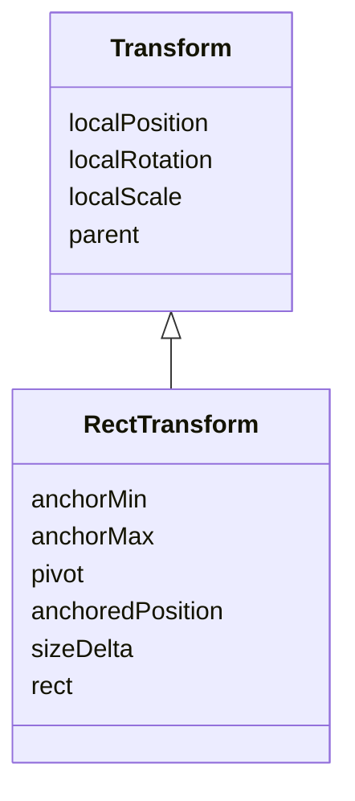

# 補足: スクリプトから RectTransform を操作する

[RectTransform — アンカーとピボット](/unity-csharp-learning/unity/rect-transform/) では、Inspector でアンカーやピボットを設定しました。このページでは、同じシーンの UI をスクリプトから読み書きします。Inspector の値がどのプロパティに対応するかを確かめてから、緑のバーとオレンジ色の帯の幅をアニメーションさせます。


## 学習目標

このページを読み終えると、以下のことができるようになります。

- `transform` を `RectTransform` として取り出せる
- Inspector の Pos、Width / Height、Left / Right が、どのプロパティに対応するかを説明できる
- `sizeDelta` が幅と一致しない場合を説明できる
- `SetSizeWithCurrentAnchors` で UI の幅を変更できる

## 前提知識

- [RectTransform — アンカーとピボット](/unity-csharp-learning/unity/rect-transform/) のシーン `SampleUILayout` を作っていること
- [フィールドでデータを維持する](/unity-csharp-learning/unity/fields-basics/) を読んでいること
- [Update メソッドと連続実行](/unity-csharp-learning/unity/update-basics/) で `Time.deltaTime` を学んでいること

---

## 1. transform を RectTransform として扱う

RectTransform は、Transform を[継承](/unity-csharp-learning/csharp/inheritance/)したクラスです。



UI は 2D なのに、3D の Transform を継承しているのは意外に思えるかもしれません。しかし、UI のゲームオブジェクトも 3D 空間の中にあり、Inspector には Pos Z や 3 軸の Rotation、Scale があります。RectTransform は、Transform の位置・回転・拡大縮小をそのまま持ったうえで、**自分のローカルの XY 平面上の矩形**を加えたものです。アンカー、ピボット、Width / Height は、この矩形を決めるための設定です。

スクリプトの `transform` プロパティの型は `Transform` です。UI のゲームオブジェクトでは、実体は `RectTransform` ですが、変数の型が `Transform` なので、`anchoredPosition` などの RectTransform のメンバーはそのままでは使えません。[ダウンキャスト](/unity-csharp-learning/csharp/type-casting/#3-ダウンキャスト)して、`RectTransform` 型の変数に入れます。

```csharp
RectTransform rectTransform = (RectTransform)transform;
```

`GetComponent<RectTransform>()` でも同じオブジェクトを取得できます。このページでは、キャストを使います。

---

## 2. Inspector の値をプロパティで読む

`SampleUILayout` シーンを開きます。前のページの最後の状態（LayoutArea が600×360、Corner・Strip・Bar が表の値）から始めてください。

Hierarchy で `LayoutArea` を選択し、Inspector の **Add Component → New script** から `SampleRectInfo` という名前のスクリプトを作成してアタッチします。スクリプトを次のように書き換えます。

```csharp
using UnityEngine;

public class SampleRectInfo : MonoBehaviour
{
    [SerializeField] private RectTransform _corner;
    [SerializeField] private RectTransform _strip;
    [SerializeField] private RectTransform _bar;

    private void Start()
    {
        Log(_corner);
        Log(_strip);
        Log(_bar);
    }

    private void Log(RectTransform target)
    {
        Debug.Log($"{target.name}: anchoredPosition={target.anchoredPosition} sizeDelta={target.sizeDelta} rect.size={target.rect.size}");
        Debug.Log($"{target.name}: localPosition={target.localPosition}");
    }
}
```

フィールドの型を `RectTransform` にしているので、Inspector の **Corner**、**Strip**、**Bar** の欄に、Hierarchy から同じ名前のゲームオブジェクトをドラッグ & ドロップできます。ゲームオブジェクトの RectTransform が入ります。

Game ビューで **Sample UI 1280x720** を選び、Play ボタンを押します。Console に次のように表示されます。

```
Corner: anchoredPosition=(-20.00, -20.00) sizeDelta=(120.00, 50.00) rect.size=(120.00, 50.00)
Corner: localPosition=(280.00, 160.00, 0.00)
Strip: anchoredPosition=(0.00, 20.00) sizeDelta=(-40.00, 60.00) rect.size=(560.00, 60.00)
Strip: localPosition=(0.00, -160.00, 0.00)
Bar: anchoredPosition=(20.00, 0.00) sizeDelta=(240.00, 40.00) rect.size=(240.00, 40.00)
Bar: localPosition=(-280.00, 0.00, 0.00)
```

確認したら、再生を停止してください。

### anchoredPosition — アンカーからの位置

**書式：[RectTransform.anchoredPosition プロパティ](https://docs.unity3d.com/ScriptReference/RectTransform-anchoredPosition.html)**
```csharp
public Vector2 anchoredPosition { get; set; }
```

アンカーの基準点からピボットまでの位置です。Inspector の **Pos X / Pos Y** に対応します。Corner は `(-20, -20)`、Bar は `(20, 0)` で、前のページで入力した値と一致します。

Strip の Pos Y は `20` で、X は `0` です。横方向にストレッチしているので、Inspector には Pos X の欄がありません。このとき X の基準は、左右に分けたアンカーの間を、ピボットの割合（0.5）で分けた点、つまり親の左右の中央になります。

一方、Transform から継承した `localPosition` は、**親のピボットから自分のピボットまで**の位置です。LayoutArea のピボットは中央なので、Corner の `localPosition` は、親の中央から右上の内側までの `(300 − 20, 180 − 20) = (280, 160)` です。UI の位置を Inspector の値に合わせて書き換えるときは、`localPosition` ではなく `anchoredPosition` を使います。

### sizeDelta と rect — 幅は rect で読む

**書式：[RectTransform.sizeDelta プロパティ](https://docs.unity3d.com/ScriptReference/RectTransform-sizeDelta.html)**
```csharp
public Vector2 sizeDelta { get; set; }
```

**書式：[RectTransform.rect プロパティ](https://docs.unity3d.com/ScriptReference/RectTransform-rect.html)**
```csharp
public Rect rect { get; }
```

`sizeDelta` は、**自分の矩形の大きさから、アンカーで囲まれた矩形の大きさを引いた値**です。`rect` は、自分の矩形そのものです。`rect.size` で幅と高さを読めます。`rect` は読み取り専用です。

Corner と Bar は、アンカーが 1 点に重なっています。アンカーで囲まれた矩形の大きさは 0 なので、`sizeDelta` は Width / Height と同じ値になります。

Strip は横方向のアンカーを親の両端に分けているので、アンカーで囲まれた矩形の幅は、親の幅の600です。

| | 計算 | 値 |
|---|---|---|
| Strip の幅（`rect.size.x`） | 600 − 20 − 20 | 560 |
| アンカーで囲まれた幅 | 親の幅 | 600 |
| `sizeDelta.x` | 560 − 600 | −40 |

ストレッチの方向では、`sizeDelta` は幅ではなく、**アンカーの間隔との差**です。Inspector で Left / Right が20のとき、`sizeDelta.x` は `−(20 + 20) = −40` になります。縦方向はアンカーが重なっているので、`sizeDelta.y` は Height の60です。

| Inspector | プロパティ | 注意 |
|---|---|---|
| Pos X / Pos Y | `anchoredPosition` | アンカーの基準点からピボットまで。`localPosition` とは基準が違う |
| Width / Height | `sizeDelta` | アンカーが重なっている方向だけ、幅・高さと一致する |
| 実際の幅・高さ | `rect.size` | 読み取り専用 |
| Left / Right | [`offsetMin`](https://docs.unity3d.com/ScriptReference/RectTransform-offsetMin.html).x / [`offsetMax`](https://docs.unity3d.com/ScriptReference/RectTransform-offsetMax.html).x | 左下・右上のアンカーから、矩形の角までの距離。Right は符号が逆になる |

Strip では、`offsetMin.x` が `20`、`offsetMax.x` が `−20` です。`offsetMax` は右上のアンカーから矩形の右上の角までを測るので、内側に20入った右端は −20 になります。

---

## 3. sizeDelta で幅をアニメーションさせる

Bar の幅を、HP ゲージのように毎フレーム減らします。

Hierarchy で `Bar` を選択し、**Add Component → New script** から `SampleBarGauge` という名前のスクリプトを作成してアタッチします。スクリプトを次のように書き換えます。

```csharp
using UnityEngine;

public class SampleBarGauge : MonoBehaviour
{
    [SerializeField] private float _maxWidth = 240.0f;
    [SerializeField] private float _speed = 80.0f;

    private RectTransform _rectTransform;
    private float _width;

    private void Start()
    {
        _rectTransform = (RectTransform)transform;
        _width = _maxWidth;
    }

    private void Update()
    {
        _width -= _speed * Time.deltaTime;
        if (_width < 0.0f)
        {
            _width = _maxWidth;
        }

        _rectTransform.sizeDelta = new Vector2(_width, _rectTransform.sizeDelta.y);
    }
}
```

`_width` を 1 秒に `_speed`（80）ずつ減らし、0 を下回ったら `_maxWidth`（240）に戻します。240から0まで減るのに3秒かかります。

`sizeDelta` は `Vector2` なので、X だけを書き換えることはできません。`new Vector2(_width, _rectTransform.sizeDelta.y)` で、高さは今の値のまま、幅だけを変えた値を代入しています。

Play ボタンを押すと、Bar が左端を保ったまま右から短くなり、3秒ごとに240の幅に戻ります。前のページで Pivot X を `0` にしたので、幅の変更の基準が左端になっています。


---

## 4. SetSizeWithCurrentAnchors で幅を設定する

### ストレッチでは sizeDelta が幅にならない

同じスクリプトを Strip にも付けてみます。再生を停止し、Hierarchy で `Strip` を選択します。**Add Component** の検索欄に `SampleBarGauge` と入力して追加し、Inspector の **Max Width** を `560` にしてください。

Play ボタンを押すと、Strip は親のパネルからはみ出します。


前の節で確かめたとおり、Strip の `sizeDelta.x` は幅ではなく、アンカーの間隔（600）との差です。`sizeDelta.x` に560を代入すると、幅は `600 + 560 = 1160` になります。幅は1160から600まで減り、また1160に戻ります。

### アンカーに合わせてサイズを決める

**書式：[RectTransform.SetSizeWithCurrentAnchors メソッド](https://docs.unity3d.com/ScriptReference/RectTransform.SetSizeWithCurrentAnchors.html)**
```csharp
public void SetSizeWithCurrentAnchors(RectTransform.Axis axis, float size);
```

| パラメータ | 説明 |
|---|---|
| `axis` | 変更する方向。横は `RectTransform.Axis.Horizontal`、縦は `RectTransform.Axis.Vertical` |
| `size` | 設定する幅または高さ |

今のアンカーのまま、`rect` の幅または高さが `size` になるように `sizeDelta` を計算して設定します。アンカーが重なっていても、分かれていても、`size` がそのまま幅になります。サイズの変更はピボットを基準にします。

再生を停止し、`SampleBarGauge` の `Update` の最後の行を、次のように書き換えます。

```csharp
// 変更前
_rectTransform.sizeDelta = new Vector2(_width, _rectTransform.sizeDelta.y);

// 変更後
_rectTransform.SetSizeWithCurrentAnchors(RectTransform.Axis.Horizontal, _width);
```

### 完成したコード

```csharp
using UnityEngine;

public class SampleBarGauge : MonoBehaviour
{
    [SerializeField] private float _maxWidth = 240.0f;
    [SerializeField] private float _speed = 80.0f;

    private RectTransform _rectTransform;
    private float _width;

    private void Start()
    {
        _rectTransform = (RectTransform)transform;
        _width = _maxWidth;
    }

    private void Update()
    {
        _width -= _speed * Time.deltaTime;
        if (_width < 0.0f)
        {
            _width = _maxWidth;
        }

        // 今のアンカーのまま、幅を _width にする
        _rectTransform.SetSizeWithCurrentAnchors(RectTransform.Axis.Horizontal, _width);
    }
}
```

---

## 動作確認

1. `SampleBarGauge` を上の完成したコードにして保存する
2. `Bar` の **Sample Bar Gauge** の **Max Width** が `240`、`Strip` の **Max Width** が `560` であることを確認する
3. Game ビューで **Sample UI 1280x720** を選び、Play ボタンを押す

Console には、2 節と同じ 6 行が表示されます。`SampleRectInfo` は `Start` で 1 回だけ記録するので、アニメーションの前の値です。


| | Bar | Strip |
|---|---|---|
| 幅の変化 | 240 → 0 | 560 → 0 |
| 1 周の時間 | 3 秒 | 7 秒 |
| 幅の変更の基準（Pivot X） | 左端（0） | 中央（0.5） |
| 見え方 | 左端を保ち、右端が左へ動く | 中央を保ち、両端が内側へ動く |

Strip が親のパネルからはみ出さず、中央に向かって短くなることを確認してください。再生中に `Bar` を選択すると、Inspector の **Width** が減り続けることも確認できます。

確認したら再生を停止します。

---

## まとめ

- `transform` の型は `Transform` なので、UI では `(RectTransform)transform` でキャストして RectTransform のメンバーを使う
- Inspector の Pos X / Pos Y は `anchoredPosition` に対応する。`localPosition` は親のピボットからの位置で、基準が違う
- `sizeDelta` は自分の矩形とアンカーで囲まれた矩形の差。ストレッチの方向では幅にならない
- 実際の大きさは `rect` で読み、幅や高さは `SetSizeWithCurrentAnchors` で設定する

---

## 理解度チェック

1. `transform.anchoredPosition` と書くとコンパイルエラーになります。理由を説明してください。
2. Corner を、親の右上から右と上に40ずつ離した位置に移すには、`anchoredPosition` にどの値を代入しますか？アンカーとピボットは右上のままとします。
3. 親の幅が600、Left / Right が20の Strip に、次のコードを実行しました。Strip の幅はいくつになりますか？

   ```csharp
   rectTransform.sizeDelta = new Vector2(100, 60);
   ```

<details markdown="1">
<summary>解答を見る</summary>

1. `transform` プロパティの型が `Transform` で、`anchoredPosition` は `RectTransform` のメンバーだからです。実体が RectTransform でも、変数の型のメンバーしか使えません。`((RectTransform)transform).anchoredPosition` のようにキャストします。
2. `new Vector2(-40, -40)` です。アンカーとピボットが右上なので、左へ40、下へ40の位置になります。
3. `600 + 100 = 700` です。横方向はストレッチなので、`sizeDelta.x` はアンカーの間隔（600）との差になります。

</details>

---

## 次のステップ

[Canvas Scaler と画面サイズへの対応](/unity-csharp-learning/unity/canvas-scaler/) では、解像度や画面の縦横比が変わったときの UI を調整します。Canvas Scaler のページでは、このページで追加したスクリプトは使いません。`LayoutArea` の **Sample Rect Info**、`Strip` と `Bar` の **Sample Bar Gauge** について、それぞれの見出しの右端にある **⋮** をクリックし、**Remove Component** を選んで外しておいてください。
