# RectTransform — アンカーとピボット

UI を右上に固定したり、親の幅に合わせて伸ばしたりするには、位置とサイズの基準を決める必要があります。このページでは、3 つの色付きの Image を配置して、**アンカー**と**ピボット**の違いを確かめます。スクリプトは使いません。


## 学習目標

- アンカーとピボットの基準が、どこにあるかを説明できる
- 親の右上から一定の距離に UI を配置できる
- 親の幅に合わせて UI を伸縮できる
- ピボットによるサイズ変更の違いを予測できる

## 前提知識

- [Image — 画像の表示と色・透明度](/unity-csharp-learning/unity/ui-image/) を読んでいること
- [GameObject の親子関係](/unity-csharp-learning/unity/gameobject-hierarchy/) を読んでいること

---

## 1. RectTransform の基準を知る

**`RectTransform`** は、UI の矩形の位置とサイズを管理するコンポーネントです。

**書式：[RectTransform コンポーネント](https://docs.unity3d.com/ScriptReference/RectTransform.html)**
```csharp
public sealed class RectTransform : Transform
```

`: Transform` は、RectTransform が [Transform](/unity-csharp-learning/unity/transform/) を[継承](/unity-csharp-learning/csharp/inheritance/)したクラスであることを表します。RectTransform は Transform の一種なので、親子関係、回転、拡大縮小は、Transform と同じように働きます。そのうえで、親の矩形に対する配置と、自分の矩形のサイズを決める設定が加わっています。それが次の表の設定です。

| 設定 | 基準 | 用途 |
|---|---|---|
| Anchors（アンカー） | **親の矩形** | 親のどこに配置するか、親のサイズ変更にどう追従するか |
| Pivot（ピボット） | **自分の矩形** | 位置を表す点、回転・サイズ変更・拡大縮小の基準 |
| Pos X / Pos Y | アンカーの基準点からピボットまで | 固定アンカーでの位置の調整 |
| Width / Height | 自分の矩形 | 固定アンカーでの幅・高さ |

アンカーもピボットも、左下を `(0, 0)`、右上を `(1, 1)` とする割合で指定します。中央は `(0.5, 0.5)` です。アンカーは親に、ピボットは自分に対する値であることを区別してください。

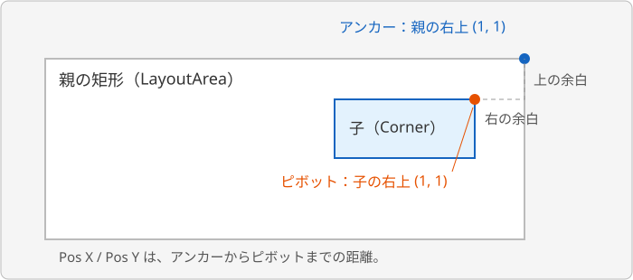

アンカーには **Min** と **Max** があります。横方向は X、縦方向は Y を使います。同じ軸の Min と Max を同じ値にすると、その軸でアンカーが重なります。異なる値にすると、その軸で親のサイズに合わせて伸縮する配置になります。

---

## 2. 親のパネルを準備する

新しいシーンを `SampleUILayout` として用意します。前のページのボタンやスクリプトは使いません。

### Image を追加する

今回は [Image の「画像を使わず、背景を表示する」](/unity-csharp-learning/unity/ui-image/#3-画像を使わず背景を表示する) と同じ操作で、単色の長方形を作ります。キャラクターの Sprite は使いません。

1. **GameObject → UI (Canvas) → Image** から Image を追加し、名前を `LayoutArea` にする
2. **Image → Color** の色選択ウィンドウで、**Hexadecimal** に `1F2938` を入力する

Source Image は初期値の None、Alpha は255のまま使います。最初の UI と一緒に作られる Canvas も、初期設定のまま使います。

### 親の幅と高さを決める

`LayoutArea` の **Rect Transform** で **Width** を `600`、**Height** を `360` に変更します。アンカーとピボットは初期値の中央のまま使います。追加時の位置は Scene ビューの表示範囲によって変わるため、**Pos X / Y が0以外なら、両方0に戻して**中央に置いてください。**Anchors** の左の三角をクリックすると、Min / Max の値も見られます。

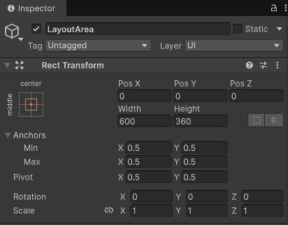

変更後の状態は次のとおりです。アンカーとピボットを変更する必要はありません。

| 項目 | X | Y |
|---|---|---|
| Anchors Min | 0.5 | 0.5 |
| Anchors Max | 0.5 | 0.5 |
| Pivot | 0.5 | 0.5 |
| Pos | 0 | 0 |
| Width / Height | 600 | 360 |

以下で追加する Image も、Pos Z、Rotation、Scale は初期値のまま使います。撮影例ではパネルの外を暗い背景にしていますが、シーンの背景色によって UI の配置は変わりません。

---

## 3. 右上に固定する — アンカーを重ねる

Hierarchy で `LayoutArea` を選択し、前の節と同じ **GameObject → UI (Canvas) → Image** から Image を追加します。名前を `Corner` に変更してください。追加した Image は `LayoutArea` の子として使います。Canvas の直下にできた場合は、Hierarchy で `LayoutArea` へドラッグしてください。

`Corner` の **Image → Color** をクリックし、**Hexadecimal** に青の `268CF2` を入力します。Source Image と Alpha は初期値のままです。

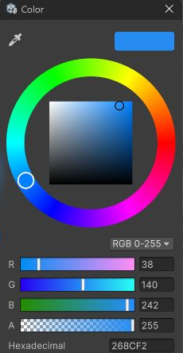

色選択ウィンドウを閉じ、**Rect Transform → Anchors** を展開します。右上を基準にするため、Min と Max の X / Y をすべて `1` に変更してください。続けて Pivot の X / Y を `1` にします。アンカーやピボットを変えると位置が自動調整されるので、**最後に** Pos X / Y を `-20`、Width を `120`、Height を `50` に入力します。

| 項目 | X | Y |
|---|---|---|
| Anchors Min | 1 | 1 |
| Anchors Max | 1 | 1 |
| Pivot | 1 | 1 |
| Pos | -20 | -20 |
| Width / Height | 120 | 50 |

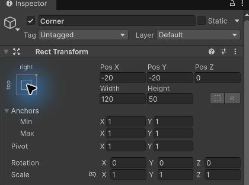

アンカーとピボットがどちらも右上なので、Pos X は親の右端から子の右端まで、Pos Y は親の上端から子の上端までの距離になります。右へ行くと X が増え、上へ行くと Y が増えるので、内側に20離す値はどちらも `-20` です。

### Anchor Presets で選ぶ

Rect Transform の左上にある小さな四角のボタンをクリックすると、**Anchor Presets** が開きます。**top** 行と **right** 列の交点が右上固定です。

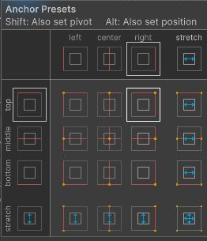

| 選び方 | 変更するもの |
|---|---|
| 通常のクリック | アンカー |
| Shift を押しながらクリック | アンカーとピボット |
| Alt を押しながらクリック | アンカーと位置 |
| Shift と Alt を押しながらクリック | アンカー、ピボット、位置 |

プリセットだけを選んでも、ピボットまで右上になるとは限りません。この例では、選んだ後に表の **Pivot** と **Pos** を確認します。以降の例も、表の数値を最終的な設定としてください。

Inspector でアンカーやピボットの値を変えると、見た目の位置を保つために Pos などが自動で調整されることがあります。表を入力するときは、アンカーとピボットを先に設定してから、位置とサイズを入力すると再現しやすくなります。

---

## 4. 左右に伸ばす — アンカーを分ける

`LayoutArea` の子としてもう1つ Image を追加し、名前を `Strip` にします。前の節と同じ色選択ウィンドウで **Hexadecimal** にオレンジの `F2731A` を入力してください。

**Rect Transform → Anchors** を展開し、次の Min / Max と Pivot を入力します。横方向のアンカーを左右の端に分け、縦方向は下端に重ねる設定です。

| 項目 | X | Y |
|---|---|---|
| Anchors Min | 0 | 0 |
| Anchors Max | 1 | 0 |
| Pivot | 0.5 | 0 |

横方向のアンカーを分けると、Inspector の **Pos X / Width** が **Left / Right** に変わります。

| 項目 | 値 | 意味 |
|---|---|---|
| Left | 20 | 親の左端からの余白 |
| Right | 20 | 親の右端からの余白 |
| Pos Y | 20 | 下側のアンカーからピボットまでの距離 |
| Height | 60 | 固定の高さ |

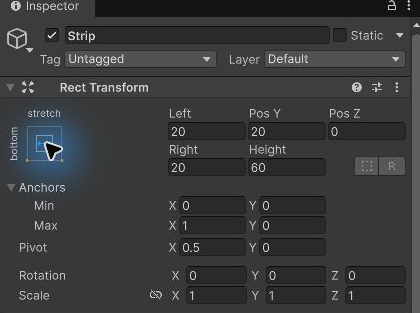

この設定では、幅は **親の幅 − Left − Right** です。親の幅が600なら560、800なら760になります。縦方向はアンカーが重なっているため、高さ60のままです。

上下もストレッチさせると、縦方向の表示は **Top / Bottom** に変わります。まずは横方向だけを分けた状態で、どの入力欄が変わるかを確認してください。

---

## 5. ピボットを基準に幅を変える

`LayoutArea` の子として Image を追加し、名前を `Bar` にします。**Image → Color** の色選択ウィンドウで、**Hexadecimal** に緑の `26BF8C` を入力します。

アンカーを親の左中央、ピボットを自分の左中央に置きます。Rect Transform の Anchors、Pivot、位置・サイズの順に、次の値を入力してください。

| 項目 | X | Y |
|---|---|---|
| Anchors Min | 0 | 0.5 |
| Anchors Max | 0 | 0.5 |
| Pivot | 0 | 0.5 |
| Pos | 20 | 0 |
| Width / Height | 240 | 40 |

ピボットが左端なので、幅を240から120にすると、左端は親の左から20の位置に残り、右端だけが左へ動きます。左から伸び縮みさせたいバーに使える設定です。

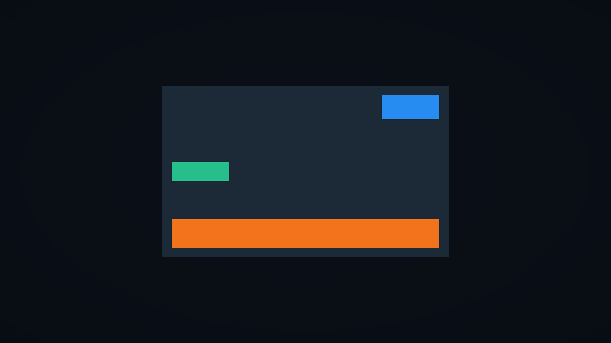

中央のピボットとも比較してみましょう。

1. **Width** を `240` に戻す
2. **Pivot X** を `0.5` にする
3. **Pos X** を `140` にする。左から20の位置に幅240で置くと、中央は `20 + 240 / 2 = 140` になる
4. **Width** を `120` にする

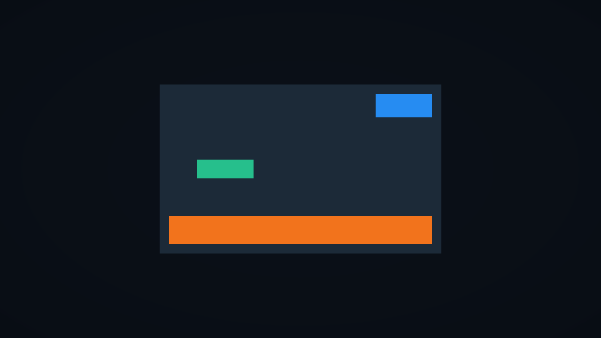

| ピボット | 幅240の左端・右端 | 幅120の左端・右端 |
|---|---|---|
| 左端、Pos X = 20 | 20・260 | 20・140 |
| 中央、Pos X = 140 | 20・260 | 80・200 |

表の端の位置は、いずれも親の左端からの距離です。比較後は **Pivot X = 0**、**Pos X = 20**、**Width = 240** に戻します。

> 💡 **ポイント**: Width / Height の変更は矩形のサイズ変更です。Scale の変更は文字や子オブジェクトなども含む拡大縮小なので、同じ操作として扱わないでください。回転や Scale の変更にもピボットが使われます。

---

## 動作確認

### Game ビューの解像度を登録する

**Game ビュー**は、ゲームを実行したときの画面を確認する場所です。上部の解像度メニューで、想定する画面の幅と高さを選べます。**Free Aspect** はビューの大きさに合わせて描画範囲が変わるので、今回は **Fixed Resolution**（固定解像度）を登録し、同じ条件で比較します。

**Game** タブを開き、上部の **Free Aspect** などと表示されているドロップダウンをクリックしてください。リスト下部の **＋** が解像度の追加ボタンです。

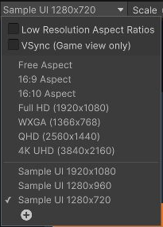

**＋** をクリックすると、登録する解像度の設定画面が開きます。**Type** は初期値の **Fixed Resolution** のまま使います。**Width & Height** の **X（幅）** に `1280`、**Y（高さ）** に `720`、**Label** に `Sample UI 1280x720` を入力し、**OK** を押してください。Label は解像度リストで見分けるための名前です。

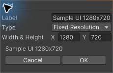

解像度メニューから、登録した **Sample UI 1280x720** を選びます。**Gizmos** はカメラなどの編集用の目印を Game ビューに重ねる機能です。上部の **Gizmos** ボタンがオンならクリックしてオフにし、UI だけを観察しやすくしてください。

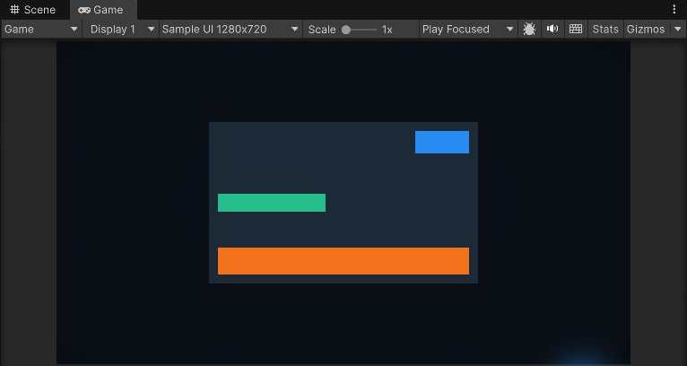

### 親のサイズを変えて比べる

Play ボタンを押し、青い `Corner`、オレンジ色の `Strip`、緑の `Bar` が、冒頭の画像の位置に表示されることを確認します。**再生中に** Hierarchy の `LayoutArea` を選択し、Rect Transform の **Width** を `800`、**Height** を `440` に変更してください。

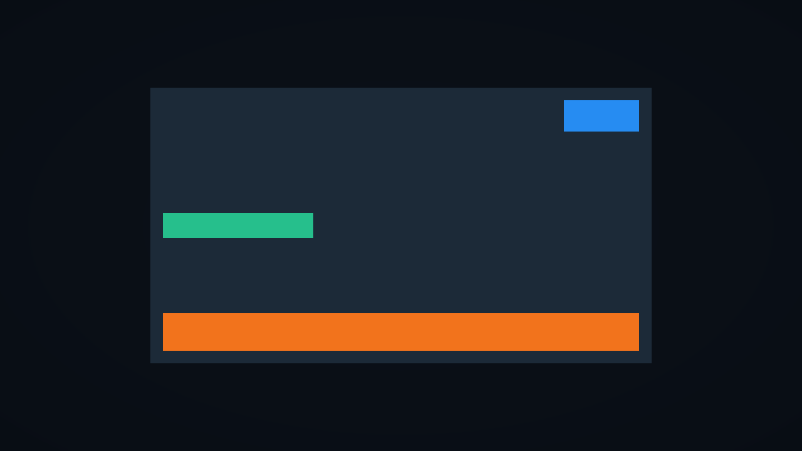

| 確認するもの | 600×360 の親 | 800×440 の親 |
|---|---|---|
| Corner の幅・高さ | 120×50 | 120×50 |
| Corner の右・上の余白 | 20・20 | 20・20 |
| Strip の幅・高さ | 560×60 | 760×60 |
| Strip の左右・下の余白 | 20・20・20 | 20・20・20 |
| Bar の幅・高さ | 240×40 | 240×40 |
| Bar の左の余白・縦位置 | 20・親の中央 | 20・親の中央 |

Inspector の **Left / Right** は幅ではなく余白です。Strip の実際の幅は上の式と画面の両端で確認します。このページの構成では、Console にログは出しません。

Play ボタンをもう一度押して停止します。再生中の変更は保存されないので、`LayoutArea` が600×360に戻ったことを確認し、シーンを保存してください。

---

## よくあるミス

### 右上固定なのに、端からはみ出す

Anchor Presets で右上を選んでも、Pivot が中央のままだと、Pos は子の中央を基準にします。Corner の **Pivot X / Y** が両方 `1` であることを確認してください。

### 親のサイズを変えても伸びない

Strip の **Anchors Min X = 0**、**Max X = 1** を確認します。また、Canvas ではなく `LayoutArea` の子になっているかも確認します。アンカーの基準は、直接の親の矩形です。

---

## まとめ

- アンカーは親の矩形、ピボットは自分の矩形を基準にする
- 固定アンカーでは位置とサイズ、ストレッチでは端からの余白を設定する
- ピボットを左端にすると、幅の変更で左端を維持できる
- 親のサイズを実際に変えると、設定した追従の仕方を確認できる

## 理解度チェック

1. Corner の直接の親が LayoutArea のとき、アンカーの `(1, 1)` はどこを指しますか？
2. Strip の親の幅が1000、Left と Right が20のとき、Strip の幅はいくつですか？
3. 左端を維持してバーの幅を変更したいとき、Pivot X はいくつにしますか？

<details markdown="1">
<summary>解答を見る</summary>

1. LayoutArea の右上です。画面の右上とは限りません。
2. `1000 − 20 − 20 = 960` です。
3. `0` です。アンカーと Pos X も固定して、Width を変更します。

</details>

## 次のステップ

[Canvas Scaler と画面サイズへの対応](/unity-csharp-learning/unity/canvas-scaler/) では、この配置を使って、解像度や画面の縦横比が変わったときの UI を調整します。

スクリプトから位置やサイズを読み書きする方法は、[補足: スクリプトから RectTransform を操作する](/unity-csharp-learning/unity/rect-transform-script/) で紹介します。

## 参考

- [Basic Layout — アンカー・ピボット・プリセット](https://docs.unity3d.com/Packages/com.unity.ugui@2.0/manual/UIBasicLayout.html)
