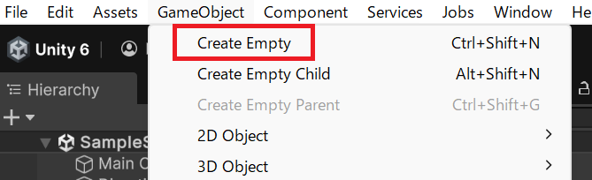

# Rigidbody で力を加える

Rigidbody コンポーネントへの参照をスクリプトから取得し、**力（Force）を加えてオブジェクトを動かす**方法を学びます。キーボード入力と組み合わせることで、プレイヤーキャラクターの移動制御を実装できます。

## 学習目標

このページを読み終えると、以下のことができるようになります。

- `Start` でコンポーネントをキャッシュして `Update` で使うパターンを使える
- `Rigidbody.AddForce()` でオブジェクトに力を加えられる
- キーボード入力に応じてオブジェクトを動かせる

## 前提知識

- [チュートリアル: 歩行者信号機](/unity-csharp-learning/unity/traffic-light/) を読んでいること

---

## 1. 空のゲームオブジェクトにスクリプトを設定する

メニューバーの GameObject → Create Empty を選択し、空のゲームオブジェクトを作成してスクリプトを追加してください。



---

## 2. 球体を作成し物理を有効にする

追加したスクリプトの、`Start` メソッドで球体を生成して Rigidbody コンポーネントを追加しましょう。`AddComponent` メソッドは追加したコンポーネントを結果として返すので、これをフィールドに保持しておくことで、後続の `Update` では毎フレーム再取得せずに物理操作に使えます。


```csharp
using UnityEngine;
using UnityEngine.InputSystem;

public class Sample : MonoBehaviour
{
    private Rigidbody _rigidbody;  // ← フィールドに保存

    private void Start()
    {
        var sphere = GameObject.CreatePrimitive(PrimitiveType.Sphere);
        _rigidbody = sphere.AddComponent<Rigidbody>(); // 追加したコンポーネントをフィールドに保存
    }

    private void Update()
    {
        // _rigidbody を使って毎フレーム処理
    }
}
```

この時点で物理が有効になるので、球体は重力によって落ちていくはずです。

> 💡 **ポイント**: `GetComponent` は毎フレーム呼ぶとパフォーマンスへの影響が積み重なります。`Start` で取得してフィールドに持っておきましょう。

---

## 3. AddForce() で力を加える

Rigidbody コンポーネントの **`AddForce()`** メソッドで、オブジェクトに力を加えられます。加えた力は物理エンジンによって自動的に速度・移動に変換されます。

**`Rigidbody.AddForce()`** — Rigidbody に力を加えます。<!-- [公式ドキュメント]() -->

**書式：Rigidbody.AddForce メソッド**

```csharp
public void AddForce(Vector3 force);
```

| パラメータ | 説明 |
|---|---|
| `force` | 加える力の方向と大きさ（`Vector3`） |

`Vector3` は X・Y・Z の3方向の値を持つ構造体です（[Transform ページ](/unity-csharp-learning/unity/transform/)で解説済み）。たとえば `new Vector3(1, 0, 0)` は X 軸方向に 1 の力を意味します。

---

## 4. キーボード入力で移動する

Input System のキー入力と `AddForce` を組み合わせると、キーボードでオブジェクトを動かせます。

```csharp
using UnityEngine;
using UnityEngine.InputSystem;

public class Sample : MonoBehaviour
{
    private Rigidbody _rigidbody;

    private void Start()
    {
        var sphere = GameObject.CreatePrimitive(PrimitiveType.Sphere);
        _rigidbody = sphere.AddComponent<Rigidbody>();
    }

    private void Update()
    {
        var move = Vector3.zero;

        if (Keyboard.current.rightArrowKey.isPressed) move.x += 1f;
        if (Keyboard.current.leftArrowKey.isPressed) move.x -= 1f;
        if (Keyboard.current.upArrowKey.isPressed) move.y += 1f;
        if (Keyboard.current.downArrowKey.isPressed) move.y -= 1f;

        _rigidbody.AddForce(move);
    }
}
```

`move` は `Vector3.zero`（全方向ゼロ）から始まり、押されているキーに応じて X または Y 方向の値を足しています。最終的に `AddForce` に渡すと、その方向に力が加わります。

球体は重力によって Y 軸のマイナス方向に重力加速度がかかり続けます。上キーを押し続けることで、これを打ち消して上方向に持ち上げることができます。

---

### 動作確認の手順

1. 新しいシーンを作成する
2. **GameObject → 3D Object → Sphere** で Sphere を追加し、名前を `Player` にする
3. Inspector ビューで **Add Component → Rigidbody** を追加する
4. 空の GameObject に `Player` スクリプトを作成してアタッチする（またはそのまま Sphere にアタッチ）
5. Play ボタンを押して方向キーで球体を動かす

---

## まとめ

- `GetComponent<T>()` で Inspector から追加されたコンポーネントの参照を取得できる
- `GetComponent` は `Start` で一度だけ呼び、フィールドに保存しておく
- `AddForce(Vector3)` でオブジェクトに力を加えて物理的に移動させられる
- キー入力 → `Vector3` の組み立て → `AddForce` の流れで自然な移動操作を実現できる

---

## 理解度チェック

1. `GetComponent<T>()` を `Update` ではなく `Start` で呼ぶ理由は何ですか？
2. `AddForce(new Vector3(0, 0, 1))` はどの方向に力を加えますか？
3. キーを離したとき、Rigidbody は即座に停止しますか？それとも少しずつ遅くなりますか？

<details markdown="1">
<summary>解答を見る</summary>

1. `GetComponent` はコストのかかる処理で、毎フレーム呼ぶとパフォーマンスへの影響が積み重なるため。`Start` で一度だけ取得してフィールドに保持する。
2. Z 軸方向（画面奥方向）に力が加わる。
3. 少しずつ遅くなる。物理エンジンの摩擦・抵抗が働いて減速する（Rigidbody の Drag 設定に依存）。

</details>

---

## 次のステップ

[Collider とトリガー判定](/unity-csharp-learning/unity/collider-trigger/) では、オブジェクト同士が重なったことをスクリプトで検知する方法を学びます。
