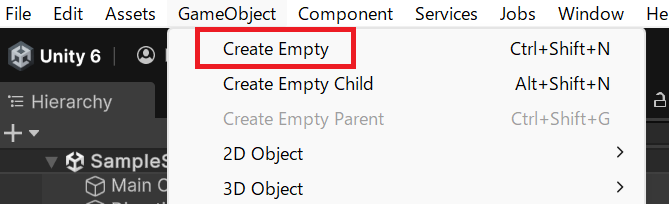

# Rigidbody で力を加える

Rigidbody コンポーネントへの参照をスクリプトから取得し、**力（Force）を加えてオブジェクトを動かす**方法を学びます。キーボード入力と組み合わせることで、プレイヤーキャラクターの移動制御を実装できます。

## 学習目標

このページを読み終えると、以下のことができるようになります。

- `Start` でコンポーネントをキャッシュして `FixedUpdate` で使うパターンを使える
- `Rigidbody.AddForce()` でオブジェクトに力を加えられる
- 物理演算の処理を `Update` ではなく `FixedUpdate` に書く理由を説明できる
- キーボード入力に応じてオブジェクトを動かせる

## 前提知識

- [線形補間アニメーション（Lerp）](/unity-csharp-learning/unity/lerp-animation/) を読んでいること

---

## 1. 空のゲームオブジェクトにスクリプトを設定する

メニューバーの GameObject → Create Empty を選択し、空のゲームオブジェクトを作成してスクリプトを追加してください。



---

## 2. 球体を作成し物理を有効にする

追加したスクリプトの、`Start` メソッドで球体を生成して Rigidbody コンポーネントを追加しましょう。`AddComponent` メソッドは追加したコンポーネントを結果として返すので、これをフィールドに保持しておくことで、後続の `FixedUpdate` では呼ばれるたびに再取得せずに物理操作に使えます。

`FixedUpdate` は、`Update` と同じように繰り返し呼ばれるメソッドです。物理演算に関わる処理は、`Update` ではなく `FixedUpdate` に書きます。理由は 4 節で説明します。

```csharp
using UnityEngine;
using UnityEngine.InputSystem;

public class Sample : MonoBehaviour
{
    private Rigidbody _rigidbody;  // ← フィールドに保存

    private void Start()
    {
        var sphere = GameObject.CreatePrimitive(PrimitiveType.Sphere);
        _rigidbody = sphere.AddComponent<Rigidbody>(); // 追加したコンポーネントをフィールドに保存
    }

    private void FixedUpdate()
    {
        // _rigidbody を使った物理演算の処理
    }
}
```

この時点で物理が有効になるので、球体は重力によって落ちていくはずです。

> 💡 **ポイント**: `GetComponent` は毎フレーム呼ぶとパフォーマンスへの影響が積み重なります。`Start` で取得してフィールドに持っておきましょう。

---

## 3. AddForce() で力を加える

Rigidbody コンポーネントの **`AddForce()`** メソッドで、オブジェクトに力を加えられます。加えた力は物理エンジンによって自動的に速度・移動に変換されます。

**`Rigidbody.AddForce()`** — Rigidbody に力を加えます。

**書式：[Rigidbody.AddForce メソッド](https://docs.unity3d.com/ScriptReference/Rigidbody.AddForce.html)**

```csharp
public void AddForce(Vector3 force);
```

| パラメータ | 説明 |
|---|---|
| `force` | 加える力の方向と大きさ（`Vector3`） |

`Vector3` は X・Y・Z の3方向の値を持つ構造体です（[Transform ページ](/unity-csharp-learning/unity/transform/)で解説済み）。たとえば `new Vector3(1, 0, 0)` は X 軸方向に 1 の力を意味します。

---

## 4. FixedUpdate で力を加える

`AddForce` は、[Update メソッドと連続実行](/unity-csharp-learning/unity/update-basics/) で使った `Update` ではなく、**`FixedUpdate` メソッド**の中で呼びます。

**`MonoBehaviour.FixedUpdate()`** — 物理演算の時間が一定の間隔（既定は 0.02 秒）進むたびに、その直前に呼ばれます。

**書式：[MonoBehaviour.FixedUpdate メソッド](https://docs.unity3d.com/ScriptReference/MonoBehaviour.FixedUpdate.html)**
```csharp
private void FixedUpdate();
```

物理演算は、画面の描画とは別に、既定では 0.02 秒（1 秒間に 50 回）ずつ時間を進めます。`AddForce` で加えた力は、呼んだ時点ではためておかれ、次に物理演算が進むときにまとめて適用されます。

`AddForce` を `Update` で呼ぶと、物理演算 1 回の間に `Update` が何回呼ばれるかによって、加わる力が変わってしまいます。

| フレームレート | 物理演算 1 回あたりの `Update` | 物理演算 1 回あたりに加わる力 |
|---|---|---|
| 25 fps | 0.5 回（2 回に 1 回は `Update` がない） | 力が加わらない回がある |
| 50 fps | 1 回 | 1 回分 |
| 100 fps | 2 回 | 2 回分（2 倍の力） |

これは、[Update メソッドと連続実行](/unity-csharp-learning/unity/update-basics/) の「フレームレート依存の問題」と同じ種類の問題です。`FixedUpdate` は、フレームレートに関係なく、物理演算 1 回の直前に必ず 1 回呼ばれます。そのため、`FixedUpdate` で `AddForce` を呼べば、物理演算 1 回あたりに加わる力は一定になります。

> 💡 **ポイント**: `FixedUpdate` は物理演算の間隔で呼ばれるので、1 フレームに 0 回のことも、複数回のこともあります。`Start`、`Update`、`FixedUpdate` などがどの順序で呼ばれるのかは、[補足: Unity のメッセージと実行順序](/unity-csharp-learning/unity/messages/) で図にしています。

`AddForce` に渡す力は、物理演算の間隔を考慮して適用されます。`Update` で移動量を計算したときのように、`Time.deltaTime` を掛ける必要はありません。物理演算の間隔を表す `Time.fixedDeltaTime` は、[Time クラスと時間制御](/unity-csharp-learning/unity/time-basics/) で扱っています。

---

## 5. キーボード入力で移動する

Input System のキー入力と `AddForce` を組み合わせると、キーボードでオブジェクトを動かせます。

```csharp
using UnityEngine;
using UnityEngine.InputSystem;

public class Sample : MonoBehaviour
{
    private Rigidbody _rigidbody;

    private void Start()
    {
        var sphere = GameObject.CreatePrimitive(PrimitiveType.Sphere);
        _rigidbody = sphere.AddComponent<Rigidbody>();
    }

    private void FixedUpdate()
    {
        var move = Vector3.zero;

        if (Keyboard.current.rightArrowKey.isPressed) move.x += 1f;
        if (Keyboard.current.leftArrowKey.isPressed) move.x -= 1f;
        if (Keyboard.current.upArrowKey.isPressed) move.y += 1f;
        if (Keyboard.current.downArrowKey.isPressed) move.y -= 1f;

        _rigidbody.AddForce(move * 15f); // 15 は力の大きさ
    }
}
```

`move` は `Vector3.zero`（全方向ゼロ）から始まり、押されているキーに応じて X または Y 方向の値を足しています。最後に力の大きさ `15f` を掛けて `AddForce` に渡すと、その方向に力が加わります。

球体には、重力によって Y 軸のマイナス方向に力がかかり続けています。Rigidbody の質量は既定で 1 なので、重力の大きさは約 9.8 です。上キーを押している間は、それより大きい 15 の力が上向きに加わるので、重力を打ち消して球体を持ち上げることができます。すでに落ちている球体は、まず落下が遅くなり、それから上に動き出します。

> 💡 **ポイント**: `isPressed` は、キーを押している間ずっと `true` になるので、`FixedUpdate` の中で調べても問題ありません。一方、押した瞬間の 1 フレームだけ `true` になる `wasPressedThisFrame` を `FixedUpdate` の中で調べると、`FixedUpdate` が呼ばれないフレームでは見逃し、1 フレームに 2 回呼ばれると 2 回とも `true` になります。ジャンプのような単発の操作は、`Update` で入力を調べてフィールドに記録しておき、`FixedUpdate` で力を加えます。

---

### 動作確認の手順

1. 新しいシーンを作成する
2. **GameObject → Create Empty** で空の GameObject を追加する
3. 空の GameObject に `Sample` スクリプトを作成してアタッチする
4. Play ボタンを押して方向キーで球体を動かす

球体は落下を始めます。→キーと←キーを押している間は左右に加速します。↑キーを押している間は上向きの力が重力を上回るので、落下がだんだん遅くなり、やがて上向きに動き出します。

球体は 1 秒ほどで画面の下に出てしまうので、Play ボタンを押したらすぐに↑キーを押してください。

---

## まとめ

- `AddComponent<T>()` の戻り値を使うと、追加したコンポーネントの参照をすぐフィールドに保存できる
- コンポーネント参照は `Start` で取得または追加し、`FixedUpdate` では再利用する
- `AddForce(Vector3)` でオブジェクトに力を加えて物理的に移動させられる
- 物理演算は一定の間隔（既定 0.02 秒）で進むので、`AddForce` は物理演算 1 回の直前に呼ばれる `FixedUpdate` で呼ぶ
- キー入力 → `Vector3` の組み立て → `AddForce` の流れで自然な移動操作を実現できる

---

## 理解度チェック

1. `GetComponent<T>()` を `FixedUpdate` ではなく `Start` で呼ぶ理由は何ですか？
2. `AddForce(new Vector3(0, 0, 1))` はどの方向に力を加えますか？
3. `AddForce` を `Update` の中で呼ぶと、どのような問題が起きますか？
4. 5 節のコードで→キーを押して離したとき、球体の左右の動きは止まりますか？

<details markdown="1">
<summary>解答を見る</summary>

1. `GetComponent` はコストのかかる処理で、繰り返し呼ぶとパフォーマンスへの影響が積み重なるため。`Start` で一度だけ取得してフィールドに保持する。
2. Z 軸方向（画面奥方向）に力が加わる。
3. 物理演算 1 回の間に `Update` が呼ばれる回数がフレームレートによって変わるため、加わる力が変わる。フレームレートが高い環境では力が強くなり、低い環境では力が加わらない回ができる。
4. 止まらない。力を加えるのをやめても、それまでに付いた速度は残る。空中には球体を減速させる床の摩擦がなく、Rigidbody の空気抵抗（Linear Damping）も既定では 0 なので、左右には同じ速さで動き続ける（上下は重力で落下し続ける）。

</details>

---

## 次のステップ

[Collider とトリガー判定](/unity-csharp-learning/unity/collider-trigger/) では、オブジェクト同士が重なったことをスクリプトで検知する方法を学びます。
