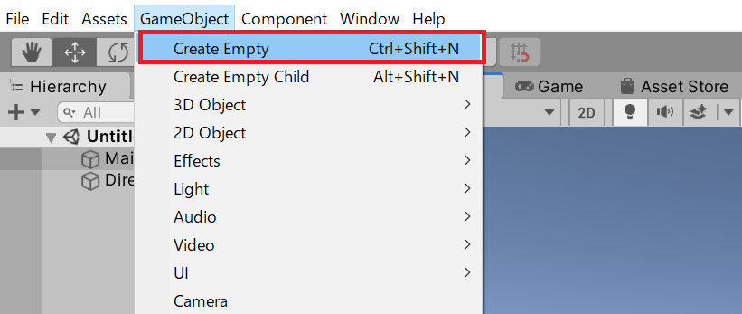
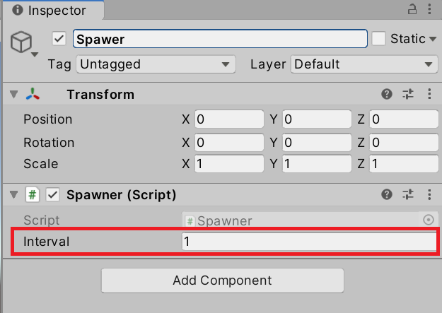
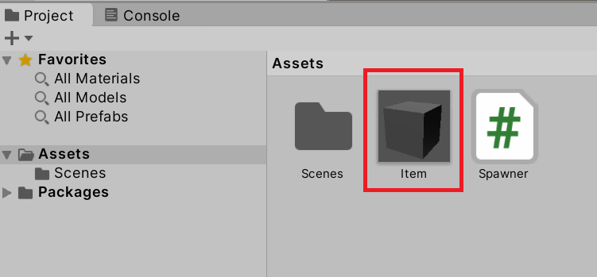
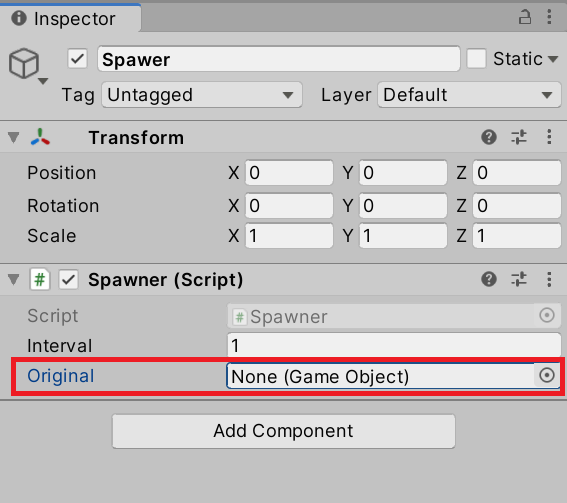
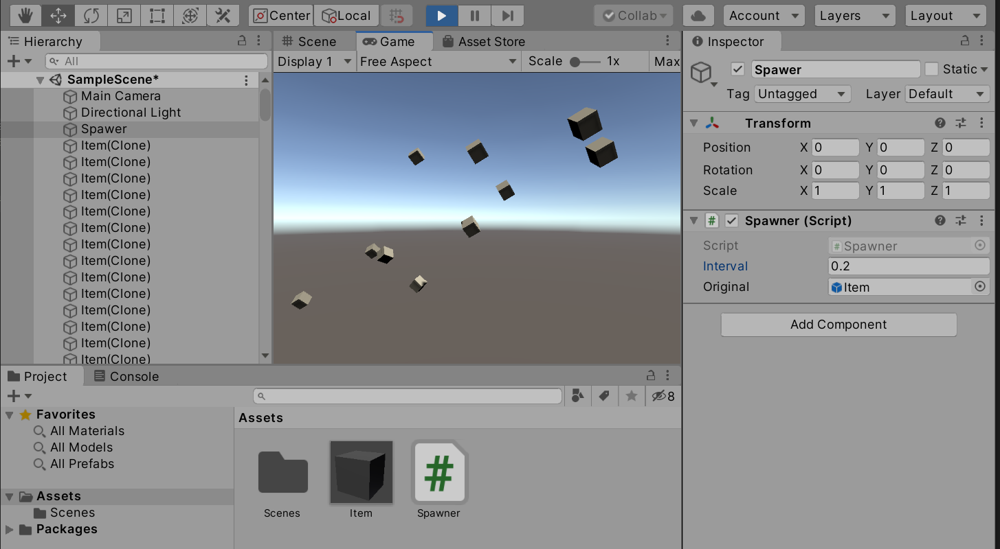

# チュートリアル: スポナー

一定時間ごとにプレハブからオブジェクトを生成し続ける**スポナー（Spawner）**を実装します。時間計測・`Instantiate()`・親子関係を組み合わせて、ゲームでよく使われる「敵やアイテムが湧く」仕組みの基本を作ります。

## 学習目標

- `Time.deltaTime` の累積で経過時間を計測できる
- `[SerializeField]` で生成間隔をパラメータ化できる
- プレハブから `Instantiate()` でオブジェクトを動的に生成できる
- `Random.Range()` でランダムな値を生成できる
- 親子関係を使って生成数の上限を管理できる

## 前提知識

- [Rigidbody で力を加える](/unity-csharp-learning/unity/rigidbody-force/) を読んでいること
- [プレハブ（Prefab）](/unity-csharp-learning/unity/prefab-basics/) を読んでいること
- [Instantiate() でオブジェクトを生成する](/unity-csharp-learning/unity/instantiate/) を読んでいること
- [GameObject の親子関係](/unity-csharp-learning/unity/gameobject-hierarchy/) を読んでいること

---

## 1. スポナーオブジェクトを作る

Hierarchy ビューを右クリックして **Create Empty** を選択し、空の GameObject を作ります。名前を `Spawner` に変更し、Position を `(X=0, Y=0, Z=0)` に設定します。



次に、Inspector ビューの **Add Component** から `Spawner` スクリプトを新規作成してアタッチします。

---

## 2. 経過時間を計測する

スポナーの核心は「一定時間が経過したかどうかの判定」です。`Time.deltaTime`（前フレームからの経過秒数）を毎フレーム加算し続けることで、経過時間を計測できます。

```csharp
// Spawner.cs
using UnityEngine;

public class Spawner : MonoBehaviour
{
    private float _elapsed;  // 経過時間（秒）

    private void Update()
    {
        _elapsed += Time.deltaTime;

        if (_elapsed > 1f)
        {
            _elapsed = 0f;
            Debug.Log("1秒経過");
        }
    }
}
```

`_elapsed` に `Time.deltaTime` を加え続けると、1秒後に `_elapsed > 1f` が `true` になります。その時点でリセットすることで、1秒ごとに繰り返し処理を実行できます。

---

## 3. 生成間隔をパラメータ化する

生成間隔をコード内に固定で書かず、`[SerializeField]` で Inspector から調整できるようにします。

```csharp
// Spawner.cs
using UnityEngine;

public class Spawner : MonoBehaviour
{
    [SerializeField]
    private float _interval = 1f;  // 生成間隔（秒）

    private float _elapsed;

    private void Update()
    {
        _elapsed += Time.deltaTime;

        if (_elapsed > _interval)
        {
            _elapsed = 0f;
            Debug.Log("スポーン");
        }
    }
}
```



`_interval` の値を Inspector から変更するだけで、生成間隔を自由に調整できます。

---

## 4. プレハブからアイテムを生成する

### アイテムプレハブを用意する

スポナーが生成するアイテムをプレハブとして用意します。

1. **GameObject → 3D Object → Cube** を追加し、名前を `Item` にする
2. Inspector で Transform を設定する

| プロパティ | 値 |
|---|---|
| Rotation | X=45, Y=45, Z=45 |
| Scale | X=0.5, Y=0.5, Z=0.5 |

3. Inspector の **Add Component → Physics → Rigidbody** を追加する
4. Hierarchy ビューの `Item` を Project ビューへドラッグ & ドロップしてプレハブ化する
5. シーン上の `Item` は削除する



### スクリプトにプレハブを設定する

`[SerializeField]` でプレハブを受け取るフィールドを追加し、`Instantiate()` で複製します。

```csharp
// Spawner.cs
using UnityEngine;

public class Spawner : MonoBehaviour
{
    [SerializeField]
    private float _interval = 1f;

    [SerializeField]
    private GameObject _original;  // 複製元のプレハブ

    private float _elapsed;

    private void Update()
    {
        _elapsed += Time.deltaTime;

        if (_elapsed > _interval)
        {
            _elapsed = 0f;
            Instantiate(_original, transform.position, Quaternion.identity);
        }
    }
}
```



Inspector ビューの **Original** 欄に、作成した Item プレハブを設定します。実行すると `_interval` 秒ごとに Item がスポーナーの位置に生成されます。

> ⚠️ `_original` が `null`（Inspector で `None` のまま）だと実行時エラーになります。必ずプレハブを設定してから実行してください。

`Instantiate(_original, transform.position, Quaternion.identity)` とすることで、スポナーオブジェクトの位置にアイテムが生成されます。スポナーを複数配置すれば、それぞれの位置から独立してスポーンします。

---

## 5. 生成直後にランダムな力を加える

`Instantiate()` の戻り値からコンポーネントを取得して、生成直後のオブジェクトを操作できます。`Random.Range()` で毎回異なる方向に飛ばしてみましょう。

**`Random.Range()`** — 指定した範囲内のランダムな値を返します。<!-- [公式ドキュメント]() -->

**書式：Random.Range メソッド**
```csharp
public static float Range(float minInclusive, float maxInclusive);
```

| パラメータ | 説明 |
|---|---|
| `minInclusive` | 最小値（この値を含む） |
| `maxInclusive` | 最大値（この値を含む） |

```csharp
// Spawner.cs
using UnityEngine;

public class Spawner : MonoBehaviour
{
    [SerializeField]
    private float _interval = 1f;

    [SerializeField]
    private GameObject _original;

    private float _elapsed;

    private void Update()
    {
        _elapsed += Time.deltaTime;

        if (_elapsed > _interval)
        {
            _elapsed = 0f;

            var item = Instantiate(_original, transform.position, Quaternion.identity);
            var rb = item.GetComponent<Rigidbody>();

            var x = Random.Range(-5f, 5f);
            var y = Random.Range( 3f, 10f);
            var z = Random.Range(-5f, 5f);
            rb.AddForce(new Vector3(x, y, z), ForceMode.Impulse);
        }
    }
}
```

`ForceMode.Impulse` は「瞬間的な力」を意味します。`AddForce` の既定は継続的な力（`Force`）ですが、`Impulse` を指定すると1フレームで一気に速度が乗り、ボールを蹴るような動きになります。



実行すると、毎回異なる方向にアイテムが飛び出します。

---

## 完成コード

<details markdown="1">
<summary>Spawner.cs（完成版）</summary>

```csharp
using UnityEngine;

public class Spawner : MonoBehaviour
{
    [SerializeField]
    private float _interval = 1f;

    [SerializeField]
    private GameObject _original;

    private float _elapsed;

    private void Update()
    {
        _elapsed += Time.deltaTime;

        if (_elapsed > _interval)
        {
            _elapsed = 0f;

            var item = Instantiate(_original, transform.position, Quaternion.identity);
            var rb = item.GetComponent<Rigidbody>();

            var x = Random.Range(-5f, 5f);
            var y = Random.Range( 3f, 10f);
            var z = Random.Range(-5f, 5f);
            rb.AddForce(new Vector3(x, y, z), ForceMode.Impulse);
        }
    }
}
```

</details>

---

## 課題

### 課題1: 複数のスポナーを設置する

シーンに Spawner オブジェクトを複数配置し、それぞれが独立した位置からスポーンすることを確認してください。

ヒント: Spawner オブジェクトを右クリック → **Duplicate** で複製し、Position を変えるだけで完成します。`transform.position` を使って生成しているため、各スポナーが自分の位置で生成します。

---

### 課題2: 出現上限を設ける

スポナーから出現するアイテムの最大数を設定し、上限に達したらスポーンを停止してください。アイテムが破棄されて上限を下回ると、再びスポーンを再開します。

ヒント: `Instantiate()` に `transform` を親として渡すと（`Instantiate(_original, transform)`）、生成したアイテムは Spawner の子オブジェクトになります。子が破棄されれば `transform.childCount` も減るため、「現在の出現数 ＝ `transform.childCount`」として管理できます。

<details markdown="1">
<summary>解答を見る</summary>

```csharp
using UnityEngine;

public class Spawner : MonoBehaviour
{
    [SerializeField]
    private float _interval = 1f;

    [SerializeField]
    private GameObject _original;

    [SerializeField]
    private int _maxCount = 5;  // 最大出現数

    private float _elapsed;

    private void Update()
    {
        _elapsed += Time.deltaTime;

        if (_elapsed > _interval)
        {
            _elapsed = 0f;

            if (transform.childCount >= _maxCount) return;  // 上限チェック

            var item = Instantiate(_original, transform);   // Spawner の子として生成
            item.transform.position = transform.position;   // スポナー位置に配置

            var rb = item.GetComponent<Rigidbody>();
            var x = Random.Range(-5f, 5f);
            var y = Random.Range( 3f, 10f);
            var z = Random.Range(-5f, 5f);
            rb.AddForce(new Vector3(x, y, z), ForceMode.Impulse);
        }
    }
}
```

アイテムが `OnTriggerEnter` などで `Destroy()` されると子から除外され、`transform.childCount` が減ります。上限を下回ると再びスポーンします。

</details>

---

### 課題3: ラッキーアイテムをランダムで出現させる

通常アイテムとは別に、低確率でラッキーアイテムをスポーンさせてみましょう。

ヒント: `Random.Range(0f, 1f)` は 0.0〜1.0 の乱数を返します。例えば `< 0.1f` の条件にすれば 10% の確率になります。ラッキーアイテム用のプレハブを `[SerializeField]` で別に用意し、確率によって `Instantiate()` するプレハブを切り替えます。

<details markdown="1">
<summary>解答を見る</summary>

```csharp
[SerializeField]
private float _luckyChance = 0.1f;  // ラッキーアイテムの出現確率（10%）

[SerializeField]
private GameObject _luckyItem;

// スポーン時の処理内で
var prefab = Random.Range(0f, 1f) < _luckyChance ? _luckyItem : _original;
Instantiate(prefab, transform.position, Quaternion.identity);
```

</details>

---

## まとめ

- `_elapsed += Time.deltaTime` の累積で経過時間を計測できる
- `[SerializeField]` で生成間隔や複製元プレハブを Inspector から設定できる
- `Instantiate(original, position, rotation)` でスポナーの位置にオブジェクトを生成できる
- `Random.Range()` で毎回異なる値を取得して動きにばらつきを持たせられる
- `Instantiate(original, transform)` で親子関係を使い、出現数を `childCount` で管理できる

---

## 理解度チェック

1. `_elapsed += Time.deltaTime` を毎フレーム実行すると、`_elapsed` の値はどのように変化しますか？
2. `Instantiate(_original)` と `Instantiate(_original, transform.position, Quaternion.identity)` の違いは何ですか？
3. 出現上限を `transform.childCount` で管理するとき、アイテムを `Instantiate` する際に何を変える必要がありますか？

<details markdown="1">
<summary>解答を見る</summary>

1. 毎フレームの処理時間（秒）が加算され続けるため、現実時間と同じ速度で増加する。60fps なら1フレームあたり約 0.0167 が加算される。
2. 前者は `_original` と同じ位置（多くの場合は原点）に生成される。後者はスポナー自身の位置（`transform.position`）に生成される。
3. `Instantiate(_original, transform)` のように親 Transform を渡して、生成したオブジェクトを Spawner の子にする必要がある。

</details>
