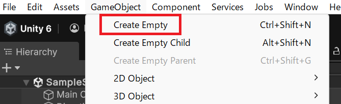
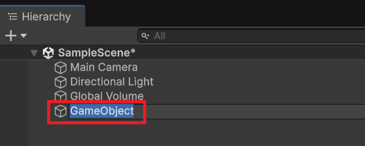
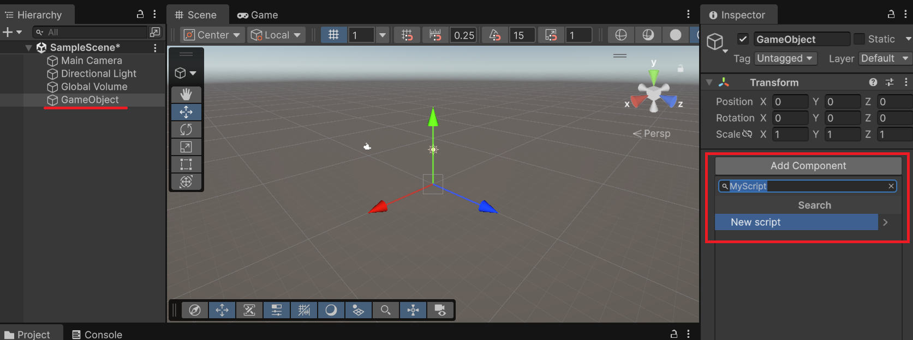
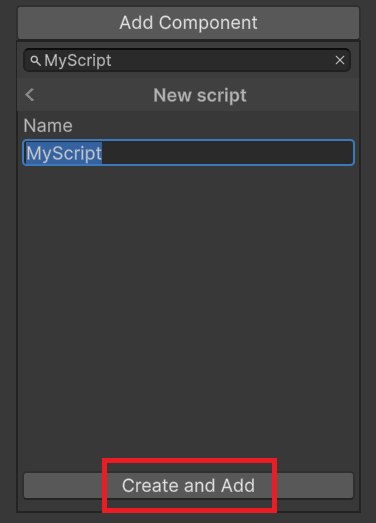

# Start メソッドとスクリプトの仕組み

Unity では C# スクリプトをゲームオブジェクトに紐づけることで、ゲームの動作をプログラムで制御できます。このページでは、スクリプトの作成方法と、最初に理解すべき **Start メソッド** の仕組みを学びます。

## 学習目標

- Unity スクリプトの作成手順とゲームオブジェクトへのアタッチ方法を説明できる
- MonoBehaviour クラスを継承する意味を理解できる
- Start メソッドが「ゲームを開始したとき1回だけ実行される」ことを理解できる

## 前提知識

- C# のクラスとメソッドの基本的な概念を理解していること

---

## 1. Unity スクリプトとは

Unity のスクリプトは C# で書かれたファイルです。スクリプトは単独では動作しません。**ゲームオブジェクトにコンポーネントとして追加（アタッチ）** することで、そのゲームオブジェクトの動作を制御できるようになります。

---

## 2. スクリプトを作成してアタッチする

スクリプトは単体では動作しません。ゲームオブジェクトに**コンポーネント**として追加（アタッチ）することで初めて実行されます。まずはスクリプトをアタッチするためのゲームオブジェクトを用意します。

**ステップ 1: 空のゲームオブジェクトを作成する**

メニューバーの **GameObject → Create Empty** を選択します。



**ステップ 2: ゲームオブジェクトに名前を付ける**

Hierarchy ビューに「GameObject」という名前のオブジェクトが追加されます。何のためのオブジェクトかわかりやすい名前に変更しましょう。

名前を変更するには、Hierarchy ビューでオブジェクトを選択した状態でもう一度クリックするか、Inspector ビュー上部のテキストボックスで変更できます。



**ステップ 3: Add Component からスクリプトを追加する**

名前を変更したゲームオブジェクトを選択した状態で、Inspector ビューの **Add Component** ボタンを押します。テキストボックスに作成するスクリプト名を入力します。まだそのスクリプトが存在しない場合は **New script** という項目が表示されます。



**ステップ 4: スクリプトを新規作成する**

**New script** を選択すると、作成するスクリプト名が確認できます。入力した名前が転写されているのを確認したら **Create and Add** ボタンを押してください。



**ステップ 5: アタッチを確認する**

プロジェクトにスクリプトファイルが作成され、同時にゲームオブジェクトにアタッチされます。Inspector ビューにスクリプトのコンポーネントが追加されていれば成功です。ゲームを実行するとこのスクリプトが実行されるようになりました。


---

## 3. MonoBehaviour の基本構造

作成されたスクリプトを開くと、次のようなコードが自動生成されています。

```csharp
using UnityEngine;

public class MyScript : MonoBehaviour
{
    private void Start()
    {
    }

    private void Update()
    {
    }
}
```

各部分の大まかな意味を確認しておきましょう。

- **`using UnityEngine;`**: Unity の機能（`GameObject` など）をこのファイルで使えるようにする宣言です。
- **`public class MyScript`**: スクリプトの本体（**クラス**）の定義です。クラスとは、関連するデータや処理をひとまとめにした設計図のようなものです。`public` はこのクラスを他の場所からも使えるようにする指定です。
- **`: MonoBehaviour`（継承）**: `MonoBehaviour` は Unity が用意しているクラスで、これを継承することでゲームオブジェクトの動作をスクリプトで制御できるようになります。継承とは、別のクラスの機能をそのまま引き継ぐ仕組みです。
- **`private void Start()`**: `Start` という名前の**メソッド**（処理のまとまり）の定義です。`private` はこのクラス内からのみ使えること、`void` は処理の結果として値を返さないことを意味します。

> 💡 **ポイント**: クラス・継承・メソッドの詳細は C# 基礎の各ページで改めて学びます。ここでは「スクリプトはこういう構造になっている」と大まかに把握しておけば十分です。

---

## 4. Start メソッドの実行タイミング

`Start` メソッドは **ゲームを開始したとき（Play ボタンを押した直後）に1回だけ呼び出されます**。

```csharp
private void Start()
{
    // ゲーム開始時に1回だけ実行される
}
```

対して `Update` メソッドは **毎フレーム繰り返し呼び出され続けます**。

| メソッド | 実行タイミング | 用途の例 |
|---|---|---|
| `Start` | ゲーム開始時に1回 | 初期配置・初期化処理 |
| `Update` | 毎フレーム | 入力検知・継続的な移動処理 |

ゲームオブジェクトを最初に配置したり初期化したりする処理は `Start` に書きます。

---

## まとめ

- Unity スクリプトはゲームオブジェクトに **コンポーネントとしてアタッチ** して使う
- スクリプトは **`MonoBehaviour` を継承** することで Unity と連携できる
- **`Start` メソッドはゲーム開始時に1回だけ実行される**

---

## 理解度チェック

1. スクリプトを書いただけで実行されないのはなぜですか？
2. `Start` メソッドと `Update` メソッドの実行タイミングの違いは何ですか？
3. ゲームオブジェクトの初期位置を設定したい場合、`Start` と `Update` のどちらに書きますか？

<details markdown="1">
<summary>解答を見る</summary>

1. スクリプトはゲームオブジェクトに **コンポーネントとしてアタッチ** しなければ実行されないため。
2. `Start` はゲーム開始時に **1回だけ**、`Update` は **毎フレーム繰り返し** 実行される。
3. **`Start`** に書く。初期設定は1回だけ行えばよいため。

</details>

---

## 次のステップ

[GameObject の生成と操作](/unity-csharp-learning/unity/gameobject-basics/) では、Start メソッドの中でゲームオブジェクトをコードから生成する方法を学びます。
