# TextMesh Pro

Unity UI 上にテキストを表示する標準コンポーネント **TextMesh Pro** の利用方法を解説します。フォントの仕組みから Font Asset の作成、スクリプトからの操作まで学びます。

## 学習目標

このページを読み終えると、以下のことができるようになります。

- Unity で UI テキストを TextMesh Pro で表示できる
- 日本語フォントを Font Asset として作成できる
- スクリプトから TextMesh Pro のテキストを変更できる

## 前提知識

- [Unity UI とボタン操作](/unity-csharp-learning/unity/unity-ui/) を読んでいること

---

## 1. TextMesh Pro とは

TextMesh Pro は、現在の Unity で UI テキストを表示する方法として推奨される標準コンポーネントです。

かつて Unity は簡易なテキスト表示コンポーネント（便宜上 **UI Text** と呼ぶ）を標準機能としていましたが、ゲームや映像作品に組み込むには表現力に乏しかったため、有償アセットで人気だった TextMesh Pro が買収・統合された経緯があります。

現在も UI Text を使うことは可能です。UI Text を追加するには「GameObject」→「UI」→「Legacy」→「Text」を選択します。

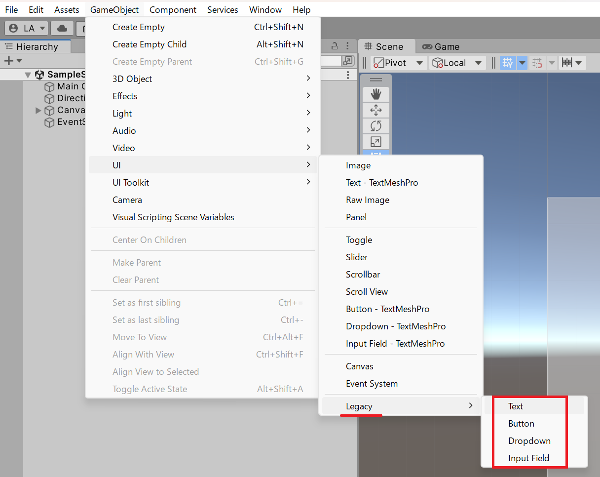

UI Text のメリットはコンポーネントが軽量で追加の設定が不要な点ですが、文字のレンダリング品質では TextMesh Pro が優位です。

TextMesh Pro を追加するには「GameObject」→「UI」→「Text - TextMesh Pro」を選択します。

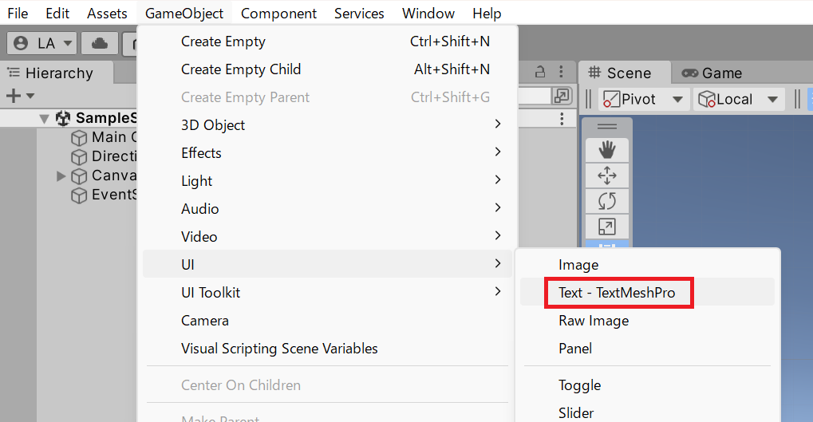

プロジェクトで初めて TextMesh Pro を使う場合、「TMP Importer」ダイアログが表示されます。「Import TMP Essentials」ボタンを押してアセットをインポートしてください。

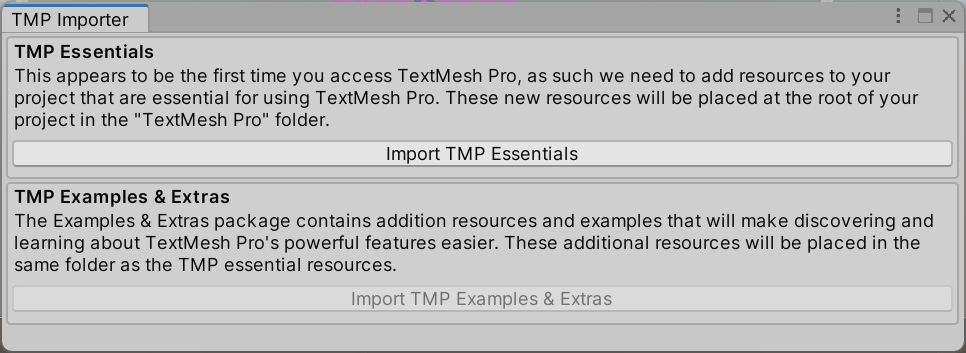

インポートが完了すると、Assets フォルダー内に「TextMesh Pro」フォルダーが作成されます。

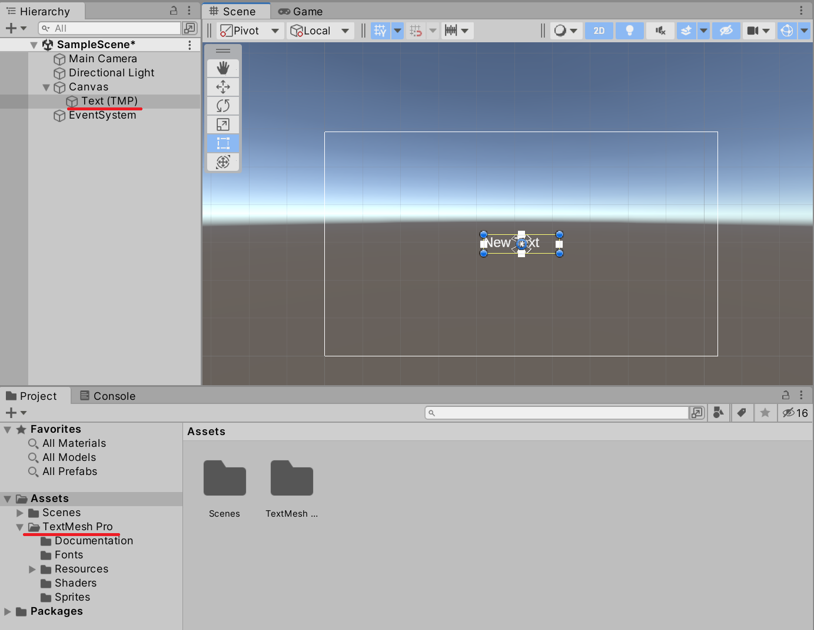

これで TextMesh Pro コンポーネントを持つゲームオブジェクトを追加できました。ただし、この時点ではアルファベットは表示できますが、日本語を入力しても表示されません。

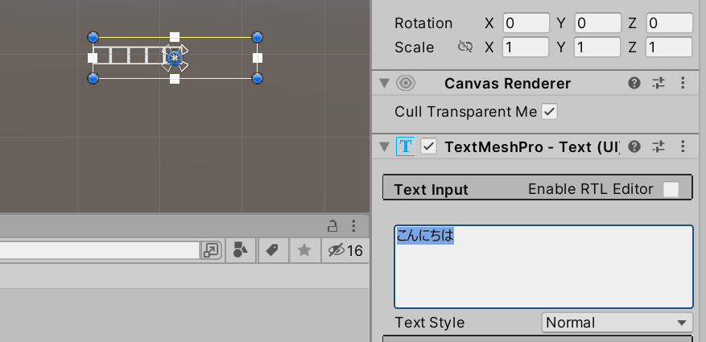

TextMesh Pro の標準フォントが日本語に対応していないためです。日本語を表示するには、日本語対応の **Font Asset** を作成する必要があります。

---

## 2. フォントと再配布

文字を表示するにはフォントデータが必要です。

ゲームにフォントを組み込む場合、システム標準フォントは再配布ライセンスを認めていないことが多いため使用できません。ゲームパッケージには**再配布可能ライセンスのフォント**を組み込む必要があります。主な選択肢は以下の通りです。

| 方法 | 例 |
|---|---|
| 再配布可能な商業フォントを購入 | モリサワ など |
| 商用利用可能なフリーフォントを利用 | IPA フォント・Google Fonts など |
| フォントを自作する | — |

本ページでは、フリーで利用・再配布できる **IPA フォント（IPAex フォント）** を使います。以下のページから最新バージョンをダウンロードしてください。

[https://moji.or.jp/ipafont/](https://moji.or.jp/ipafont/)

ZIP を展開すると、以下のフォントファイルが含まれています。

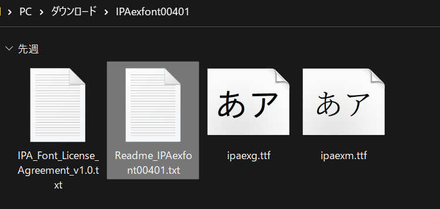

`ipaexg.ttf`（ゴシック体）と `ipaexm.ttf`（明朝体）がフォントデータです。フォルダーごと Unity の Assets フォルダーにドラッグ＆ドロップしてインポートしてください。

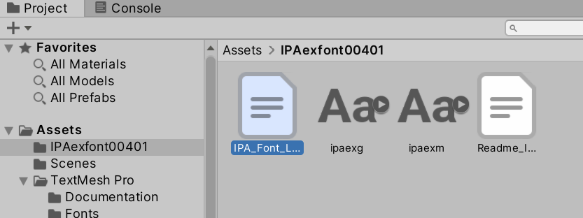

---

## 3. Font Asset を作成する

TextMesh Pro はビルボード的な平面メッシュに文字テクスチャを貼り付けることでテキストを表示します。

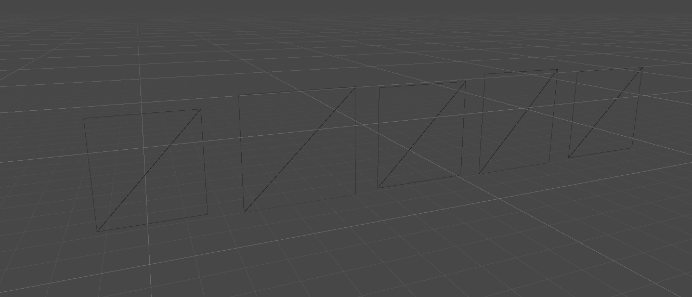

このフォントデータをテクスチャ化したものを**フォントアトラス**と呼び、TextMesh Pro に設定するフォントデータを **Font Asset** と呼びます。

Font Asset を作成するには「Window」→「TextMeshPro」→「Font Asset Creator」を選択します。

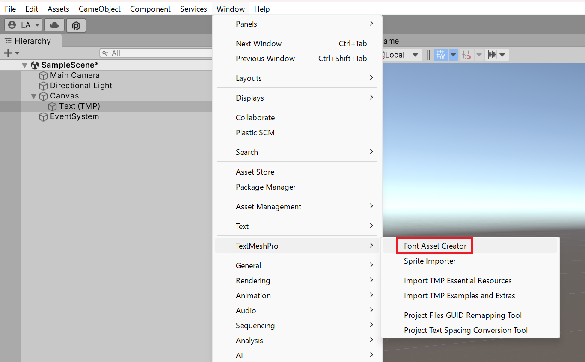

「Font Asset Creator」ダイアログが表示されたら、以下の項目を設定します。

| 設定項目 | 説明 |
|---|---|
| `Source Font File` | ダウンロードした IPA フォントを指定 |
| `Atlas Resolution` | テクスチャ解像度。高いほど綺麗だがサイズが増加 |
| `Character Set` | 生成する文字セット。日本語は `Custom Characters` を選択 |
| `Custom Character List` | テクスチャに書き込む文字の一覧 |

`Character Set` で「Custom Characters」を選ぶと下部に `Custom Character List` テキストボックスが表示されます。使用する文字を貼り付けてください。使用文字が事前に確定できない場合はひらがな・カタカナ・記号・常用漢字を含む文字セット（JIS X 0208 相当）を用意しておくと便利です。

[JIS X 0208 相当文字一覧](./JISX0208.txt)

上のリンクを開き、全文をコピーして `Custom Character List` に貼り付けてください。

設定が完了したら「Generate Font Atlas」ボタンを押します。ウィンドウ右側にプレビューが表示されます。

> ⚠️ **注意**: 全文字セットを含めた場合、フォントアトラスの生成には数分かかることがあります。生成中は Unity エディターが応答しなくなりますが、完了するまでそのまま待ってください。

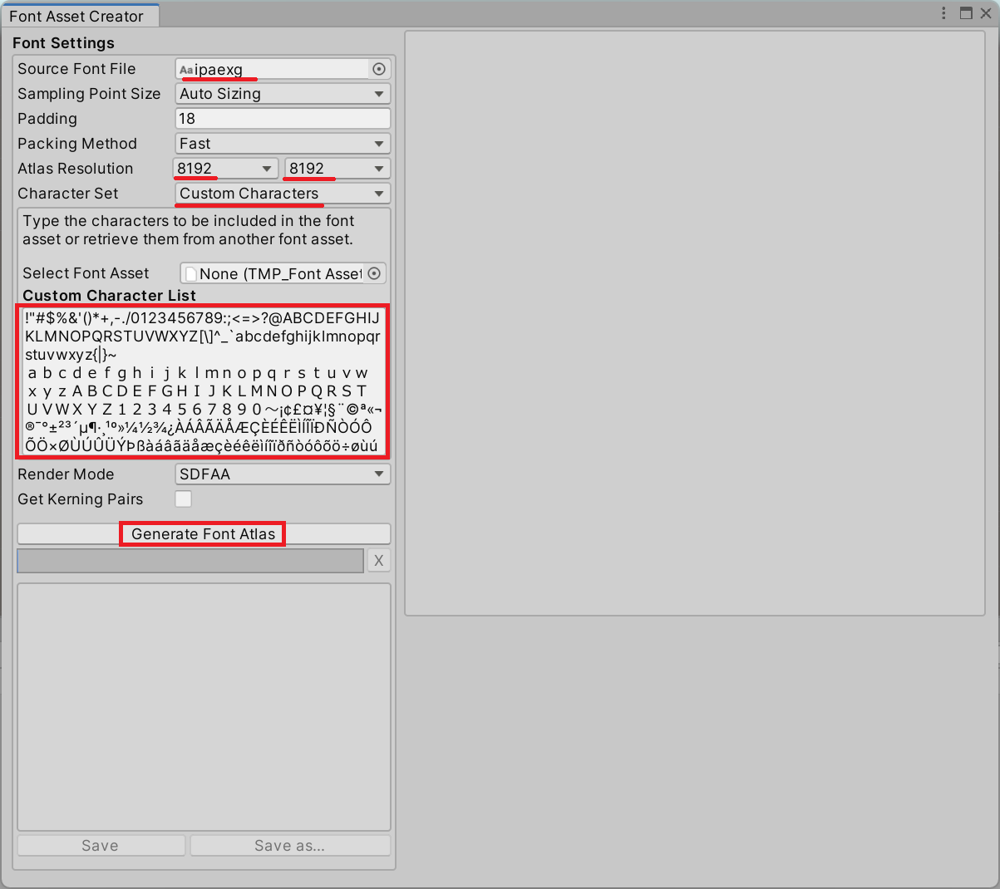

「Save」ボタンを押して Font Asset をプロジェクトに保存します。

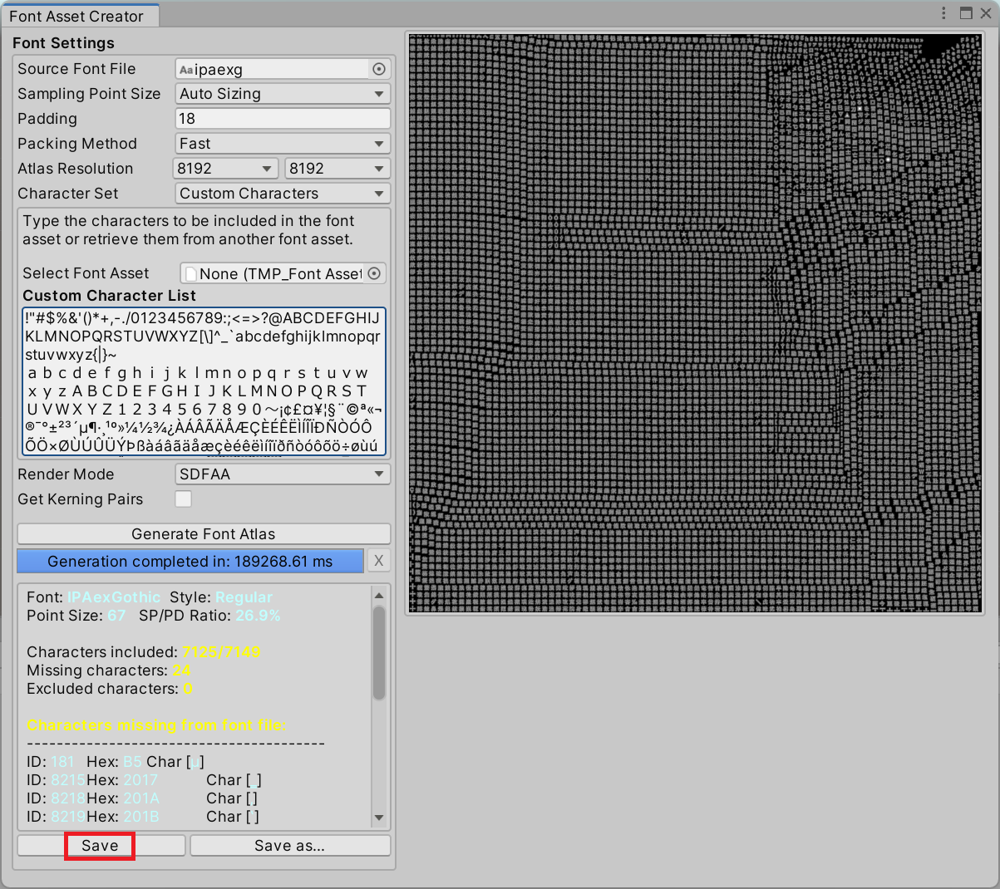

最後に、TextMesh Pro コンポーネントの「Font Asset」項目に生成した Font Asset を設定します。

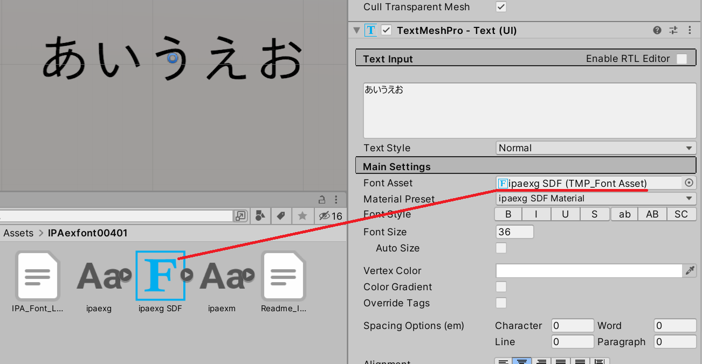

Font Asset が対象の文字を含んでいれば、日本語テキストが正しくレンダリングされます。

---

## 4. スクリプトから TextMesh Pro を操作する

C# スクリプトから TextMesh Pro コンポーネントを操作するには **`TMP_Text`** 型を使います。

**`TMP_Text`** — TextMesh Pro コンポーネントの基底クラスです。<!-- [公式ドキュメント]() -->

**書式：TMP_Text クラス**
```csharp
public abstract class TMP_Text : MaskableGraphic
```

表示テキストの取得・変更には **`text` プロパティ**を使います。

**`TMP_Text.text`** — TextMesh Pro に表示するテキストを取得または設定します。<!-- [公式ドキュメント]() -->

**書式：text プロパティ**
```csharp
public virtual string text { get; set; }
```

以下は `[SerializeField]` で参照を受け取り、`Start` でテキストを設定するサンプルです。

```csharp
using TMPro;
using UnityEngine;

public class Sample : MonoBehaviour
{
    [SerializeField]
    private TMP_Text _textUi = null;

    private void Start()
    {
        _textUi.text = "Hello TextMesh Pro";
    }
}
```

Inspector ビューの `_textUi` 欄に TextMesh Pro ゲームオブジェクトをドラッグして設定し、ゲームを実行すると指定したテキストが画面に表示されます。

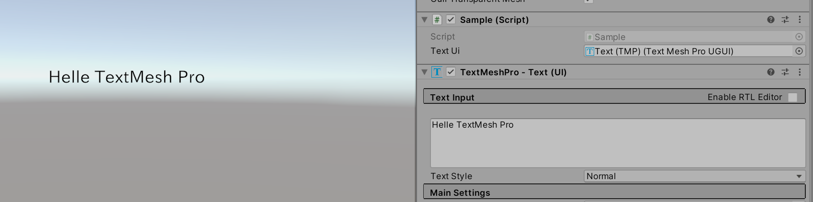

> 💡 **ポイント**: `TMP_Text` は `TextMeshProUGUI`（Unity UI 用）と `TextMeshPro`（ワールド空間用）の共通基底クラスです。`TMP_Text` 型でフィールドを宣言すると、どちらのコンポーネントも代入できます。

---

## まとめ

- Unity UI のテキスト表示には UI Text より **TextMesh Pro** を使う
- 日本語を表示するには再配布可能な日本語フォントから **Font Asset** を作成する
- Font Asset は「Window」→「TextMeshPro」→「Font Asset Creator」で生成する
- スクリプトからは **`TMP_Text.text`** プロパティでテキストを操作する

---

## 理解度チェック

以下の問いに答えられるか確認しましょう。

1. TextMesh Pro で日本語が表示されない場合、何を作成する必要がありますか？
2. `TMP_Text.text` プロパティはどのような型ですか？
3. 次のコードは何をしますか？

   ```csharp
   [SerializeField]
   private TMP_Text _label = null;

   private void Start()
   {
       _label.text = $"スコア: {0}";
   }
   ```

<details markdown="1">
<summary>解答を見る</summary>

1. 日本語フォントの **Font Asset** を作成し、TextMesh Pro コンポーネントに設定する。
2. `string` 型。
3. Inspector で設定した `_label` の TextMesh Pro コンポーネントに、ゲーム開始時に `"スコア: 0"` というテキストを表示する。

</details>

---

## 次のステップ

[Unity UI とボタン操作](/unity-csharp-learning/unity/unity-ui/) では、ボタンのクリックイベントと TextMesh Pro を組み合わせてインタラクティブな UI を実装しています。合わせて確認してみてください。

## 参考

- [TextMesh Pro パッケージドキュメント](https://docs.unity3d.com/Packages/com.unity.textmeshpro@3.0/manual/index.html)
- [IPAex フォント](https://moji.or.jp/ipafont/)
