# TextMesh Pro

Unity UI 上にテキストを表示する標準コンポーネント **TextMesh Pro** の利用方法を解説します。フォントの仕組みから Font Asset の作成、スクリプトからの操作まで学びます。

## 学習目標

このページを読み終えると、以下のことができるようになります。

- Unity で UI テキストを TextMesh Pro で表示できる
- 日本語フォントを Font Asset として作成できる
- Font Asset の Static と Dynamic の違いを説明し、使い分けられる
- スクリプトから TextMesh Pro のテキストを変更できる

## 前提知識

- [Unity UI とボタン操作](/unity-csharp-learning/unity/unity-ui/) を読んでいること

---

## 1. TextMesh Pro とは

TextMesh Pro は、現在の Unity で UI テキストを表示する方法として推奨される標準コンポーネントです。

かつて Unity は簡易なテキスト表示コンポーネント（便宜上 **UI Text** と呼ぶ）を標準機能としていましたが、ゲームや映像作品に組み込むには表現力に乏しかったため、有償アセットで人気だった TextMesh Pro が買収・統合された経緯があります。

現在も UI Text を使うことは可能です。UI Text を追加するには「GameObject」→「UI」→「Legacy」→「Text」を選択します。

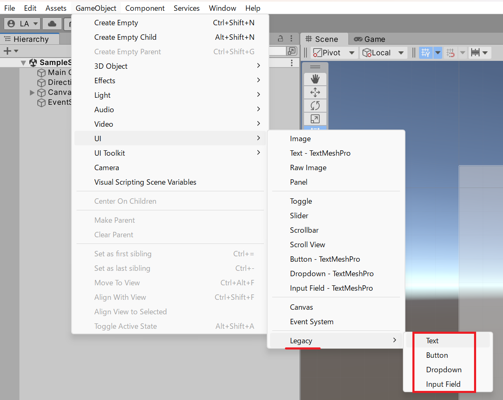

UI Text のメリットはコンポーネントが軽量で追加の設定が不要な点ですが、文字のレンダリング品質では TextMesh Pro が優位です。

TextMesh Pro を追加するには「GameObject」→「UI」→「Text - TextMesh Pro」を選択します。

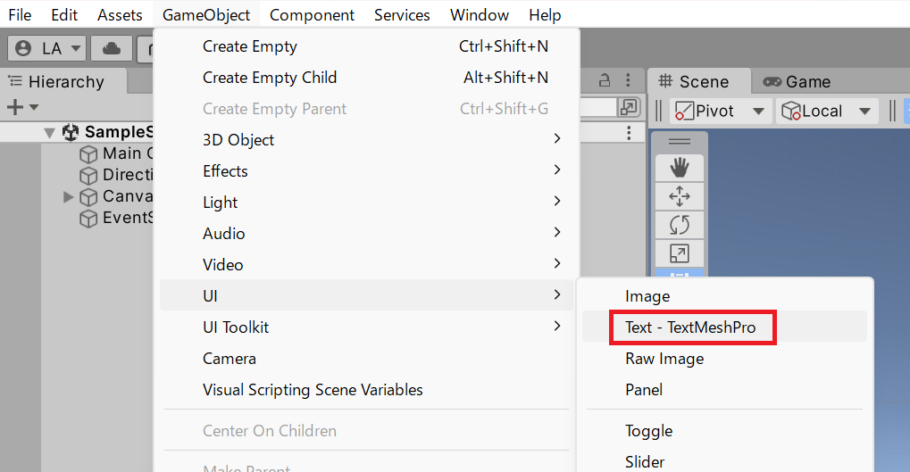

プロジェクトで初めて TextMesh Pro を使う場合、「TMP Importer」ダイアログが表示されます。「Import TMP Essentials」ボタンを押してアセットをインポートしてください。

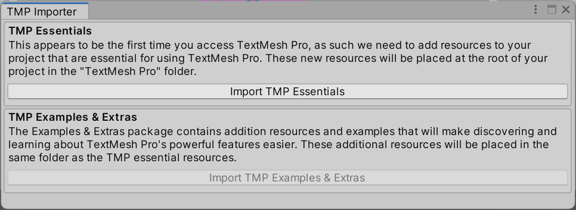

インポートが完了すると、Assets フォルダー内に「TextMesh Pro」フォルダーが作成されます。

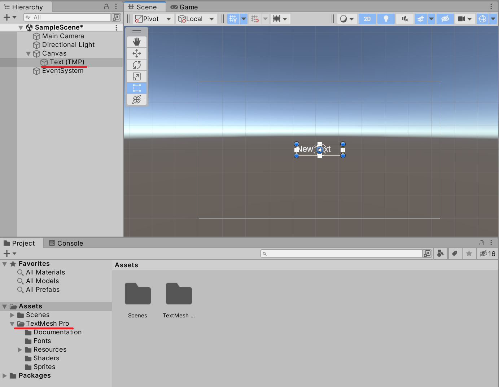

これで TextMesh Pro コンポーネントを持つゲームオブジェクトを追加できました。ただし、この時点ではアルファベットは表示できますが、日本語を入力しても表示されません。

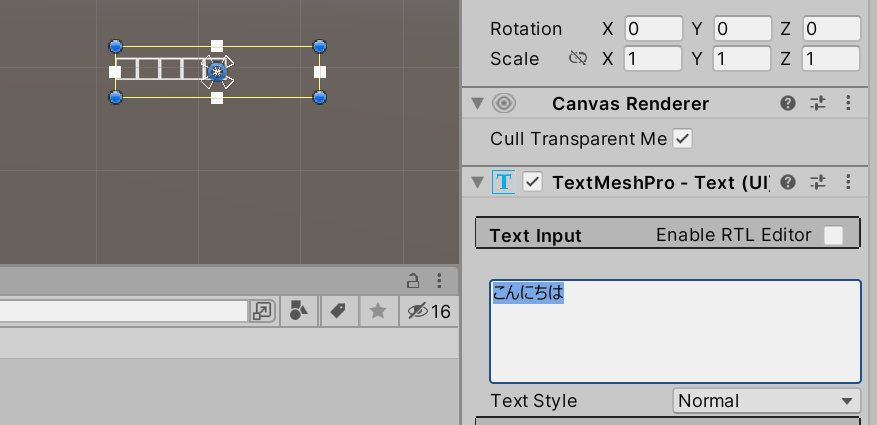

TextMesh Pro の標準フォントが日本語に対応していないためです。日本語を表示するには、日本語対応の **Font Asset** を作成する必要があります。

---

## 2. フォントと再配布

文字を表示するにはフォントデータが必要です。

ゲームにフォントを組み込む場合、システム標準フォントは再配布ライセンスを認めていないことが多いため使用できません。ゲームパッケージには**再配布可能ライセンスのフォント**を組み込む必要があります。主な選択肢は以下の通りです。

| 方法 | 例 |
|---|---|
| 再配布可能な商業フォントを購入 | モリサワ など |
| 商用利用可能なフリーフォントを利用 | IPA フォント・Google Fonts など |
| フォントを自作する | — |

本ページでは、フリーで利用・再配布できる **IPA フォント（IPAex フォント）** を使います。以下のページから最新バージョンをダウンロードしてください。

[https://moji.or.jp/ipafont/](https://moji.or.jp/ipafont/)

ZIP を展開すると、以下のフォントファイルが含まれています。

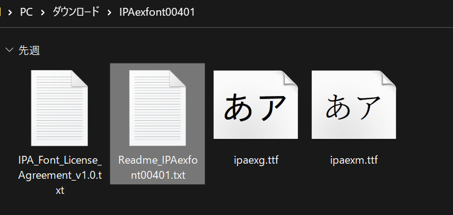

`ipaexg.ttf`（ゴシック体）と `ipaexm.ttf`（明朝体）がフォントデータです。フォルダーごと Unity の Assets フォルダーにドラッグ＆ドロップしてインポートしてください。

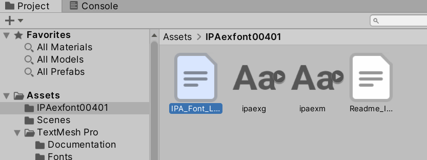

---

## 3. Font Asset を作成する

TextMesh Pro はビルボード的な平面メッシュに文字テクスチャを貼り付けることでテキストを表示します。

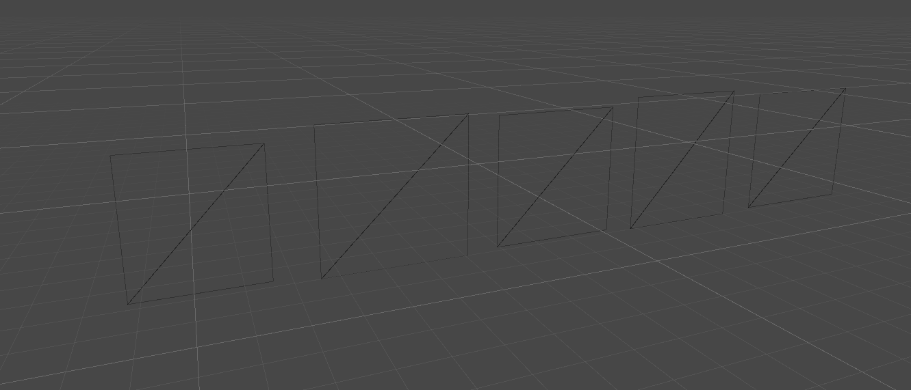

このフォントデータをテクスチャ化したものを**フォントアトラス**と呼び、TextMesh Pro に設定するフォントデータを **Font Asset** と呼びます。

### 3.1 Static と Dynamic

Font Asset には、フォントアトラスに文字を書き込むタイミングが異なる 2 つのモードがあります。モードは Font Asset の **Atlas Population Mode** という設定で決まります。

| モード | 文字を書き込むタイミング |
|---|---|
| **Static** | Unity エディターで、使う文字をあらかじめ書き込んでおく。実行中に文字は増えない |
| **Dynamic** | 空のフォントアトラスから始め、テキストで文字が使われたときに、その文字を書き込む |

Static の Font Asset は、作成するときに指定した文字だけを持っています。指定しなかった文字は表示できません。

Dynamic の Font Asset は、元のフォントファイル（`ipaexg.ttf` など）への参照を持ち続けます。フォントアトラスにない文字が使われると、元のフォントファイルからその文字を描いてフォントアトラスに追加します。

テキストの 1 文字ごとに、次のように処理されます。

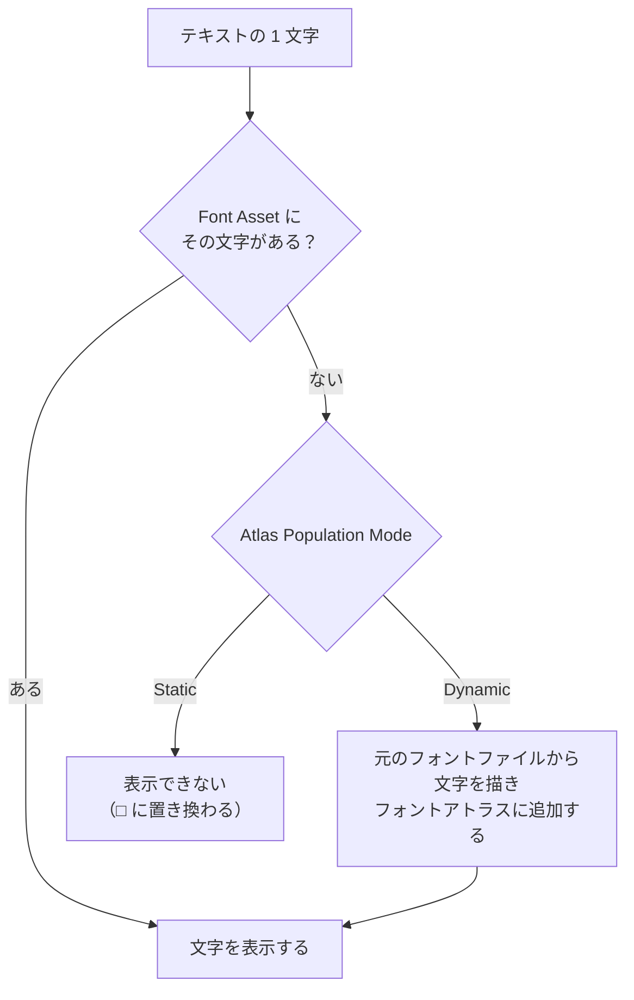
```mermaid
flowchart TD
    A[テキストの 1 文字] --> B{Font Asset に<br>その文字がある？}
    B -- ある --> E[文字を表示する]
    B -- ない --> C{Atlas Population Mode}
    C -- Dynamic --> D[元のフォントファイルから文字を描き<br>フォントアトラスに追加する]
    D --> E
    C -- Static --> F[表示できない<br>（□ に置き換わる）]
```

2 つのモードには、次の違いがあります。

| | Static | Dynamic |
|---|---|---|
| 表示できる文字 | 作成時に指定した文字だけ | 元のフォントファイルにある文字すべて |
| 作成の手間 | 使う文字を決めて、フォントアトラスを生成する | 作成するだけ。文字の指定は不要 |
| 実行時の負荷 | 小さい | 新しい文字が使われるたびに、文字を描く処理が発生する |
| ビルドに含まれるもの | Font Asset だけ | Font Asset と元のフォントファイル |
| 向いている場面 | 表示する文字があらかじめ決まっている | 入力欄など、どの文字が表示されるかわからない |

> 💡 **ポイント**: Atlas Population Mode には、もう 1 つ **Dynamic OS** というモードがあります。元のフォントファイルの代わりに、実行している環境（OS）にインストールされたフォントを使うモードです。フォントを再配布しない用途向けで、本ページでは扱いません。

まず手軽な Dynamic の Font Asset で日本語を表示し、その後で Static の Font Asset を作成します。

### 3.2 Dynamic の Font Asset を作成する

Project ビューで `ipaexg.ttf` を選択し、メニューから「Assets」→「Create」→「TextMeshPro」→「Font Asset」→「SDF」を選択します。Project ビューで `ipaexg.ttf` を右クリックして、表示されたメニューから同じ項目を選んでもかまいません。

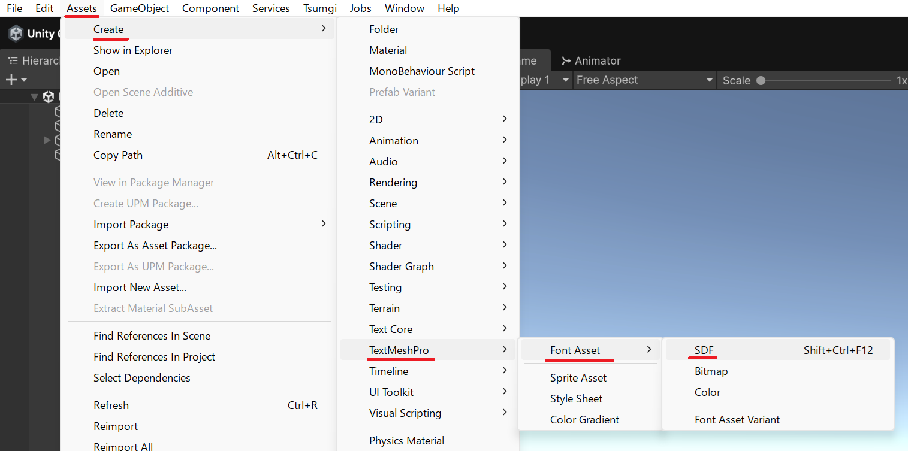

`ipaexg.ttf` と同じフォルダーに、`ipaexg SDF` という Font Asset が作成されます。作成した Font Asset を選択すると、Inspector ビューの「Generation Settings」で、`Atlas Population Mode` が `Dynamic` になっていることを確認できます。

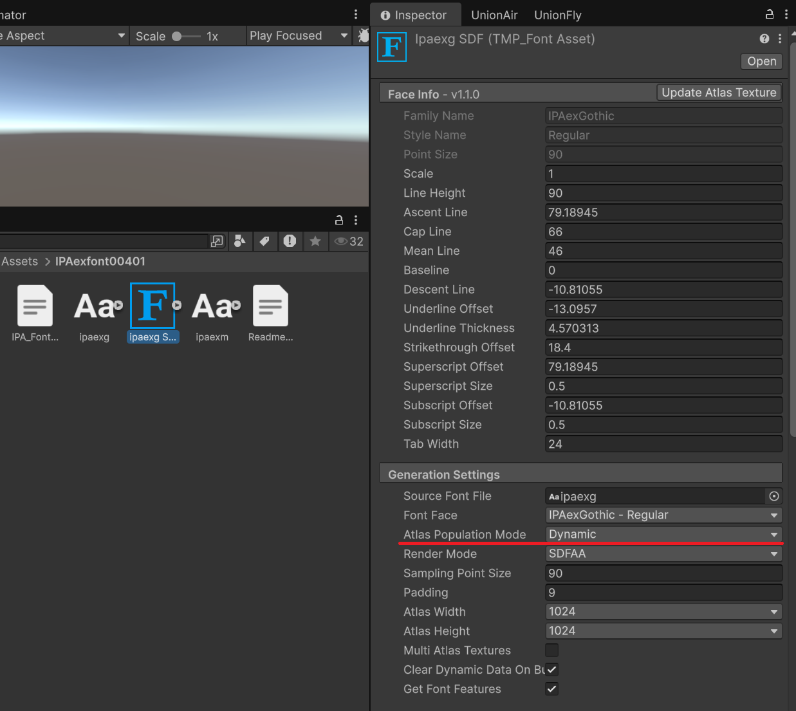

Hierarchy ビューで TextMesh Pro のゲームオブジェクトを選択し、Inspector ビューの TextMesh Pro コンポーネントの「Font Asset」項目に `ipaexg SDF` を設定します。続けて、「Text Input」に `日本語を表示します` と入力します。文字の色は既定では白で、背景によっては見えにくいため、「Vertex Color」を黒に変更しておきます。

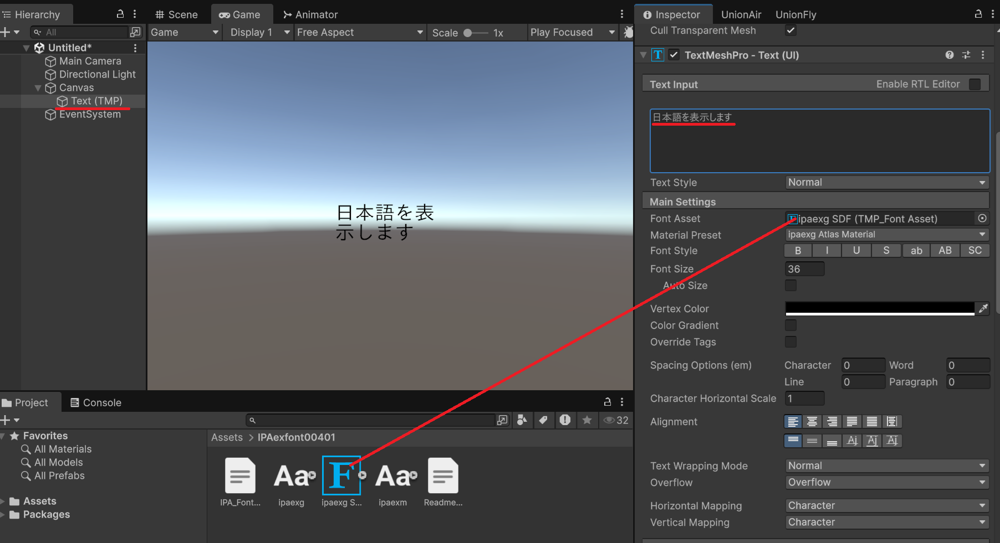

Game ビュー（Scene ビュー）に `日本語を表示します` と表示されれば成功です。Font Asset Creator で文字を指定していないのに、日本語が表示されました。

もう一度 `ipaexg SDF` を選択し、Inspector ビューの「Character Table」を開いてみましょう。これまでテキストで使った文字（`日`、`本`、`語` など）だけが追加されています。使っていない文字は含まれません。Dynamic の Font Asset は、このように使われた文字だけをフォントアトラスに書き込みます。

`ipaexg SDF` を設定する前に入力していたテキスト（1 節で入力した文字や、既定の `New Text` など）があれば、その文字も含まれます。そのため、「Character Table」の見出しに表示される文字数（下の画面では `[9] Characters`）は、それまでの操作によって変わります。

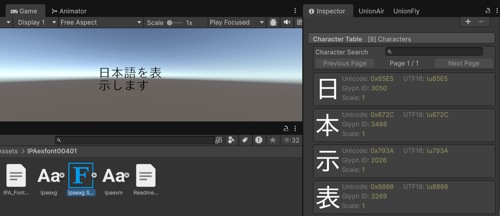

#### Dynamic の Font Asset の注意点

Dynamic の Font Asset を使うときは、次の点に注意してください。

- **元のフォントファイルを削除しない**：Dynamic の Font Asset は、元のフォントファイルから文字を描きます。元のフォントファイルはビルドにも含まれるため、そのフォントの再配布が許可されている必要があります。
- **フォントアトラスがいっぱいになると、文字を追加できない**：作成直後のフォントアトラスは 1024 × 1024 ピクセルの 1 枚です。日本語のように文字の種類が多いと、すぐにいっぱいになります。「Generation Settings」の `Multi Atlas Textures` にチェックを入れると、いっぱいになったときに新しいフォントアトラスが追加されます。
- **エディターで使った文字が Font Asset に保存される**：エディターでテキストを入力したりゲームを実行したりすると、使った文字が Font Asset のファイルに書き込まれます。Git などでファイルを管理していると、Font Asset に変更が出続けます。追加された文字は、Inspector ビューの右上にある「⋮」メニュー（または Font Asset のコンポーネント名の右クリック）から「Clear Dynamic Data」を選ぶと消去できます。なお、`Clear Dynamic Data On Build` にチェックが入っている（既定の設定）場合、ビルドの前に追加された文字が自動で消去されます。

### 3.3 Static の Font Asset を作成する

表示する文字があらかじめ決まっているときは、Static の Font Asset を作成します。

Static の Font Asset は、Font Asset Creator で作成します。「Window」→「TextMeshPro」→「Font Asset Creator」を選択します。

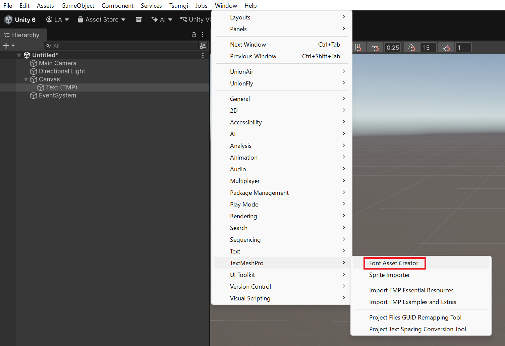

「Font Asset Creator」ダイアログが表示されたら、以下の項目を設定します。

| 設定項目 | 説明 |
|---|---|
| `Source Font` | ダウンロードした IPA フォント（`ipaexg`）を指定 |
| `Atlas Resolution` | テクスチャ解像度。高いほど綺麗だがサイズが増加。ここでは `8192` × `8192` を選択 |
| `Character Set` | 生成する文字セット。日本語は `Custom Characters` を選択 |
| `Custom Character List` | テクスチャに書き込む文字の一覧 |

`Character Set` で「Custom Characters」を選ぶと下部に `Custom Character List` テキストボックスが表示されます。使用する文字を貼り付けてください。ここでは、ひらがな・カタカナ・記号・よく使われる漢字を含む文字セット（JIS X 0208 相当）を使います。

[JIS X 0208 相当文字一覧](./JISX0208.txt)

上のリンクを開き、全文をコピーして `Custom Character List` に貼り付けてください。

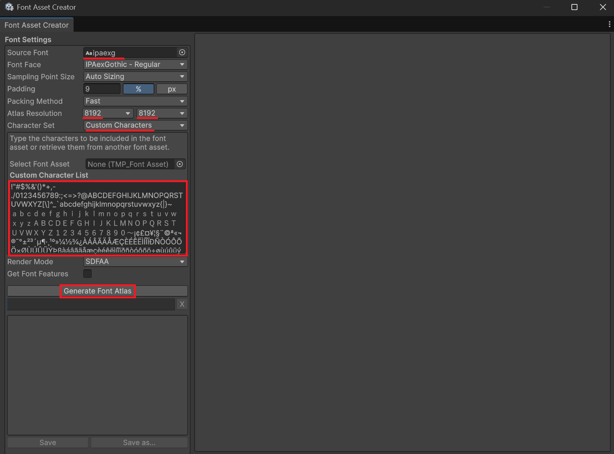

設定が完了したら「Generate Font Atlas」ボタンを押します。生成が終わると、ウィンドウ右側にフォントアトラスのプレビューが表示されます。

> ⚠️ **注意**: 全文字セットを含めた場合、フォントアトラスの生成には数分かかることがあります。生成中は Unity エディターが応答しなくなりますが、完了するまでそのまま待ってください。

「Save」ボタンを押して Font Asset をプロジェクトに保存します。保存するファイル名は、既定では `ipaexg SDF` です。3.2 で作成した Dynamic の Font Asset と同じ名前になるため、`ipaexg Static SDF` に変更して保存してください。

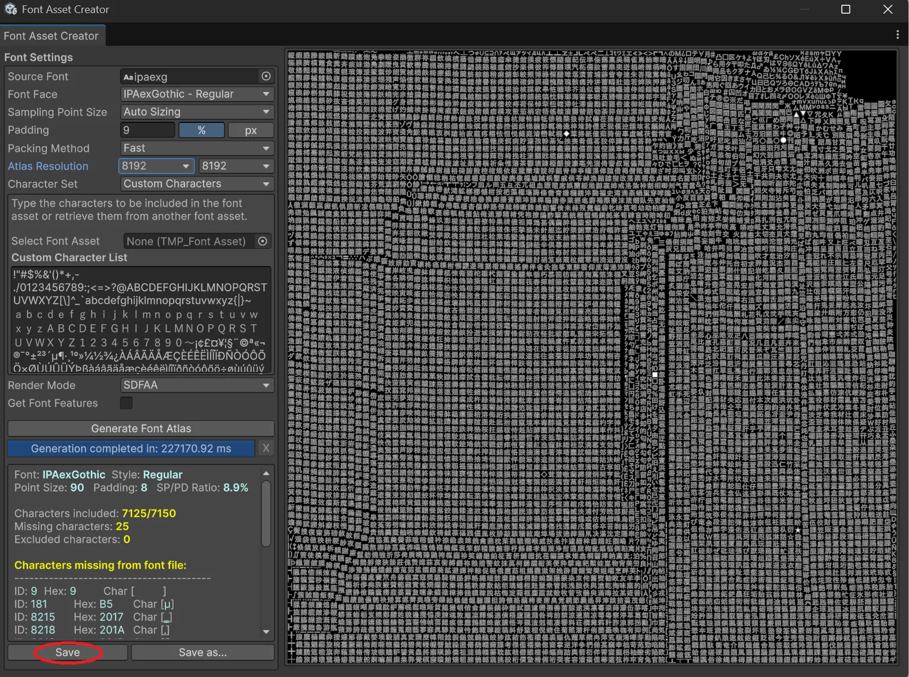

Font Asset Creator で作成した Font Asset は、`Atlas Population Mode` が `Static` になります。

最後に、TextMesh Pro コンポーネントの「Font Asset」項目を、`ipaexg SDF` から `ipaexg Static SDF` に変更します。

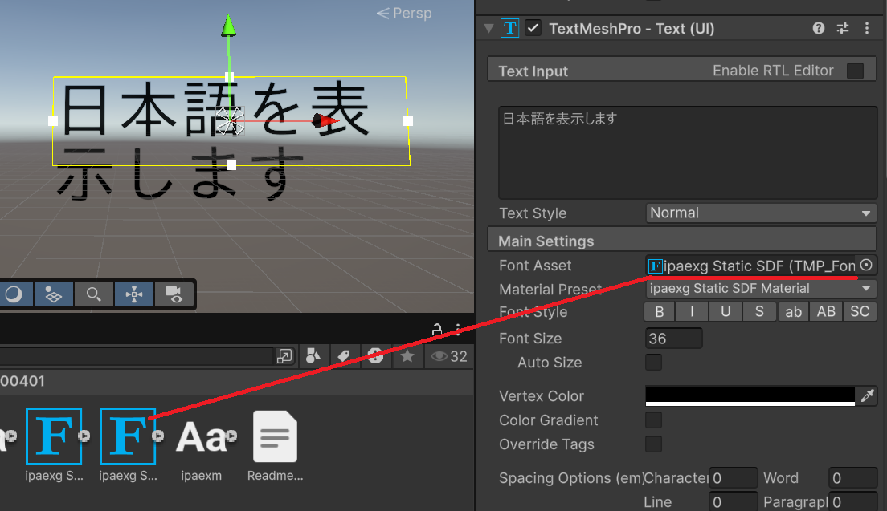

Font Asset が対象の文字を含んでいれば、日本語テキストが正しくレンダリングされます。

### 3.4 Static と Dynamic を組み合わせる

Static の Font Asset に含まれていない文字は表示できません。試しに、「Text Input」に JIS X 0208 に含まれない文字 `髙`（はしごだか）を加えて、`髙橋さん` と入力してみましょう。`髙` が `□` に置き換わり、Console ビューに次の警告が表示されます（`[ ]` の中の名前は、Font Asset とゲームオブジェクトの名前によって変わります）。

```
The character with Unicode value 髙 was not found in the [ipaexg Static SDF] font asset or any potential fallbacks. It was replaced by Unicode character □ in text object [Text (TMP)].
```

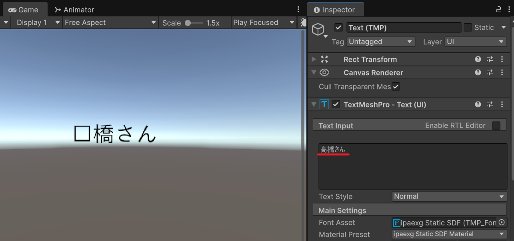

このようなときは、Static の Font Asset の **Fallback Font Assets**（フォールバック）に、Dynamic の Font Asset を設定します。Font Asset に文字がないとき、TextMesh Pro はフォールバックに設定された Font Asset から文字を探します。

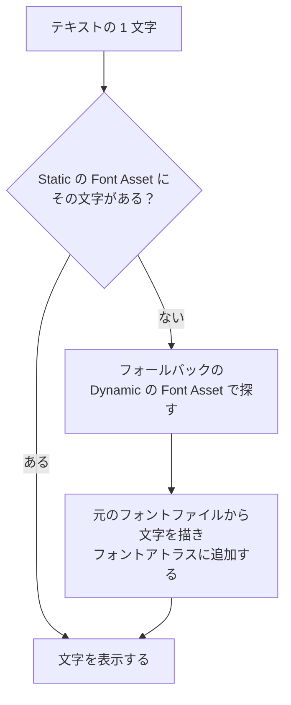
```mermaid
flowchart TD
    A[テキストの 1 文字] --> B{Static の Font Asset に<br>その文字がある？}
    B -- ある --> E[文字を表示する]
    B -- ない --> C[フォールバックの<br>Dynamic の Font Asset で探す]
    C --> D[元のフォントファイルから文字を描き<br>フォントアトラスに追加する]
    D --> E
```

よく使う文字は Static の Font Asset から高速に表示し、それ以外の文字だけを Dynamic の Font Asset で補えます。

Project ビューで、Font Asset Creator で作成した `ipaexg Static SDF` を選択します。Inspector ビューの「Fallback Font Assets」を開き、「+」ボタンを押して追加された欄に、3.2 で作成した `ipaexg SDF` を設定します。

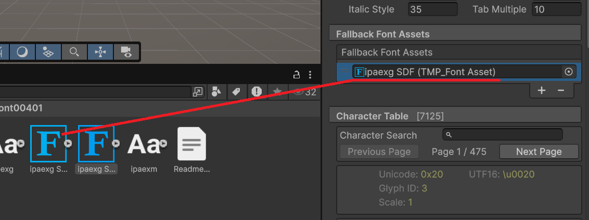

`髙橋さん` の `髙` が表示されれば成功です。Console ビューの警告も表示されなくなります。

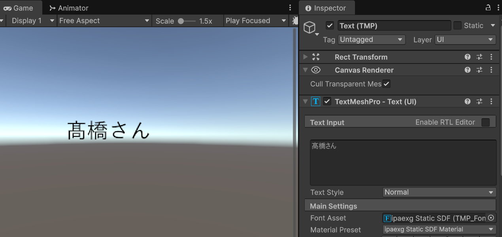

---

## 4. スクリプトから TextMesh Pro を操作する

C# スクリプトから TextMesh Pro コンポーネントを操作するには **`TMP_Text`** 型を使います。

**`TMP_Text`** — TextMesh Pro コンポーネントの基底クラスです。

**書式：[TMP_Text クラス](https://docs.unity3d.com/Packages/com.unity.textmeshpro@latest/api/TMPro.TMP_Text.html)**
```csharp
public abstract class TMP_Text : MaskableGraphic
```

表示テキストの取得・変更には **`text` プロパティ**を使います。

**`TMP_Text.text`** — TextMesh Pro に表示するテキストを取得または設定します。

**書式：[TMP_Text.text プロパティ](https://docs.unity3d.com/Packages/com.unity.textmeshpro@latest/api/TMPro.TMP_Text.html#TMPro_TMP_Text_text)**
```csharp
public virtual string text { get; set; }
```

以下は `[SerializeField]` で参照を受け取り、`Start` でテキストを設定するサンプルです。

```csharp
using TMPro;
using UnityEngine;

public class Sample : MonoBehaviour
{
    [SerializeField]
    private TMP_Text _textUi = null;

    private void Start()
    {
        _textUi.text = "Hello TextMesh Pro";
    }
}
```

Inspector ビューの `_textUi` 欄に TextMesh Pro ゲームオブジェクトをドラッグして設定し、ゲームを実行すると指定したテキストが画面に表示されます。

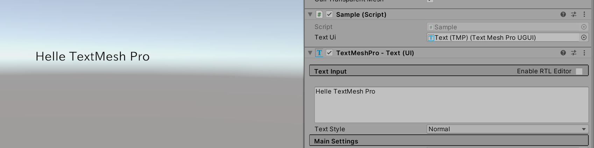

> 💡 **ポイント**: `TMP_Text` は `TextMeshProUGUI`（Unity UI 用）と `TextMeshPro`（ワールド空間用）の共通基底クラスです。`TMP_Text` 型でフィールドを宣言すると、どちらのコンポーネントも代入できます。

---

## まとめ

- Unity UI のテキスト表示には UI Text より **TextMesh Pro** を使う
- 日本語を表示するには再配布可能な日本語フォントから **Font Asset** を作成する
- Font Asset には、文字をあらかじめ書き込む **Static** と、使われたときに書き込む **Dynamic** がある
- Dynamic の Font Asset は「Assets」→「Create」→「TextMeshPro」→「Font Asset」→「SDF」で作成する。元のフォントファイルがビルドに含まれる
- Static の Font Asset は「Window」→「TextMeshPro」→「Font Asset Creator」で生成する。指定した文字だけを表示できる
- Static の Font Asset の **Fallback Font Assets** に Dynamic の Font Asset を設定すると、足りない文字を補える
- スクリプトからは **`TMP_Text.text`** プロパティでテキストを操作する

---

## 理解度チェック

以下の問いに答えられるか確認しましょう。

1. TextMesh Pro で日本語が表示されない場合、何を作成する必要がありますか？
2. プレイヤーが名前を自由に入力する入力欄に使う Font Asset は、Static と Dynamic のどちらが向いていますか？ 理由も答えてください。
3. `TMP_Text.text` プロパティはどのような型ですか？
4. 次のコードは何をしますか？

   ```csharp
   [SerializeField]
   private TMP_Text _label = null;

   private void Start()
   {
       _label.text = $"スコア: {0}";
   }
   ```

<details markdown="1">
<summary>解答を見る</summary>

1. 日本語フォントの **Font Asset** を作成し、TextMesh Pro コンポーネントに設定する。
2. Dynamic。どの文字が入力されるかあらかじめわからないため。Dynamic の Font Asset は、使われた文字を元のフォントファイルから描いてフォントアトラスに追加する。
3. `string` 型。
4. Inspector で設定した `_label` の TextMesh Pro コンポーネントに、ゲーム開始時に `"スコア: 0"` というテキストを表示する。

</details>

---

## 次のステップ

[Image — 画像の表示と色・透明度](/unity-csharp-learning/unity/ui-image/) では、キャラクター画像を Canvas に表示し、画像の縦横比や色、透明度を調整します。

## 参考

- [TextMesh Pro パッケージドキュメント](https://docs.unity3d.com/Packages/com.unity.ugui@2.0/manual/TextMeshPro/index.html)
- [Dynamic fonts assets](https://docs.unity3d.com/Packages/com.unity.ugui@2.0/manual/TextMeshPro/FontAssetsDynamicFonts.html)
- [Font Asset Fallback](https://docs.unity3d.com/Packages/com.unity.ugui@2.0/manual/TextMeshPro/FontAssetsFallback.html)
- [IPAex フォント](https://moji.or.jp/ipafont/)
