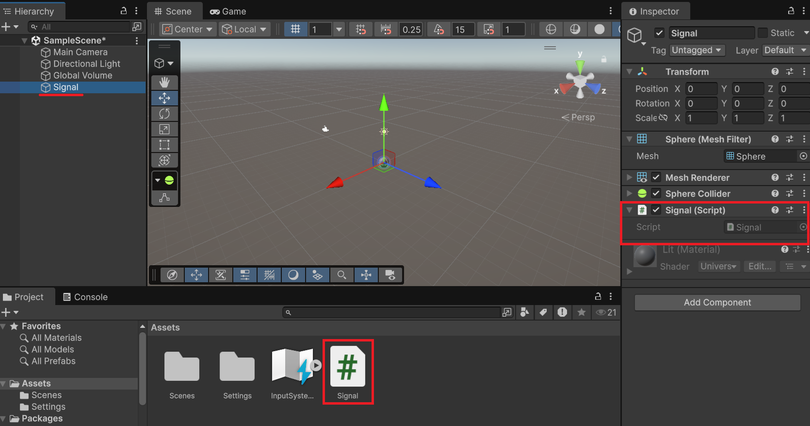

# チュートリアル: 信号機

スクリプトだけで「信号機」を作ります。Sphere 1つが赤↔青と自動的に切り替わる仕組みを実装し、**複数の状態を `int` で管理するパターン（ステートマシン）**を学びます。

## 学習目標

- `int` フィールドで離散的な状態（赤/青）を管理できる
- 状態ごとに異なる duration でタイマーを制御できる
- `GetComponent<Renderer>().material.color` でオブジェクトの色を変更できる
- 処理を専用メソッドに分割して整理できる

## 前提知識

- [Update メソッドと連続実行](/unity-csharp-learning/unity/update-basics/) を読んでいること
- [Time クラスと時間制御](/unity-csharp-learning/unity/time-basics/) を読んでいること
- [フィールドでデータを維持する](/unity-csharp-learning/unity/fields-basics/) を読んでいること

---

## 1. スクリプトを準備する


新しいシーンを作成し、球体 GameObject を作ります（メニューバー **GameObject → 3D Object → Sphere**）。


Hierarchy ビューで追加した球体を `Signal` という名前に変更してください。この GameObject に `Signal` という名前のスクリプトを作成してアタッチします（Inspector ビューの **Add Component → New script**）。



スクリプトを開いて、以降の手順に従いコードを書いていきましょう。

## 2. 色を変える

Sphere の色は、`GetComponent` メソッドで `Renderer` コンポーネントを取得し、その `material` プロパティ、さらに `color` プロパティへたどることで変更できます。

`Renderer` コンポーネントは、GameObject を画面に描画するためのコンポーネントです。Sphere や Cube が画面に見えているのは、この `Renderer` コンポーネントが見た目の表示を担当しているからです。

流れとしては、まず `GetComponent` メソッドで Sphere についている `Renderer` コンポーネントを取得します。次に `Renderer.material` プロパティで、その `Renderer` コンポーネントが使っているマテリアルにアクセスします。最後に `Material.color` プロパティを使うと、表示色を変更できます。マテリアルとは、色やテクスチャ、見た目の質感など、表示のしかたをまとめて管理する設定の集まりです。

**`GameObject.GetComponent<T>()`** — この GameObject に追加されているコンポーネントを取得します。<!-- [公式ドキュメント]() -->

**書式：GameObject.GetComponent メソッド**
```csharp
public T GetComponent<T>();
```

| 名前 | 型 | 説明 |
|---|---|---|
| `T` | 型パラメーター | 取得したいコンポーネントの型（例: `Renderer`） |

`MonoBehaviour` を継承しているスクリプトは、自分がアタッチされているゲームオブジェクトからコンポーネントを取得する `GetComponent()` メソッドを持ちます。従って、スクリプトの中で `GetComponent<Renderer>()` と直接書くことで「このスクリプトがアタッチされている GameObject から `Renderer` を取得する」という意味になります。

---

**`Renderer.material`** — `Renderer` コンポーネントが現在使っているマテリアルを取得します。`Renderer` コンポーネントから見た目の設定へ進む入口です。<!-- [公式ドキュメント]() -->

**書式：Renderer.material プロパティ**
```csharp
public Material material { get; set; }
```

---

**`Material.color`** — マテリアルのメインカラーを設定・取得します。`Renderer.material` でレンダラーが使用するマテリアルにアクセスし、`.color` で色を変更します。<!-- [公式ドキュメント]() -->

**書式：Material.color プロパティ**
```csharp
public Color color { get; set; }
```

---

この `Material.color` プロパティから色を変更できます。これを時間経過で行うために、Update() メソッドとは分離して、独自の `UpdateSignal` メソッドに分けて書きましょう。

```csharp
using UnityEngine;

public class Signal : MonoBehaviour
{
    private int _state = 0;

    private void Start()
    {
        UpdateSignal();
    }

    private void UpdateSignal()
    {
        GetComponent<Renderer>().material.color = _state == 0 ? Color.red : Color.blue;
    }
}
```


`UpdateSignal` メソッドは Unity で定められた `Start` や `Update` メソッドではないため自動的には実行されません。時間経過によって色を切り替えたいときに実行する想定です。

上記のコードでは `Start` メソッドから `UpdateSignal` メソッドを呼び出すことで、初期化時に色を変更してします。このコードでは `_state` フィールドが表示するべき色を表し、0 であれば赤、そうでなければ青になります。

---

## 3. タイマーで赤↔青を切り替える

下準備ができたので、時間経過で色を切り替えるようにプログラムしましょう。`Update` メソッドを追加して、時間経過によって `_state` フィールドを切り替えることで色を変更できます。

時間経過による色の切り替えを管理するために、以下のフィールドを追加しましょう。

```csharp
private float _timer       = 0f; // 経過時間（秒）
private float _redDuration  = 3f;  // 赤の表示時間（秒）
private float _blueDuration = 3f;  // 青の表示時間（秒）
```

`Update` でタイマーを積算し、現在の `_state` に応じた経過時間を超えたら状態を進めます。

```csharp
private void Update()
{
    _timer += Time.deltaTime;

    float duration = _state == 0 ? _redDuration : _blueDuration;

    if (_timer >= duration)
    {
        _timer -= duration;
        _state = (_state + 1) % 2;  // 0 → 1 → 0 → … と循環
        UpdateSignal();
    }
}
```

`(_state + 1) % 2` という式は `0` と `1` を交互に返す計算です。`0 + 1 = 1`、`1 + 1 = 2` と経過時間ごとに状態値が増えていきますが 2 に到達すると `2 % 2 = 0` となり、0 に戻ります。

```csharp
using UnityEngine;

public class Signal : MonoBehaviour
{
    private int   _state       = 0;
    private float _timer       = 0f;
    private float _redDuration  = 3f;
    private float _blueDuration = 3f;

    private void Start()
    {
        UpdateSignal();
    }

    private void Update()
    {
        _timer += Time.deltaTime;

        float duration = _state == 0 ? _redDuration : _blueDuration;

        if (_timer >= duration)
        {
            _timer -= duration;
            _state = (_state + 1) % 2;
            UpdateSignal();
        }
    }

    private void UpdateSignal()
    {
        GetComponent<Renderer>().material.color = _state == 0 ? Color.red : Color.blue;
    }
}
```

<video controls src="./video.mp4"></video>

> 💡 **ポイント**: `UpdateSignal` は状態が変わったときだけ呼ばれます。毎フレーム `GetComponent` が呼ばれるわけではないため、パフォーマンスへの影響はほとんどありません。

---

## 課題

### 課題 1: 各フェーズの秒数を Inspector から変更する

`_redDuration` と `_blueDuration` を `[SerializeField]` 付きにして、Unity の Inspector ビューから値を変更できるようにしてください。

<details markdown="1">
<summary>解答を見る</summary>

```csharp
[SerializeField] private float _redDuration  = 3f;
[SerializeField] private float _blueDuration = 3f;
```

Play 中に Inspector から値を変えると、次のフェーズ切り替えから新しい時間が反映されます。

</details>

---

### 課題 2: 黄色フェーズを追加して 3 色にする

赤 → 青 → 黄 → 赤 のサイクルに変更してください。

ヒント: `% 2` を `% 3` に変え、`_state 2 = 黄` を追加します。duration の切り替えと `UpdateSignal` も 3 状態に対応させます。

<details markdown="1">
<summary>解答を見る</summary>

```csharp
using UnityEngine;

public class Signal : MonoBehaviour
{
    private int _state = 0;  // 0=赤, 1=青, 2=黄
    private float _timer = 0f;
    private float _redDuration = 3f;
    private float _blueDuration = 3f;
    private float _yellowDuration = 1f;

    private void Start()
    {
        UpdateSignal();
    }

    private void Update()
    {
        _timer += Time.deltaTime;

        float duration;
        if (_state == 0) duration = _redDuration;
        else if (_state == 1) duration = _blueDuration;
        else duration = _yellowDuration;

        if (_timer >= duration)
        {
            _timer -= duration;
            _state = (_state + 1) % 3;  // 0 → 1 → 2 → 0 → …
            UpdateSignal();
        }
    }

    private void UpdateSignal()
    {
        Color color;
        if (_state == 0) color = Color.red;
        else if (_state == 1) color = Color.blue;
        else color = Color.yellow;

        GetComponent<Renderer>().material.color = color;
    }
}
```

</details>

---

### 課題 3: 青→赤に切り替わる前に青を点滅させる

赤と青の切り替えのみとして、青フェーズの残り 1 秒で Sphere を点滅させる警告演出を追加してください。

ヒント: `_state == 1 && _timer >= _blueDuration - 1f` のときに、別タイマーで点滅フラグを用意して反転を表現します。状態が赤に切り替わるときに関連フラグをリセットすることを忘れないでください。

<details markdown="1">
<summary>解答を見る</summary>

```csharp
using UnityEngine;

public class Signal : MonoBehaviour
{
    private int _state = 0;
    private float _timer = 0f;
    private float _redDuration = 3f;
    private float _blueDuration = 3f;
    private float _blinkTimer = 0f;
    private bool _isBlinkOn = true;

    private Renderer _renderer;

    private void Start()
    {
        _renderer = GetComponent<Renderer>();
        TransitionTo(_state);
    }

    private void Update()
    {
        _timer += Time.deltaTime;

        switch (_state)
        {
            case 0:  UpdateRed();  break;
            case 1: UpdateBlue(); break;
        }
    }

    private void UpdateRed()
    {
        if (_timer >= _redDuration)
            TransitionTo(1); // 青に遷移
    }

    private void UpdateBlue()
    {
        // 残り 1 秒で点滅
        if (_timer >= _blueDuration - 1f)
        {
            _blinkTimer += Time.deltaTime;
            if (_blinkTimer >= 0.25f)
            {
                _blinkTimer -= 0.25f;
                _isBlinkOn = !_isBlinkOn;
                _renderer.material.color = _isBlinkOn ? Color.blue : Color.gray;
            }
        }

        if (_timer >= _blueDuration)
            TransitionTo(0); // 赤に遷移
    }

    private void TransitionTo(int next) // 状態遷移（リセット）
    {
        _timer = 0f;
        _blinkTimer = 0f;
        _isBlinkOn = true;
        _state = next;
        _renderer.material.color = next == 0 ? Color.red : Color.blue;
    }
}
```

</details>

---

## まとめ

- `int _state` フィールドで状態を数値として管理できる
- `(_state + 1) % 2` で 2 つの状態を循環できる（状態数が増えても `% N` で対応）
- `GetComponent<Renderer>().material.color` でオブジェクトの色を変更できる
- 状態の反映は専用メソッド（`UpdateSignal`）に分けて整理すると管理しやすい

---

## 理解度チェック

以下の問いに答えられるか確認しましょう。

1. `(_state + 1) % 2` が `0` と `1` を交互に返す理由を説明してください。
2. `UpdateSignal` を `Update` 内で毎フレーム呼ばず、状態が変わるときだけ呼ぶのはなぜですか？
3. 4 つの状態を循環させるには `% 2` をどう変えればよいですか？

<details markdown="1">
<summary>解答を見る</summary>

1. `%`（剰余）は割り算の余りを返す演算子。`(0 + 1) % 2 = 1`、`(1 + 1) % 2 = 0` となり、0 と 1 を交互に繰り返す。
2. 毎フレーム呼ぶと不要な `GetComponent` と color 代入が発生するため。状態変化時だけ呼ぶことで効率的になる。
3. `% 4` にする。

</details>

---

## 次のステップ

[Rigidbody で力を加える](/unity-csharp-learning/unity/rigidbody-force/) では、`GetComponent` でコンポーネントをキャッシュし、`AddForce` でオブジェクトを物理的に動かす方法を学びます。
