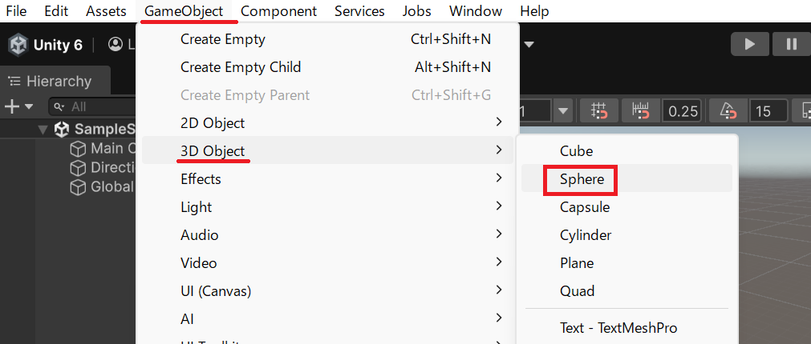
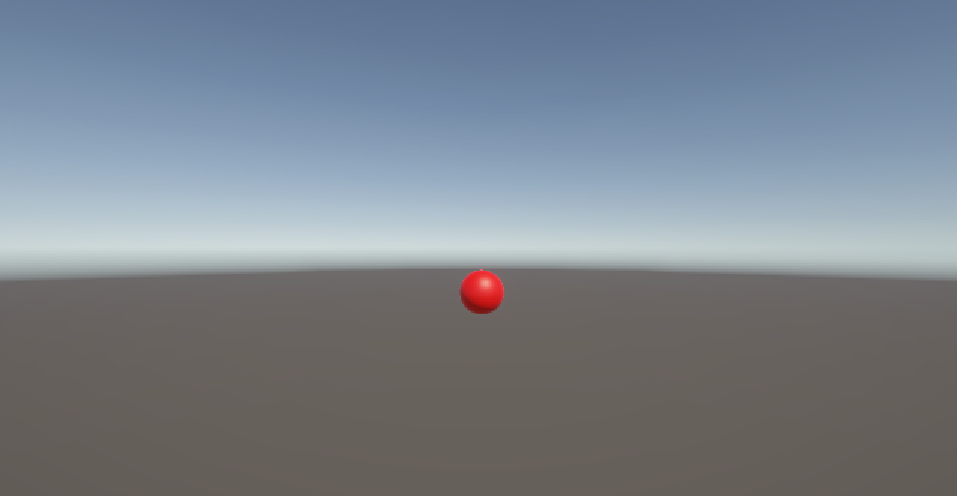

# チュートリアル: 歩行者信号機

スクリプトだけで「歩行者信号機」を作ります。Sphere 1つが赤↔青と自動的に切り替わる仕組みを実装し、**複数の状態を `int` で管理するパターン（ステートマシン）**を学びます。

## 学習目標

- `int` フィールドで離散的な状態（赤/青）を管理できる
- 状態ごとに異なる duration でタイマーを制御できる
- `GetComponent<Renderer>().material.color` でオブジェクトの色を変更できる
- 処理を専用メソッドに分割して整理できる

## 前提知識

- [Update メソッドと連続実行](/unity-csharp-learning/unity/update-basics/) を読んでいること
- [Time クラスと時間制御](/unity-csharp-learning/unity/time-basics/) を読んでいること
- [フィールドでデータを維持する](/unity-csharp-learning/unity/fields-basics/) を読んでいること

---

## 1. スクリプトを準備する

新しいシーンを作成し、空の GameObject を作ります（メニューバー **GameObject → Create Empty**）。Hierarchy ビューで `PedestrianSignal` という名前に変更してください。

この GameObject に `PedestrianSignal` という名前のスクリプトを作成してアタッチします（Inspector ビューの **Add Component → New script**）。

スクリプトを開いて、以降の手順に従いコードを書いていきましょう。

---

## 2. 信号機を作る

Sphere を1つ生成し、後から参照できるようにフィールドに保持します。

```csharp
using UnityEngine;

public class PedestrianSignal : MonoBehaviour
{
    private GameObject signal;

    private void Start()
    {
        signal = GameObject.CreatePrimitive(PrimitiveType.Sphere);
        signal.name = "Signal";
    }
}
```

`signal` をメソッドの外（フィールド）に持つことで、`Start` 以外のメソッドからも参照できます。



---

## 3. 色を変える

`GetComponent<Renderer>().material.color` を使って Sphere の色を変えます。

**`GameObject.GetComponent<T>()`** — この GameObject に追加されているコンポーネントを取得します。<!-- [公式ドキュメント]() -->

**書式：GameObject.GetComponent メソッド**
```csharp
public T GetComponent<T>();
```

| パラメータ | 説明 |
|---|---|
| `T` | 取得したいコンポーネントの型（例: `Renderer`） |

---

**`Material.color`** — マテリアルのメインカラーを設定・取得します。`Renderer.material` でレンダラーが使用するマテリアルにアクセスし、`.color` で色を変更します。<!-- [公式ドキュメント]() -->

**書式：Material.color プロパティ**
```csharp
public Color color { get; set; }
```

---

色の管理を専用メソッド `UpdateSignal` に分けて書きます。

```csharp
private int state = 0;  // 0 = 赤, 1 = 青

private void UpdateSignal()
{
    signal.GetComponent<Renderer>().material.color = state == 0 ? Color.red : Color.blue;
}
```

`UpdateSignal` を `Start` の末尾から呼ぶことで、ゲーム開始直後に初期色（赤）が反映されます。

```csharp
private void Start()
{
    signal = GameObject.CreatePrimitive(PrimitiveType.Sphere);
    signal.name = "Signal";
    UpdateSignal();  // 初期色を反映
}
```



---

## 4. タイマーで赤↔青を切り替える

タイマーが各フェーズの時間を超えるたびに `state` を切り替えます。

```csharp
private float timer       = 0f;
private float redDuration  = 3f;  // 赤の表示時間（秒）
private float blueDuration = 3f;  // 青の表示時間（秒）
```

`Update` でタイマーを積算し、現在の `state` に応じた duration を超えたら状態を進めます。

```csharp
private void Update()
{
    timer += Time.deltaTime;

    float duration = state == 0 ? redDuration : blueDuration;

    if (timer >= duration)
    {
        timer -= duration;
        state = (state + 1) % 2;  // 0 → 1 → 0 → … と循環
        UpdateSignal();
    }
}
```

`(state + 1) % 2` は `0` と `1` を交互に返す式です。`0 + 1 = 1`、`1 + 1 = 2` で `2 % 2 = 0` となり、0 に戻ります。

<video controls src="./video.mp4"></video>

ここまでのコード全体：

```csharp
using UnityEngine;

public class PedestrianSignal : MonoBehaviour
{
    private GameObject signal;
    private int   state       = 0;
    private float timer       = 0f;
    private float redDuration  = 3f;
    private float blueDuration = 3f;

    private void Start()
    {
        signal = GameObject.CreatePrimitive(PrimitiveType.Sphere);
        signal.name = "Signal";
        UpdateSignal();
    }

    private void Update()
    {
        timer += Time.deltaTime;

        float duration = state == 0 ? redDuration : blueDuration;

        if (timer >= duration)
        {
            timer -= duration;
            state = (state + 1) % 2;
            UpdateSignal();
        }
    }

    private void UpdateSignal()
    {
        signal.GetComponent<Renderer>().material.color = state == 0 ? Color.red : Color.blue;
    }
}
```

> 💡 **ポイント**: `UpdateSignal` は状態が変わったときだけ呼ばれます。毎フレーム `GetComponent` が呼ばれるわけではないため、パフォーマンスへの影響はほとんどありません。

---

## 課題

### 課題 1: 各フェーズの秒数を Inspector から変更する

`redDuration` と `blueDuration` を `[SerializeField]` 付きにして、Unity の Inspector ビューから値を変更できるようにしてください。

<details markdown="1">
<summary>解答を見る</summary>

```csharp
[SerializeField] private float redDuration  = 3f;
[SerializeField] private float blueDuration = 3f;
```

Play 中に Inspector から値を変えると、次のフェーズ切り替えから新しい時間が反映されます。

</details>

---

### 課題 2: 青→赤に切り替わる前に青を点滅させる

青フェーズの残り 1 秒で Sphere を点滅させる警告演出を追加してください。

ヒント: `state == 1 && timer >= blueDuration - 1f` のときに Blinker パターン（別タイマーで `isBlinkOn` を反転）を動かします。状態が切り替わるときに `blinkTimer` と `isBlinkOn` をリセットするのを忘れずに。

<details markdown="1">
<summary>解答を見る</summary>

```csharp
private float blinkTimer = 0f;
private bool  isBlinkOn  = true;

private void Update()
{
    timer += Time.deltaTime;

    float duration = state == 0 ? redDuration : blueDuration;

    // 青フェーズ残り 1 秒で点滅
    if (state == 1 && timer >= blueDuration - 1f)
    {
        blinkTimer += Time.deltaTime;
        if (blinkTimer >= 0.25f)
        {
            blinkTimer -= 0.25f;
            isBlinkOn = !isBlinkOn;
            signal.GetComponent<Renderer>().material.color = isBlinkOn ? Color.blue : Color.gray;
        }
    }

    if (timer >= duration)
    {
        timer -= duration;
        blinkTimer = 0f;   // リセット
        isBlinkOn  = true; // リセット
        state = (state + 1) % 2;
        UpdateSignal();
    }
}
```

</details>

---

### 課題 3: 黄色フェーズを追加して 3 色にする

赤 → 青 → 黄 → 赤 のサイクルに変更してください。

ヒント: `% 2` を `% 3` に変え、`state 2 = 黄` を追加します。duration の切り替えと `UpdateSignal` も 3 状態に対応させます。

<details markdown="1">
<summary>解答を見る</summary>

```csharp
private int   state          = 0;  // 0=赤, 1=青, 2=黄
private float timer          = 0f;
private float redDuration    = 3f;
private float blueDuration   = 3f;
private float yellowDuration = 1f;

private void Update()
{
    timer += Time.deltaTime;

    float duration;
    if      (state == 0) duration = redDuration;
    else if (state == 1) duration = blueDuration;
    else                 duration = yellowDuration;

    if (timer >= duration)
    {
        timer -= duration;
        state = (state + 1) % 3;  // 0 → 1 → 2 → 0 → …
        UpdateSignal();
    }
}

private void UpdateSignal()
{
    Color color;
    if      (state == 0) color = Color.red;
    else if (state == 1) color = Color.blue;
    else                 color = Color.yellow;

    signal.GetComponent<Renderer>().material.color = color;
}
```

</details>

---

### 課題 4: 2つの信号機を逆位相で動かす（発展）

同じシーンに 2 つ目の Sphere を追加し、1 つ目が赤のとき 2 つ目は青、逆も然りとなるように動かしてください。

ヒント: `signal2` と `state2`・`timer2` フィールドを追加し、`state2` の初期値を `1`（青スタート）にするだけで逆位相になります。

<details markdown="1">
<summary>解答を見る</summary>

```csharp
using UnityEngine;

public class PedestrianSignal : MonoBehaviour
{
    private GameObject signal;
    private GameObject signal2;
    private int   state  = 0;  // 赤スタート
    private int   state2 = 1;  // 青スタート（逆位相）
    private float timer  = 0f;
    private float timer2 = 0f;
    private float redDuration  = 3f;
    private float blueDuration = 3f;

    private void Start()
    {
        signal = GameObject.CreatePrimitive(PrimitiveType.Sphere);
        signal.name = "Signal1";
        signal.transform.position = new Vector3(-1.5f, 0, 0);

        signal2 = GameObject.CreatePrimitive(PrimitiveType.Sphere);
        signal2.name = "Signal2";
        signal2.transform.position = new Vector3(1.5f, 0, 0);

        UpdateSignals();
    }

    private void Update()
    {
        timer  += Time.deltaTime;
        timer2 += Time.deltaTime;

        float duration1 = state  == 0 ? redDuration : blueDuration;
        float duration2 = state2 == 0 ? redDuration : blueDuration;

        if (timer >= duration1)
        {
            timer -= duration1;
            state = (state + 1) % 2;
            UpdateSignals();
        }

        if (timer2 >= duration2)
        {
            timer2 -= duration2;
            state2 = (state2 + 1) % 2;
            UpdateSignals();
        }
    }

    private void UpdateSignals()
    {
        signal.GetComponent<Renderer>().material.color  = state  == 0 ? Color.red : Color.blue;
        signal2.GetComponent<Renderer>().material.color = state2 == 0 ? Color.red : Color.blue;
    }
}
```

</details>

---

## まとめ

- `int state` フィールドで状態を数値として管理できる
- `(state + 1) % 2` で 2 つの状態を循環できる（状態数が増えても `% N` で対応）
- `GetComponent<Renderer>().material.color` でオブジェクトの色を変更できる
- 状態の反映は専用メソッド（`UpdateSignal`）に分けて整理すると管理しやすい

---

## 理解度チェック

以下の問いに答えられるか確認しましょう。

1. `(state + 1) % 2` が `0` と `1` を交互に返す理由を説明してください。
2. `UpdateSignal` を `Update` 内で毎フレーム呼ばず、状態が変わるときだけ呼ぶのはなぜですか？
3. 4 つの状態を循環させるには `% 2` をどう変えればよいですか？

<details markdown="1">
<summary>解答を見る</summary>

1. `%`（剰余）は割り算の余りを返す演算子。`(0 + 1) % 2 = 1`、`(1 + 1) % 2 = 0` となり、0 と 1 を交互に繰り返す。
2. 毎フレーム呼ぶと不要な `GetComponent` と color 代入が発生するため。状態変化時だけ呼ぶことで効率的になる。
3. `% 4` にする。

</details>
