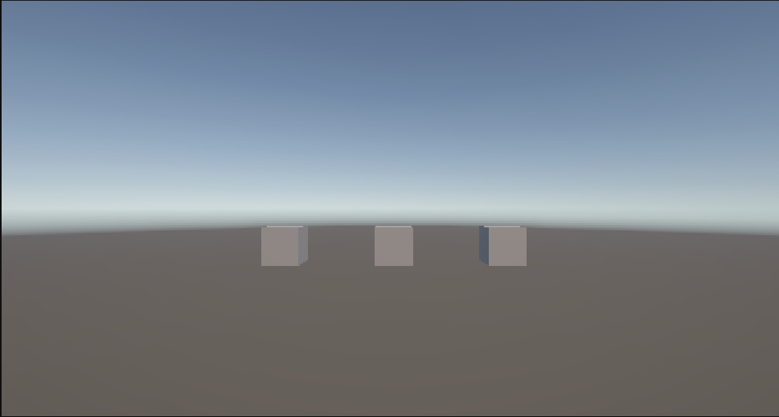
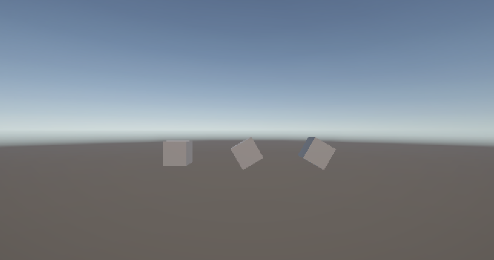
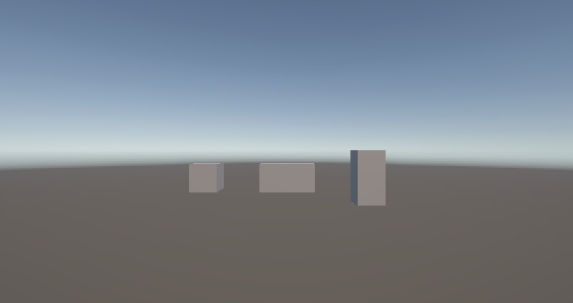

# Transform でオブジェクトを操作する

すべての GameObject は **Transform コンポーネント**を持っており、位置・サイズ・回転を管理しています。このページでは、スクリプトから Transform を通じてオブジェクトを自在に配置・変形する方法を学びます。

## 学習目標

+ `transform` プロパティから Transform コンポーネントを取得できる
+ `position` でオブジェクトの位置を設定できる
+ `rotation`（`Quaternion.Euler`）でオブジェクトを回転させられる
+ `localScale` でオブジェクトのサイズを変更できる

## 前提知識

- [GameObject の生成と操作](/unity-csharp-learning/unity/gameobject-basics/) を読んでいること

---

## 1. Transform コンポーネントとは

Transform はすべての GameObject が必ず持つ特別なコンポーネントで、**位置・サイズ（スケール）・回転**の3つを管理します。

**`GameObject.transform`** — GameObject の Transform コンポーネントを取得します。<!-- [公式ドキュメント]() -->

**書式：GameObject.transform プロパティ**
```csharp
public Transform transform { get; }
```

Transform を取得したら、そのプロパティを通じてオブジェクトを操作できます。

```csharp
gameObject.transform.プロパティ名 = 値;
```

---

## 2. Vector3 — 3次元の値を表す構造体

位置・サイズには **`Vector3`** 構造体を使います。X・Y・Z の3つの値をひとまとめにしたものです。

**`Vector3` コンストラクター** <!-- [公式ドキュメント]() -->

**書式：Vector3 コンストラクター**
```csharp
public Vector3(float x, float y, float z);
```

| パラメータ | 説明 |
|---|---|
| `x` | X 軸方向の値 |
| `y` | Y 軸方向の値（上下） |
| `z` | Z 軸方向の値 |

`Vector3` の値を作るには **`new` 演算子**を使い、**コンストラクター**（新しい値を作成するための特別な呼び出し）を呼び出します。この `new Vector3(...)` の結果が `Vector3` の値となり、プロパティに直接代入したり変数に保存したりできます。

```csharp
new Vector3(20, 1, 10)  // X=20, Y=1, Z=10 の Vector3 値
```

---

## 3. position で位置を設定する

**`Transform.position`** — ワールド空間でのオブジェクトの位置を設定します。<!-- [公式ドキュメント]() -->

**書式：Transform.position プロパティ**
```csharp
public Vector3 position { get; set; }
```

何も指定しなければオブジェクトは原点（`Vector3(0, 0, 0)`）に生成されます。`position` を指定することで、オブジェクトを任意の位置に配置できます。複数のオブジェクトに異なる `position` を設定すると、位置の違いが一目でわかります。

```csharp
using UnityEngine;

public class TransformSample : MonoBehaviour
{
    private void Start()
    {
        var cubeA = GameObject.CreatePrimitive(PrimitiveType.Cube);
        cubeA.name = "CubeA";
        cubeA.transform.position = new Vector3(-3, 0, 0);

        var cubeB = GameObject.CreatePrimitive(PrimitiveType.Cube);
        cubeB.name = "CubeB";
        cubeB.transform.position = new Vector3(0, 0, 0);

        var cubeC = GameObject.CreatePrimitive(PrimitiveType.Cube);
        cubeC.name = "CubeC";
        cubeC.transform.position = new Vector3(3, 0, 0);
    }
}
```



---

## 4. rotation でオブジェクトを回転させる

**`Transform.rotation`** — オブジェクトの回転を設定します。<!-- [公式ドキュメント]() -->

**書式：Transform.rotation プロパティ**
```csharp
public Quaternion rotation { get; set; }
```

このプロパティは `Vector3` ではなく **`Quaternion`（四元数）** という値を受け取ります。Quaternion はコンピューターが回転を効率よく扱うための内部表現で、直接数値を入力するのが難しい形式です。

そこで、Unity では人間が直感的に扱いやすい**オイラー角**（X・Y・Z 軸ごとの角度）から Quaternion に変換するメソッドが用意されています。

**`Quaternion.Euler`** — オイラー角（度数）から Quaternion 値に変換します。<!-- [公式ドキュメント]() -->

**書式：Quaternion.Euler メソッド**
```csharp
public static Quaternion Euler(float x, float y, float z);
```

| パラメータ | 説明 |
|---|---|
| `x` | X 軸まわりの回転角度（度） |
| `y` | Y 軸まわりの回転角度（度） |
| `z` | Z 軸まわりの回転角度（度） |

```csharp
using UnityEngine;

public class TransformSample : MonoBehaviour
{
    private void Start()
    {
        var cubeA = GameObject.CreatePrimitive(PrimitiveType.Cube);
        cubeA.name = "CubeA";
        cubeA.transform.position = new Vector3(-3, 0, 0);
        cubeA.transform.rotation = Quaternion.Euler(0, 0, 0);

        var cubeB = GameObject.CreatePrimitive(PrimitiveType.Cube);
        cubeB.name = "CubeB";
        cubeB.transform.position = new Vector3(0, 0, 0);
        cubeB.transform.rotation = Quaternion.Euler(0, 0, 30);

        var cubeC = GameObject.CreatePrimitive(PrimitiveType.Cube);
        cubeC.name = "CubeC";
        cubeC.transform.position = new Vector3(3, 0, 0);
        cubeC.transform.rotation = Quaternion.Euler(0, 0, 60);
    }
}
```



Z 軸に 0・30・60 度をそれぞれ指定することで、回転量の違いが比較できます。

---

## 5. localScale でサイズを変更する

**`Transform.localScale`** — オブジェクトのスケール（拡大率）を設定します。<!-- [公式ドキュメント]() -->

**書式：Transform.localScale プロパティ**
```csharp
public Vector3 localScale { get; set; }
```

初期値は `new Vector3(1, 1, 1)`（等倍）です。複数のオブジェクトに異なるスケールを設定すると、大きさの違いが一目でわかります。

```csharp
using UnityEngine;

public class TransformSample : MonoBehaviour
{
    private void Start()
    {
        var cubeA = GameObject.CreatePrimitive(PrimitiveType.Cube);
        cubeA.name = "CubeA";
        cubeA.transform.position = new Vector3(-3, 0, 0);
        cubeA.transform.localScale = new Vector3(1, 1, 1);

        var cubeB = GameObject.CreatePrimitive(PrimitiveType.Cube);
        cubeB.name = "CubeB";
        cubeB.transform.position = new Vector3(0, 0, 0);
        cubeB.transform.localScale = new Vector3(2, 1, 1);

        var cubeC = GameObject.CreatePrimitive(PrimitiveType.Cube);
        cubeC.name = "CubeC";
        cubeC.transform.position = new Vector3(3, 0, 0);
        cubeC.transform.localScale = new Vector3(1, 2, 1);
    }
}
```



---

## まとめ

- Transform コンポーネントはすべての GameObject が持ち、**位置・回転・サイズ**を管理する
- `position` には `new Vector3(x, y, z)` でワールド座標を設定する
- `rotation` には `Quaternion.Euler(x, y, z)` でオイラー角から変換した値を使う
- `localScale` には `new Vector3(x, y, z)` で各軸の拡大率を設定する

---

## 理解度チェック

1. Transform が管理する3つの情報は何ですか？
2. `localScale = new Vector3(1, 3, 1)` にするとオブジェクトはどう変化しますか？
3. `rotation` プロパティに `Vector3` を直接代入できないのはなぜですか？

<details markdown="1">
<summary>解答を見る</summary>

1. **位置**（position）・**サイズ**（localScale）・**回転**（rotation）
2. Y 軸方向に3倍に伸びる（縦長になる）
3. `rotation` の型は `Quaternion` であり、`Vector3` とは異なる型のため。角度で指定したい場合は `Quaternion.Euler()` で変換する。

</details>

---

## 次のステップ

[AddComponent と物理演算](/unity-csharp-learning/unity/rigidbody/) では、コンポーネントをスクリプトから追加してオブジェクトに物理挙動を与える方法を学びます。
