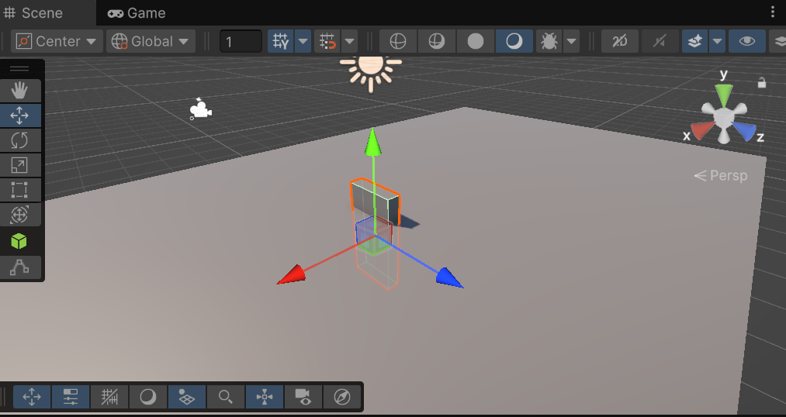
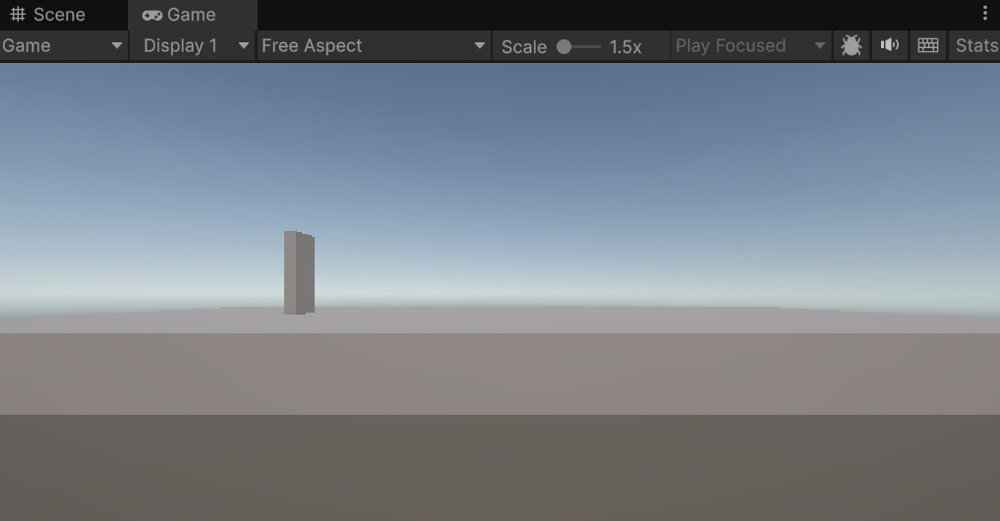

# Transform でオブジェクトを操作する

すべての GameObject は **Transform コンポーネント**を持っており、位置・サイズ・回転を管理しています。このページでは、スクリプトから Transform を通じてオブジェクトを自在に配置・変形する方法を学びます。

## 学習目標

- `transform` プロパティから Transform コンポーネントを取得できる
- `localScale` でオブジェクトのサイズを変更できる
- `position` でオブジェクトの位置を設定できる
- `rotation`（`Quaternion.Euler`）でオブジェクトを回転させられる

## 前提知識

- [GameObject の生成と操作](/unity-csharp-learning/unity/gameobject-basics/) を読んでいること

---

## 1. Transform コンポーネントとは

Transform はすべての GameObject が必ず持つ特別なコンポーネントで、**位置・サイズ（スケール）・回転**の3つを管理します。

**`GameObject.transform`** — GameObject の Transform コンポーネントを取得します。<!-- [公式ドキュメント]() -->

**書式：GameObject.transform プロパティ**
```csharp
public Transform transform { get; }
```

Transform を取得したら、そのプロパティを通じてオブジェクトを操作できます。

```csharp
gameObject.transform.プロパティ名 = 値;
```

---

## 2. Vector3 — 3次元の値を表す構造体

位置・サイズには **`Vector3`** 構造体を使います。X・Y・Z の3つの値をひとまとめにしたものです。

**`Vector3` コンストラクター** <!-- [公式ドキュメント]() -->

**書式：Vector3 コンストラクター**
```csharp
public Vector3(float x, float y, float z);
```

| パラメータ | 説明 |
|---|---|
| `x` | X 軸方向の値 |
| `y` | Y 軸方向の値（上下） |
| `z` | Z 軸方向の値 |

`Vector3` の値を作るには **`new` 演算子**を使い、**コンストラクター**（新しい値を作成するための特別な呼び出し）を呼び出します。この `new Vector3(...)` の結果が `Vector3` の値となり、プロパティに直接代入したり変数に保存したりできます。

```csharp
new Vector3(20, 1, 10)  // X=20, Y=1, Z=10 の Vector3 値
```

---

## 3. localScale でサイズを変更する

**`Transform.localScale`** — オブジェクトのスケール（拡大率）を設定します。<!-- [公式ドキュメント]() -->

**書式：Transform.localScale プロパティ**
```csharp
public Vector3 localScale { get; set; }
```

初期値は `new Vector3(1, 1, 1)`（等倍）です。たとえば X 方向に20倍、Y 方向を1倍、Z 方向に10倍に変形するには：

```csharp
using UnityEngine;

public class Domino : MonoBehaviour
{
    private void Start()
    {
        var stage = GameObject.CreatePrimitive(PrimitiveType.Cube);
        stage.name = "Stage";
        stage.transform.localScale = new Vector3(20, 1, 10);
    }
}
```


---

## 4. position で位置を設定する

**`Transform.position`** — ワールド空間でのオブジェクトの位置を設定します。<!-- [公式ドキュメント]() -->

**書式：Transform.position プロパティ**
```csharp
public Vector3 position { get; set; }
```

何も指定しなければオブジェクトは原点（`Vector3(0, 0, 0)`）に生成されます。そのまま板を追加すると、ステージと同じ原点に生成されてめり込んでしまいます。

```csharp
var startTile = GameObject.CreatePrimitive(PrimitiveType.Cube);
startTile.name = "Start Tile";
startTile.transform.localScale = new Vector3(0.25F, 2, 1);
```



この問題を解決するには `position` プロパティで板を正しい位置に移動させます。

```csharp
using UnityEngine;

public class Domino : MonoBehaviour
{
    private void Start()
    {
        var stage = GameObject.CreatePrimitive(PrimitiveType.Cube);
        stage.name = "Stage";
        stage.transform.localScale = new Vector3(20, 1, 10);

        var startTile = GameObject.CreatePrimitive(PrimitiveType.Cube);
        startTile.name = "Start Tile";
        startTile.transform.localScale = new Vector3(0.25F, 2, 1);
        startTile.transform.position = new Vector3(-5, 1.5F, 0);
    }
}
```



Y 軸に `1.5F` を指定することで、ステージ（高さ1）の上面に板の底面がちょうど乗る位置に調整しています。

---

## 5. rotation でオブジェクトを回転させる

**`Transform.rotation`** — オブジェクトの回転を設定します。<!-- [公式ドキュメント]() -->

**書式：Transform.rotation プロパティ**
```csharp
public Quaternion rotation { get; set; }
```

このプロパティは `Vector3` ではなく **`Quaternion`（四元数）** という値を受け取ります。Quaternion はコンピューターが回転を効率よく扱うための内部表現で、直接数値を入力するのが難しい形式です。

そこで、Unity では人間が直感的に扱いやすい**オイラー角**（X・Y・Z 軸ごとの角度）から Quaternion に変換するメソッドが用意されています。

**`Quaternion.Euler`** — オイラー角（度数）から Quaternion 値に変換します。<!-- [公式ドキュメント]() -->

**書式：Quaternion.Euler メソッド**
```csharp
public static Quaternion Euler(float x, float y, float z);
```

| パラメータ | 説明 |
|---|---|
| `x` | X 軸まわりの回転角度（度） |
| `y` | Y 軸まわりの回転角度（度） |
| `z` | Z 軸まわりの回転角度（度） |

```csharp
using UnityEngine;

public class Domino : MonoBehaviour
{
    private void Start()
    {
        var stage = GameObject.CreatePrimitive(PrimitiveType.Cube);
        stage.name = "Stage";
        stage.transform.localScale = new Vector3(20, 1, 10);

        var startTile = GameObject.CreatePrimitive(PrimitiveType.Cube);
        startTile.name = "Start Tile";
        startTile.transform.localScale = new Vector3(0.25F, 2, 1);
        startTile.transform.position = new Vector3(-5, 1.5F, 0);
        startTile.transform.rotation = Quaternion.Euler(0, 0, -10);
    }
}
```


Z 軸に `-10` 度を指定することで、板を右方向に少し傾けています。

---

## まとめ

- Transform コンポーネントはすべての GameObject が持ち、**位置・サイズ・回転**を管理する
- `localScale`・`position` には `new Vector3(x, y, z)` で値を設定する
- `rotation` には `Quaternion.Euler(x, y, z)` でオイラー角から変換した値を使う

---

## 理解度チェック

1. Transform が管理する3つの情報は何ですか？
2. `localScale = new Vector3(1, 3, 1)` にするとオブジェクトはどう変化しますか？
3. `rotation` プロパティに `Vector3` を直接代入できないのはなぜですか？

<details>
<summary>解答を見る</summary>

1. **位置**（position）・**サイズ**（localScale）・**回転**（rotation）
2. Y 軸方向に3倍に伸びる（縦長になる）
3. `rotation` の型は `Quaternion` であり、`Vector3` とは異なる型のため。角度で指定したい場合は `Quaternion.Euler()` で変換する。

</details>

---

## 次のステップ

[AddComponent と物理演算](/unity-csharp-learning/unity/rigidbody/) では、コンポーネントをスクリプトから追加してオブジェクトに物理挙動を与える方法を学びます。
