# Image — 画像の表示と色・透明度

キャラクター画像を Canvas に表示し、縦横比を保ったり、色や透明度を変えたりしてみましょう。背景の長方形とキャラクターの2つの **Image** を使います。スクリプトは使いません。

## 学習目標

- PNG 画像を Sprite として取り込み、Image に割り当てられる
- Preserve Aspect で画像の縦横比を維持できる
- Color で画像を着色したり、半透明にしたりできる
- 画像を使う Image と、単色の背景として使う Image の違いを説明できる

## 前提知識

- [Unity UI とボタン操作](/unity-csharp-learning/unity/unity-ui/) を読んでいること

---

## 1. Image と Sprite の役割

**Image** は、Canvas 上に画像を表示するコンポーネントです。キャラクターの立ち絵、アイコン、メニューの背景などに使います。

**書式：[Image コンポーネント](https://docs.unity3d.com/Packages/com.unity.ugui@2.0/manual/script-Image.html)**
```csharp
public class Image : MaskableGraphic, ISerializationCallbackReceiver, ILayoutElement, ICanvasRaycastFilter
```

Image に指定する画像は、**Sprite** として取り込みます。Sprite は、画像を2次元の描画に使うためのアセットです。Project ビューにある Sprite が画像の素材、Hierarchy にある Image がシーンでその素材を表示する側、と区別してください。同じ Sprite を複数の Image で使うこともできます。

## 2. 教材のキャラクター画像を取り込む

### PNG をダウンロードする

次の画像は、プログラミングを手伝う Codex を日本アニメ風に擬人化した、教材用のオリジナルキャラクター **「Codex ちゃん」** です。紺と白の衣装、青緑のアクセント、コードの括弧を模した髪飾りを付けています。画像生成で用意しました。

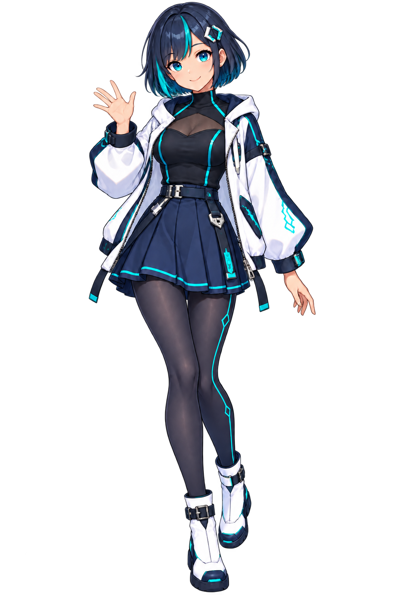

<p><a href="{{ site.baseurl }}/unity/ui-image/codex-chan.png" download="codex-chan.png">Codex ちゃんの PNG をダウンロード</a></p>

リンクから `codex-chan.png` を保存してください。画像は **1024×1536 ピクセル**で、キャラクターの周囲は透明です。ページ上の薄い灰色は表示用の背景で、PNG には含まれません。この PNG を自分の Unity プロジェクトに取り込んで使います。

### Project にインポートする

Project ビューで **Assets** 内の作業用フォルダーを選び、メニューバーの **Assets → Import New Asset...** を選択します。**Import New Asset** は、プロジェクトの外にあるファイルを Assets にコピーして取り込む操作です。

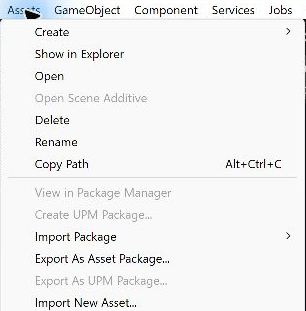

ファイル選択画面で、保存した `codex-chan.png` を選び、**Import** を押してください。取り込みが終わると、Project ビューに画像のサムネイルが表示されます。

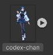

### Sprite として使えるようにする

Project ビューの `codex-chan` をクリックして、Inspector を開きます。**Texture Type** は、画像を Unity で何に使うかを決める設定です。ここで **Sprite (2D and UI)** を選択してください。

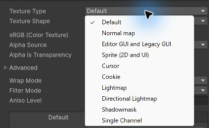

**Sprite Mode** は、画像を1つの Sprite として扱うか、複数に分割するかを決めます。この教材では全身画像を1つとして使うので **Single** にします。すでに Single なら変更は不要です。

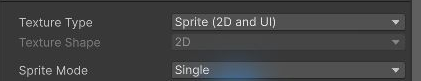

Inspector の下部にある **Apply** を押します。これは、変更した取り込み設定を画像アセットに反映するボタンです。設定を変えただけでは反映されないので、押し忘れないようにしてください。


---

## 3. 画像を使わず、背景を表示する

新しいシーンを `SampleUIImage` として用意します。前のページのボタンやスクリプトは使いません。

### 背景の Image を追加する

メニューバーの **GameObject → UI (Canvas) → Image** を選択します。Hierarchy に追加された Image の名前を `Background` に変更してください。

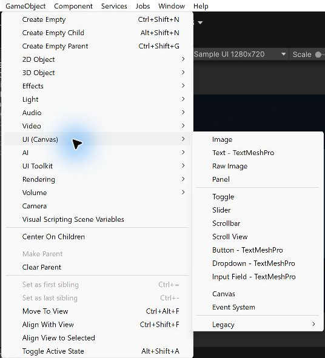

前のページの Button と同じく、シーンに最初の UI を追加すると Canvas と EventSystem も作成されます。Background は Canvas の子として使い、Canvas の初期設定はそのままにします。

前のページで使った **Rect Transform** の **Width** を `640`、**Height** を `560` に変更してください。**Pos X / Pos Y** が `0` 以外なら、両方 `0` に戻して中央に置きます。アンカーとピボットは初期値の中央を使います。

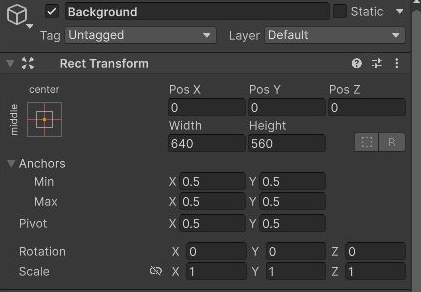

### Source Image と Color

Inspector の **Image** を見てください。**Source Image** は、表示する Sprite を指定する欄です。初期値の **None (Sprite)** は、画像を指定していない状態です。そのままなら、RectTransform の範囲が **Color** の単色で塗られます。今回は背景の長方形なので、画像は指定しません。

**Color** の右側にある色の帯をクリックすると、色選択ウィンドウが開きます。

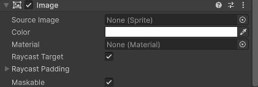

下部の **Hexadecimal** 欄に `E8EEF5` と入力して、背景を薄い青灰色にします。Hexadecimal は、赤・緑・青の強さを16進数で表した色コードです。本文では `#E8EEF5` と表記しますが、入力欄では `#` を省略できます。

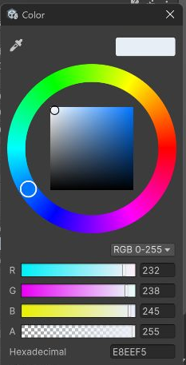

**A（Alpha）** は透明度です。撮影例の **RGB 0–255** 表示では、`0` が完全に透明、`255` が完全に不透明です。ここでは初期値の `255` を使うので変更は不要です。入力後はウィンドウ右上の **×** で閉じてください。

---

## 4. キャラクターの Sprite を表示する

Hierarchy で **Canvas** を選び、先ほどと同じ **GameObject → UI (Canvas) → Image** から、もう1つ Image を追加します。名前を `Portrait` に変更してください。Background を選んだまま追加すると Background の子になるため、今回は Canvas を選び直してから追加します。

Portrait の **Rect Transform** で **Width / Height** を両方 `480` にします。**Pos X / Pos Y** が `0` 以外なら両方 `0` に戻し、中央に置きます。

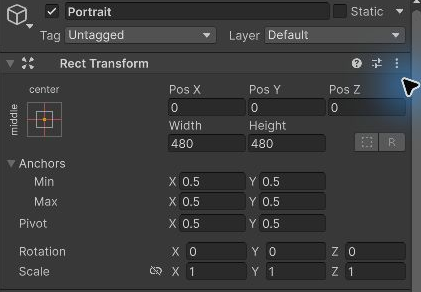

Project ビューの `codex-chan` を、Portrait の **Image → Source Image** 欄へドラッグしてください。欄に `codex-chan` と表示されれば、割り当てられています。

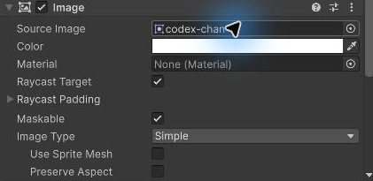

**Image Type** は、画像の表示方法です。今回は画像全体を1枚として描く、初期値の **Simple** を使います。**Color** も初期値の白のまま使います。白なら元画像の色をそのまま表示できます。

Hierarchy では、Canvas の子として Background と Portrait がこの順に並んでいることを確認してください。同じ Canvas 内の兄弟では、下にある UI が後から描かれ、手前に表示されます。この順序なら、背景の上にキャラクターを表示できます。

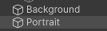

**Game** タブを開き、表示を見てください。PNG の透明な部分からは Background の色が見えます。ただし、この時点では、縦長のキャラクターが横に広がっています。ビューが狭くて全体が見えないときは、[Game ビューを広げて見る](#game-ビューを広げて見る) の操作を使ってください。

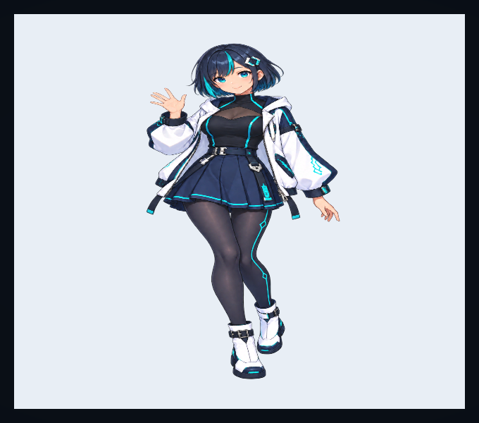

---

## 5. Preserve Aspect で縦横比を保つ

Portrait の Image にある **Preserve Aspect** にチェックを入れます。これは、元画像の縦横比を保って、RectTransform の範囲に収まるように表示する設定です。

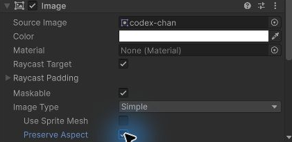

今回の PNG は幅と高さの比が **2:3** ですが、配置枠は **480×480** の正方形です。チェックなしでは正方形に合わせて引き伸ばされます。チェックありなら画像全体は **320×480** の範囲に収まり、左右に余白ができます。PNG 自体にも透明な余白があるため、キャラクターの体の幅はさらに小さく見えます。

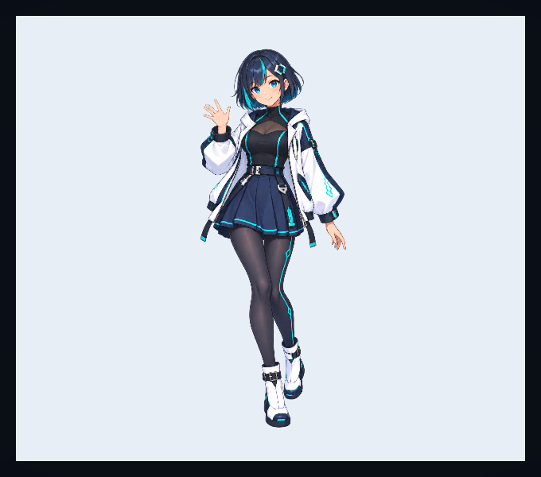

**Preserve Aspect を有効にしても、RectTransform の Width / Height は480のままです。** 変わるのは枠の中での画像の描き方です。

---

## 6. Color で色と透明度を変える

### 画像を着色する

Portrait の **Image → Color** の帯をクリックし、**Hexadecimal** に `80CFFF` と入力します。A は `255` のままです。

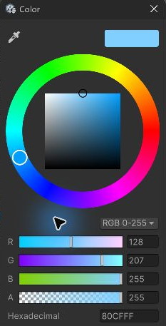

ウィンドウを閉じて Game ビューを見ると、キャラクター全体が青く着色されています。

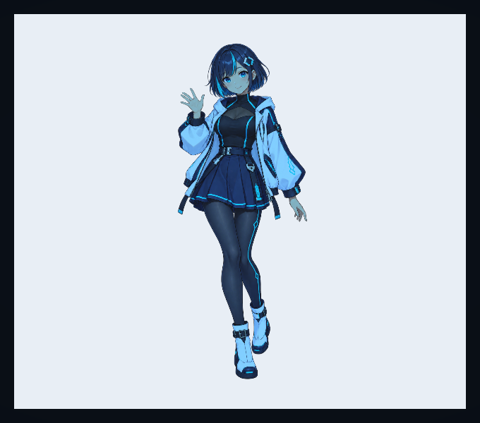

Image の Color は、元画像の各画素の色に掛け合わせる色です。白い部分は指定した色に近づき、暗い部分は暗いまま残ります。元画像の色をすべて1色に置き換える設定ではありません。PNG の透明な部分も透明なままです。

### 半透明にする

色選択ウィンドウをもう一度開き、**Hexadecimal** を白の `FFFFFF` に戻します。続けて **A** を `128` に変更してください。

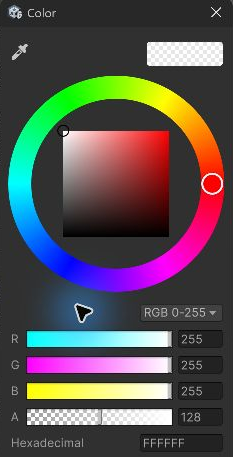

Game ビューでは、キャラクターが半透明になります。髪や衣服が描かれている場所にも、後ろの背景色が透けて見えます。

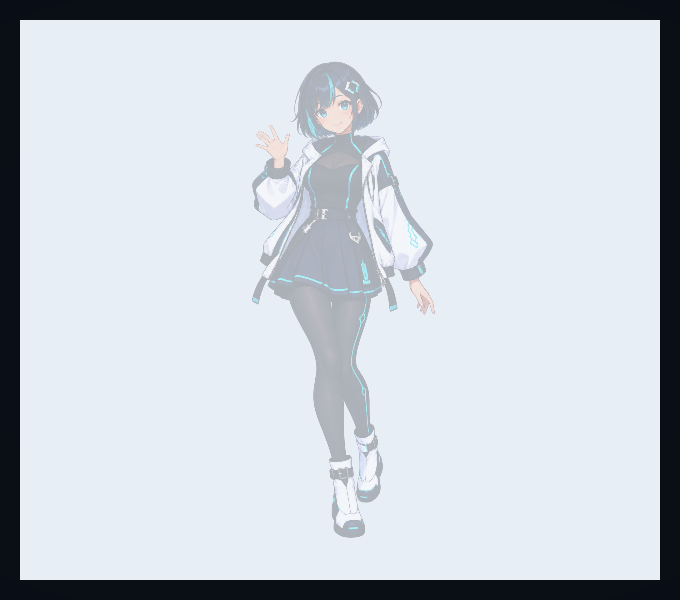

Color の Alpha は、元画像が持つ Alpha に掛け合わされます。元から透明な場所は透明なまま、元が不透明な場所は約半分の透明度になります。A を `0` にすれば、Image 全体が見えなくなります。

確認できたら、**Hexadecimal は `FFFFFF`、A は `255`** に戻します。Preserve Aspect は有効のままにしてください。

---

## 動作確認

シーンを保存して Play ボタンを押し、Game ビューで確認します。Play 中に試した変更は停止すると戻るので、完成状態の設定は停止中に行って保存してください。

| 対象 | 確認する状態 |
|---|---|
| 画像アセット codex-chan | Texture Type は Sprite (2D and UI)、Sprite Mode は Single |
| Background | Source Image は None、Color は #E8EEF5・Alpha 255、サイズは640×560 |
| Portrait | Source Image は codex-chan、Color は白・Alpha 255、サイズは480×480 |
| Portrait の Preserve Aspect | 有効 |
| Hierarchy | Canvas の子に Background、Portrait の順に並ぶ |

Game ビューでは、薄い青灰色の背景の中央にキャラクターが表示され、体が横に引き伸ばされていないことを確認します。キャラクターの周囲は PNG の透明な部分なので、背景が見えます。見た目は [Preserve Aspect を有効にした画面](#5-preserve-aspect-で縦横比を保つ) と一致します。

### Game ビューを広げて見る

**Game** タブをダブルクリックすると、そのビューを一時的に最大化できます。表示範囲が狭くて背景やキャラクターが見切れるときに使ってください。次は、完成状態を広げた Game ビューで見た画面です。

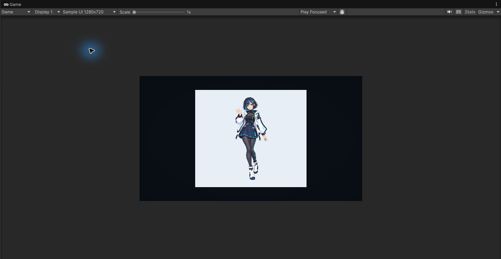

Inspector で設定を変えるときは、もう一度 **Game** タブをダブルクリックすると元の配置に戻れます。ビューを広げる操作は、Image の Width / Height を変更する操作とは別です。

---

## よくあるミス

### Source Image に画像を割り当てられない

画像アセットの Texture Type が **Sprite (2D and UI)** か、変更後に **Apply** を押したかを確認してください。Image に指定するのは Sprite です。

### キャラクターが表示されない、または色が違う

Portrait の Source Image が `codex-chan` になっているか、Color が白・A が255かを確認します。Background の下に Portrait が並んでいるかも確認してください。Background が後から描かれる順序だと、キャラクターを覆います。

---

## まとめ

- Image は Canvas 上で画像を表示するコンポーネント、Sprite は画像の素材となるアセット
- Source Image が None なら、Color の単色で矩形を塗れる
- Preserve Aspect は配置枠を変えず、枠内で元の縦横比を維持する
- Color の RGB は着色、Alpha は透明度を調整する

---

## 理解度チェック

1. PNG を Image の Source Image に割り当てるには、どの Texture Type を使いますか？
2. Preserve Aspect を有効にすると、RectTransform の Width / Height は元画像のサイズに変わりますか？
3. Image を約半分の透明度にするには、撮影例の RGB 0–255 表示で A をいくつにしますか？

<details markdown="1">
<summary>解答を見る</summary>

1. **Sprite (2D and UI)** です。変更後は Apply を押して設定を反映します。
2. 変わりません。RectTransform の枠内での描き方が変わります。
3. `128` です。元画像の Alpha にこの値が掛け合わされます。

</details>

---

## 次のステップ

[RectTransform — アンカーとピボット](/unity-csharp-learning/unity/rect-transform/) では、単色の Image を配置し、親のサイズが変わったときの位置や大きさを調整します。
