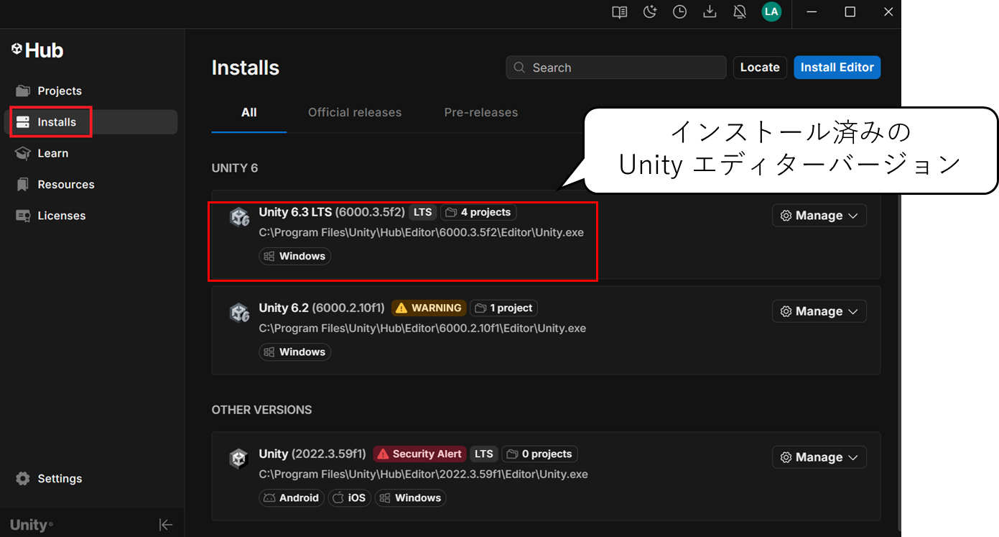
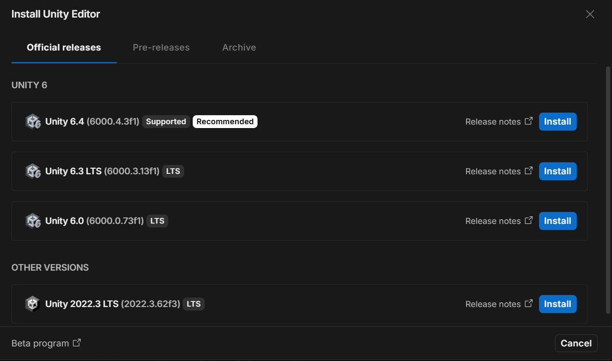
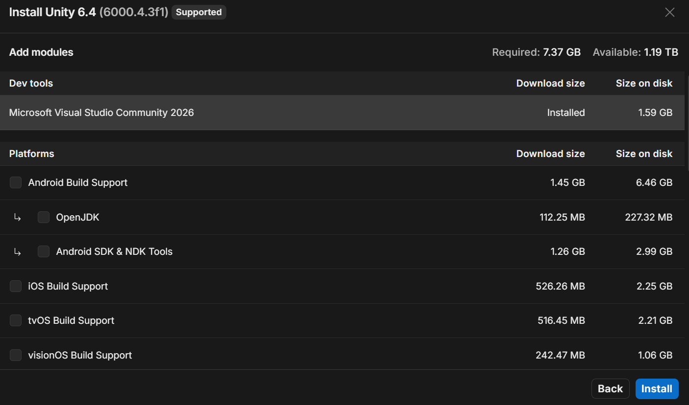
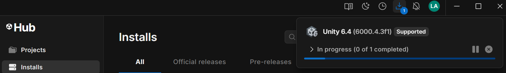
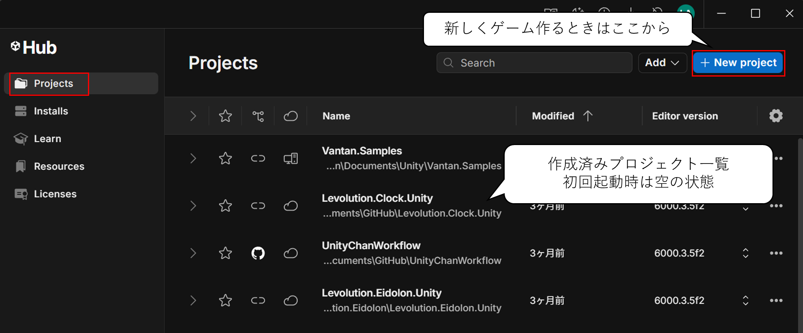
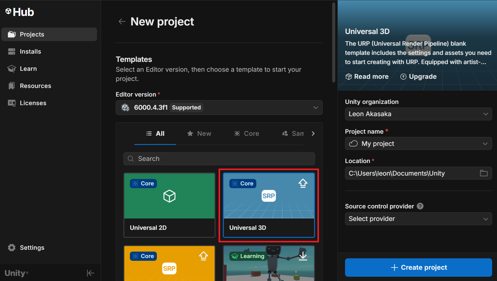
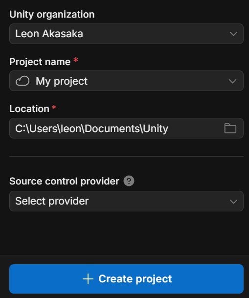
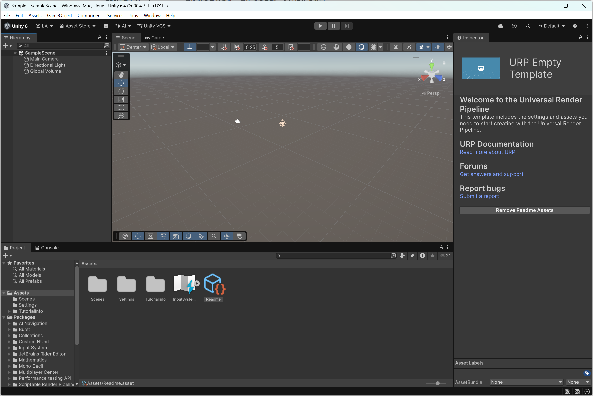

# Unity エディター入門

[Unity](https://unity.com/ja) は、世界で広く使われているゲームエンジンです。2D・3D を問わず、モバイル・PC・コンソール・XR など 25 以上のプラットフォーム向けにゲームを開発・配信できます。C# スクリプトを使った柔軟なゲームロジックの実装と、大規模なコミュニティ・エコシステムが特徴です。このページでは、Unity Hub と Unity エディターを導入し、開発を始める準備を整えます。

## 学習目標

- Unity Hub をインストールできる
- Unity Hub から Unity エディターをインストール・管理できる
- Unity エディターの基本的なビューの役割を説明できる
- 新規プロジェクトを作成して Unity エディターを起動できる

---

## 1. Unity Hub とは

**Unity Hub** は Unity エディターを管理するためのランチャーアプリです。以下の機能を提供します。

- 複数バージョンの Unity エディターのインストール・削除
- プロジェクトの一覧管理と起動
- ライセンスの管理（無料の Personal プランを含む）
- 学習リソースへのアクセス

Unity エディターを直接インストールするのではなく、まず **Unity Hub** を経由することが推奨されています。

---

## 2. Unity Hub をインストールする

### ステップ 1: Unity Hub のダウンロード

[Unity 公式サイト](https://unity.com/ja) にアクセスし、「Unity をダウンロード」または「Unity Hub」のリンクから Unity Hub のインストーラーをダウンロードします。

> 💡 **ポイント**: フッターの「ダウンロード → Unity Hub」からも直接アクセスできます。

### ステップ 2: インストーラーを実行する

ダウンロードした `UnityHubSetup-x64.exe`（Windows）または `Unity Hub.dmg`（macOS）を実行し、画面の指示に従ってインストールします。

### ステップ 3: Unity Hub を起動してサインインする

インストール後に Unity Hub を起動します。Unity アカウントが必要です。アカウントがない場合は「アカウントを作成」から無料で登録できます。

サインインすると、ライセンスの選択画面が表示されます。個人利用や学習目的であれば **Personal（個人）** プランを選択してください。

---

## 3. Unity エディターをインストールする

Unity Hub のインストールが完了したら、Unity エディターをインストールします。

### ステップ 1: 「Installs」タブを開く

Unity Hub の左メニューから **「Installs」** 項目を選択します。

### ステップ 2: エディターバージョンを選択する

「Install Editor」ボタンを押し、インストールするバージョンを選択します。

| 種類 | 概要 |
|---|---|
| **LTS (Long Term Support)** | 長期サポート版。安定していて本番開発に推奨 |
| **TECH ストリーム** | 最新機能を含む版。最新機能を試したい場合に選択 |

学習目的や新規のゲーム作成では最新の **LTS バージョン**を選択するのが無難です。チームで開発する場合は、メンバー全員でバージョンを合わせる必要があります。

### ステップ 3: モジュールを選択する

インストール時に追加モジュールを選択できます。最低限以下を確認してください。

| モジュール | 説明 |
|---|---|
| **Microsoft Visual Studio Community** | コードエディター（Windows のみ。未インストールの場合に選択） |
| **Android Build Support** | Android 向けビルドを行う場合に必要 |
| **iOS Build Support** | iOS 向けビルドを行う場合に必要 |

学習初期は **Visual Studio Community** のみで十分です。後からモジュールを追加することもできます。

### ステップ 4: インストールを開始する

「Install」ボタンを押すと、ダウンロードとインストールが始まります。

容量が大きいため、安定したネットワーク環境で実行してください（目安：数 GB）。

---

## 4. 新規プロジェクトを作成する

### ステップ 1: 「Projects」タブを開く

Unity Hub の左メニューから **「Projects」** 項目を選択します。

### ステップ 2: 新規プロジェクトを作成する

右上の「+ New project」ボタンを押し、テンプレートを選択します。本チュートリアルでは、特に指示がない限り「Universal 3D」を選択してください。基本的な 3D ゲームを作る基本設定の状態でプロジェクトが作成されます。

テンプレートはあくまで初期設定であり、プロジェクト作成後に設定を変更することで、目的に合わせたゲームを作成できます。場面に応じて 2D と 3D を切り替えるといったことも可能です。

### ステップ 3: プロジェクト名と保存場所を設定する

「Create project」前に、主に次の項目を設定します。

| 項目 | 意味 | どう設定するか |
|---|---|---|
| **Unity organization** | Unity Cloud 上でプロジェクトを管理する組織。チーム開発時の所属先になる | 個人学習なら自分の組織（または Personal 相当）を選択。チーム開発なら共有している組織を選ぶ |
| **Project name** | プロジェクト名。Unity Hub の一覧名、ローカルフォルダー名、Cloud プロジェクト名のベースになる | 後から見て分かる名前にする（例: `MyFirst3DGame`）。Cloud を有効にする場合はクラウド側にも同名で作成される |
| **Location** | ローカル PC 上でプロジェクトを保存する場所（現在説明している保存先フォルダー） | バックアップしやすく、十分な空き容量がある場所を選ぶ |
| **Source control provider** | バージョン管理の連携先。履歴管理や共同開発の基盤になる | 学習初期は未設定でも問題ない。チーム開発なら `Unity Version Control` や Git 連携を検討 |

### Cloud project と Local project の違い

- **Local project**: `Location` で指定した PC 内のフォルダーに作成される通常のプロジェクト
- **Cloud project**: Unity organization を指定してクラウド連携を有効にすると、ローカルに加えて Unity Cloud 側にもプロジェクト情報が紐づく

> 💡 **ポイント**: まずは Local project として開始し、必要になったら Cloud 連携や Source Control を追加する進め方でも問題ありません。

設定後に「Create project」ボタンを押すと、Unity エディターが起動し、新しいプロジェクトが開きます。

---

## 5. Unity エディターの画面構成

Unity エディターは複数の**ビュー（ウィンドウ）**で構成されています。

### 主要なビュー

| ビュー | 役割 |
|---|---|
| **Scene ビュー** | ゲームオブジェクトを 3D 空間上で配置・編集する作業エリア |
| **Game ビュー** | 実際にゲームを実行したときの見た目を確認するプレビューエリア |
| **Hierarchy ビュー** | シーン内のゲームオブジェクトの一覧と親子関係を表示 |
| **Project ビュー** | プロジェクト内のファイル（スクリプト・画像・プレハブなど）を管理 |
| **Inspector ビュー** | 選択中のゲームオブジェクトのコンポーネントやプロパティを表示・編集 |
| **Console ビュー** | スクリプトのログ出力やエラーメッセージを確認 |

### ツールバー

画面上部のツールバーには以下のボタンがあります。

- **再生（▶）**: ゲームを実行する。もう一度押すと停止
- **一時停止（⏸）**: 実行中のゲームを一時停止する
- **ステップ（⏭）**: 一時停止中にフレームを 1 つ進める

> 💡 **ポイント**: 再生中に Inspector でオブジェクトの値を変更して動作を確認できますが、**再生を停止すると変更は元に戻ります**。実際の設定変更は停止後に行いましょう。

---

## 6. Unity エディターのバージョン管理

プロジェクトは作成時の Unity バージョンに紐付けられます。Unity Hub では複数バージョンを並行してインストール・管理できます。

- **バージョンの追加**: Hub の「インストール」タブから追加可能
- **プロジェクトのバージョン切り替え**: 「プロジェクト」タブでプロジェクト行の Unity バージョン列をクリックして変更可能（互換性に注意）
- **モジュールの追加**: インストール済みバージョンの横にある「⋮」メニューから後から追加可能

> ⚠️ **注意**: 新しいバージョンで保存したプロジェクトを古いバージョンで開くとエラーになることがあります。チームで開発する場合はバージョンを統一してください。

---

## まとめ

| 手順 | 内容 |
|---|---|
| 1 | Unity Hub をダウンロード・インストールする |
| 2 | Unity アカウントでサインインし、Personal ライセンスを取得する |
| 3 | Unity Hub から LTS バージョンの Unity エディターをインストールする |
| 4 | 「プロジェクト」タブから新規プロジェクトを作成する |
| 5 | エディターの各ビューの役割を確認する |

---

## 次のステップ

- [Start メソッドとスクリプト](../start-method/) — C# スクリプトを作成してゲームオブジェクトに紐付ける
