# Unity UI とボタン操作

ボタンやテキストなどゲーム画面上にユーザーと対話するための機能を表示する基本的な方法と仕組みを理解するために、ボタンを押すと反応する簡単なプログラムを作ります。

## 学習目標

このページを読み終えると、以下のことができるようになります。

- Canvas コンポーネントと Unity UI の仕組みを理解できる
- ボタンのクリックイベントをスクリプトと紐付けられる
- スクリプトから UI テキストを変更できる

## 前提知識

- [フィールドでデータを維持する](/unity-csharp-learning/unity/fields-basics/) を読んでいること

---

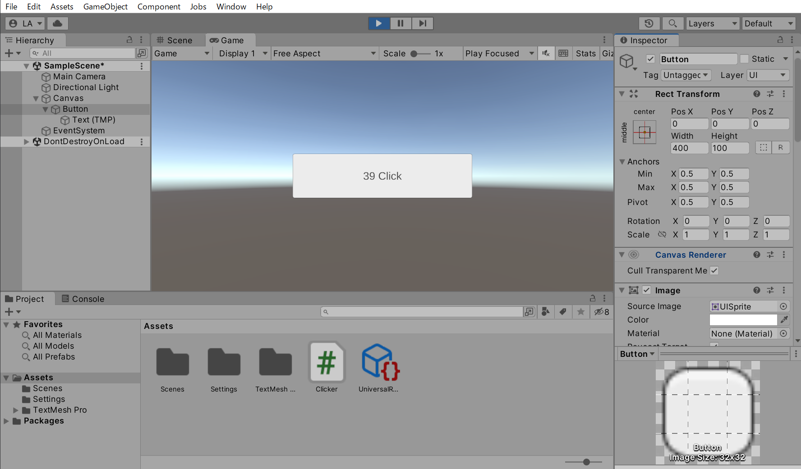

---

## 1. Unity UI とは

ゲームのメニュー画面等で見られる「ボタン」「テキスト」「選択項目リスト」など、ユーザーに情報を表示したり、ユーザーの入力に反応するコンポーネントをユーザーインターフェース（User Interface）と呼び、一般に省略して **UI** と呼びます。

Unity の標準 UI には歴史的な経緯で2種類あるので混同しないよう注意してください。

| 種類 | 概要 |
|---|---|
| [Immediate Mode GUI（IMGUI）](https://docs.unity3d.com/Manual/GUIScriptingGuide.html) | 古くから存在するスクリプトベースの UI。デバッグ用途向けで、ゲームへの組み込みは推奨しない |
| [Unity UI（uGUI）](https://docs.unity3d.com/Packages/com.unity.ugui@1.0/manual/index.html) | ゲームオブジェクトの階層で UI 構造を表現できる、現在の標準的な UI システム |

本ページでは **Unity UI（uGUI）** を使ったボタンの動作について解説します。

---

## 2. Canvas

試しにボタンを追加してみましょう。メニューバーから「GameObject」→「UI」→「Button - TextMeshPro」を選択してください。

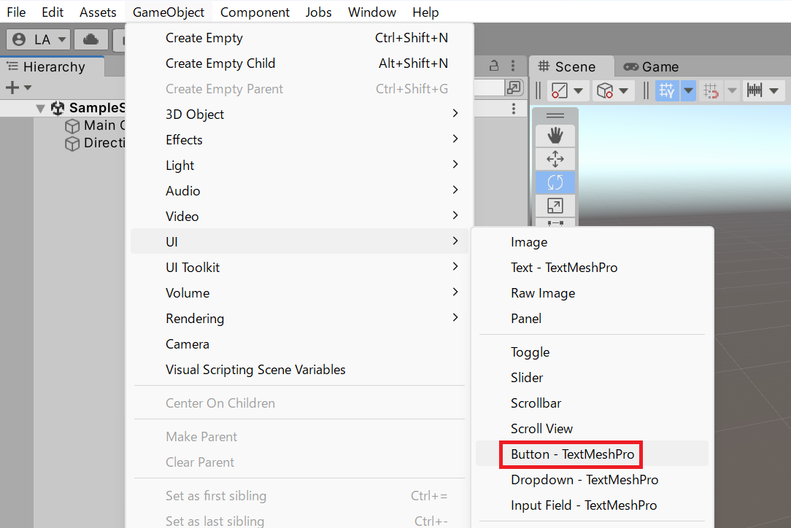

プロジェクトに最初に TextMesh Pro 依存コンポーネントを含める場合、TMP Importer ダイアログが表示されます。「Import TMP Essentials」ボタンを押して必要なアセットをインポートしてください。

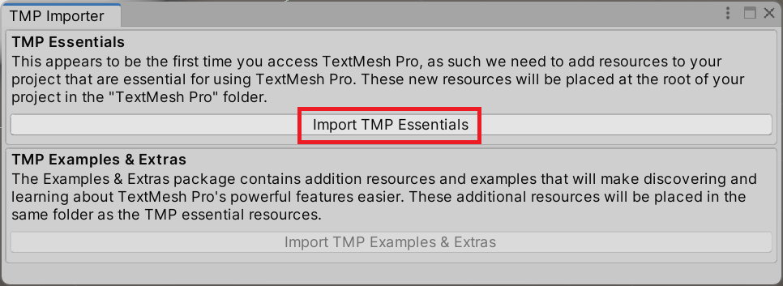

ボタンを追加すると、Hierarchy ビューに Button ゲームオブジェクトが追加されます。現在のシーンに初めて Unity UI ゲームオブジェクトを追加した場合、同時に **Canvas** ゲームオブジェクトと **EventSystem** ゲームオブジェクトも追加されます。Button ゲームオブジェクトは Canvas ゲームオブジェクトの子になっています。

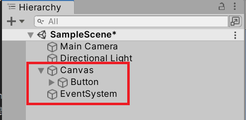

**`Canvas` コンポーネント** — Unity UI の中核となる機能を提供するコンポーネントです。<!-- [公式ドキュメント]() -->

通常、UI はスクリーンに固定して表示するためカメラの動きとは連動しません。Unity UI はカメラの影響を受けず、スクリーン全域に対応する Canvas に管理される仕組みになっています。Unity UI は**必ず Canvas ゲームオブジェクトの子に配置**しなければなりません。

また、Canvas の下に配置されるゲームオブジェクトの `Transform` コンポーネントはすべて **`RectTransform`** に置き換えられる点にも注目してください。

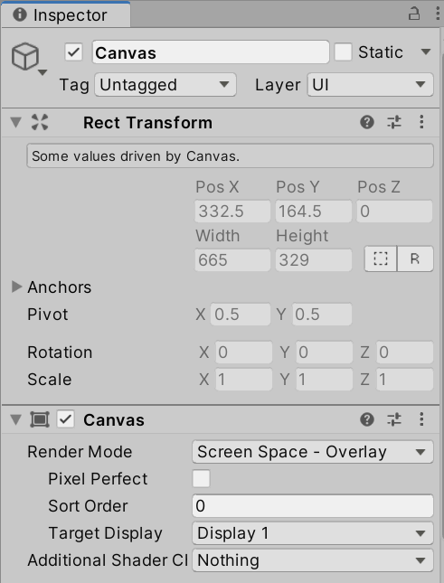

**`RectTransform` コンポーネント** — 2次元の UI レイアウトに特化した Transform です。<!-- [公式ドキュメント]() -->

トップの Canvas の `RectTransform` の値は編集できません。これは描画先のスクリーンに直接対応しているためです。Unity エディター上では Game ビューのサイズに、実環境ではデバイスの解像度に対応します。

---

## 3. ボタンを配置する

UI の配置は Canvas 内の平面座標で行います。`RectTransform` コンポーネントでは、位置を `Pos X` / `Pos Y` / `Pos Z`、幅を `Width`、高さを `Height` で設定します。Scene ビュー上で UI を配置するときは **Rect Tool** ボタンで編集モードを切り替えると便利です。

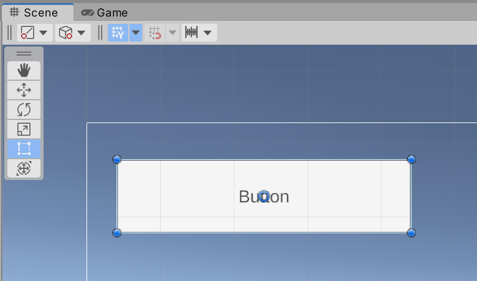

ここでは画面の中央に配置してみましょう。配置座標を `0` に、幅を `400`、高さを `100` に設定します。`Anchors` 以下の設定も下のスクリーンショットに合わせてください。

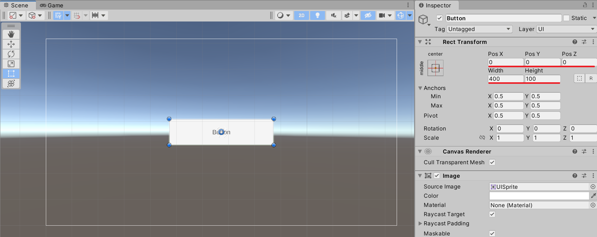

---

## 4. クリックに反応する

配置したボタンが押されたときにスクリプトが反応できるようにします。Button ゲームオブジェクトを選択した状態で、Inspector ビュー下部の「Add Component」ボタンを押してください。

検索ボックスに「Clicker」と入力し、「New script」を選択します。

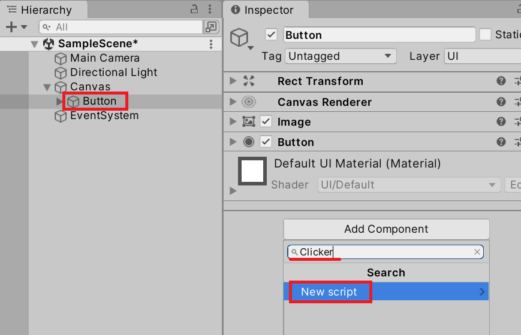

スクリプト名が「Clicker」になっていることを確認して「Create and Add」ボタンを押します。

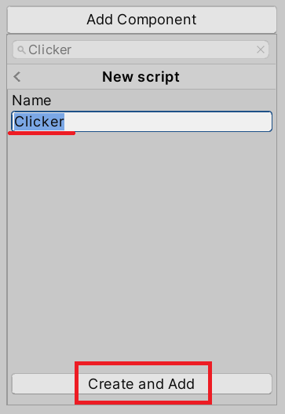

Assets フォルダーに `Clicker.cs` が追加されるので、開いて次のように編集します。

```csharp
using UnityEngine;

public class Clicker : MonoBehaviour
{
    private int _count;

    public void OnClick()
    {
        _count++;
        Debug.Log($"OnClick: {_count}", this);
    }
}
```

`OnClick()` メソッドが呼び出されるたびに `_count` フィールドをインクリメントし、クリック回数を Console ビューに出力するシンプルな実装です。ただし、このスクリプトだけでは動作しません。`OnClick()` メソッドがボタンのクリックイベントと紐付いていないためです。

Inspector ビューで Button コンポーネントの下部にある `On Click ()` 項目の **＋** ボタンを押して、新しいイベントを追加します。

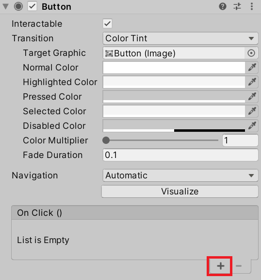

イベントの設定項目が表示されたら、左側の「Runtime Only」の下に、呼び出したいスクリプトを持つゲームオブジェクトを設定します。今回は `Clicker` スクリプトが Button ゲームオブジェクト自身にアタッチされているので、Button ゲームオブジェクトを設定します。

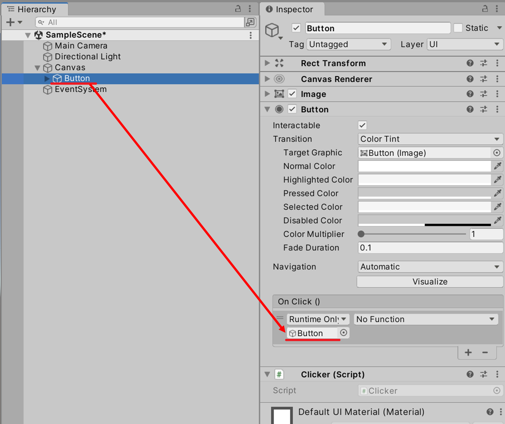

ゲームオブジェクトを設定すると右側の「No Function」コンボボックスが有効になります。「Clicker」→「OnClick ()」を選択してください。

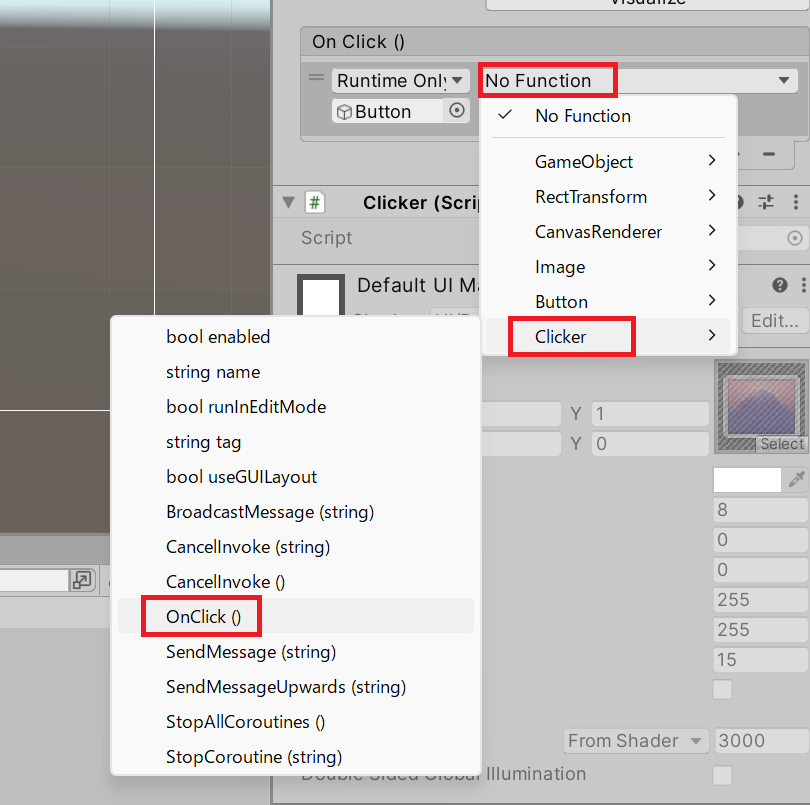

> 💡 **ポイント**: `OnClick()` メソッドのアクセス修飾子が `public` でないとリストに表示されません。

以上の設定が正しければ、ボタンを押すたびに Console ビューにクリック回数が出力されます。

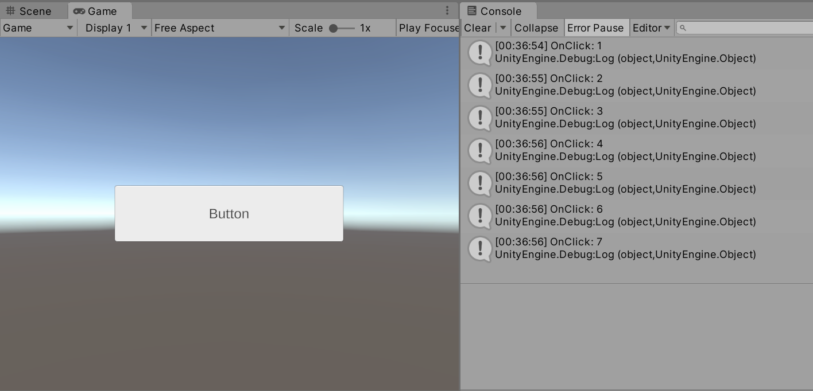

---

## 5. ボタンのテキストを書き換える

最後に、ボタンが押された回数をボタン自身のテキストに表示するプログラムを実装します。

ボタンのテキストには TextMesh Pro が使われています。`[SerializeField]` 経由で `TMP_Text` フィールドに参照を設定し、クリックのたびにテキストを更新します。

```csharp
using TMPro;
using UnityEngine;

public class Clicker : MonoBehaviour
{
    [SerializeField]
    private TMP_Text _content = null;
    private int _count;

    private void Start()
    {
        UpdateText();
    }

    public void OnClick()
    {
        _count++;
        UpdateText();
    }

    private void UpdateText()
    {
        if (_content)
        {
            _content.text = $"{_count} Click";
        }
    }
}
```

`_content` フィールドに `[SerializeField]` 属性が付いているので、Inspector ビューから設定できます。Button ゲームオブジェクトの子にある Text (TMP) ゲームオブジェクトを `_content` 欄にドラッグして設定してください。

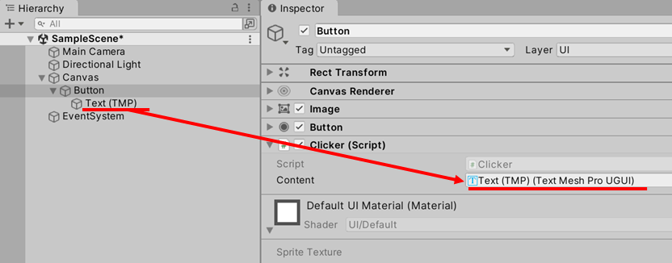

これでボタンを押すたびにボタン上のテキストが更新されます。

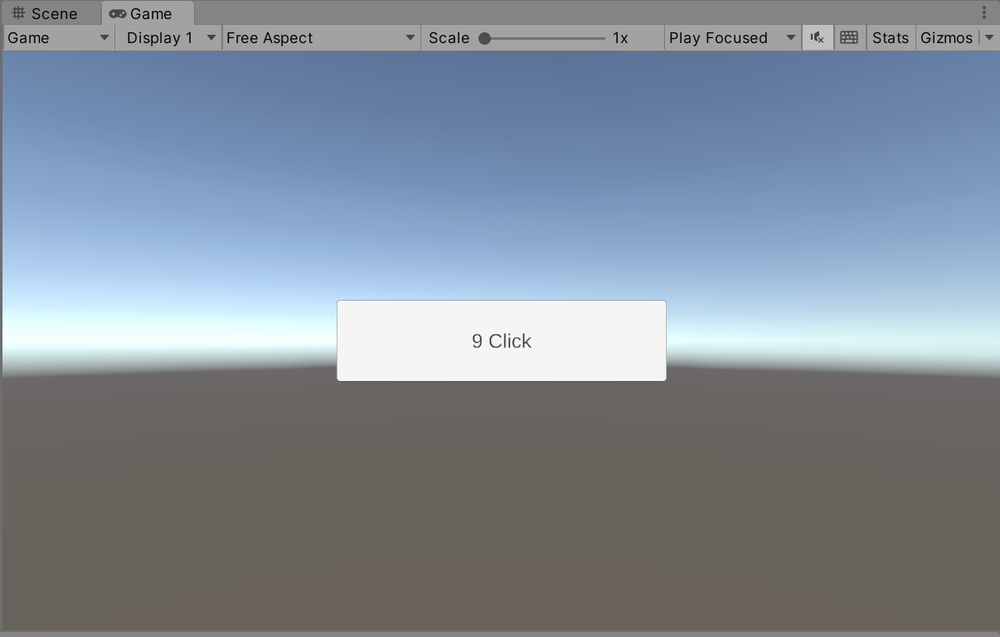

---

## まとめ

- Unity UI（uGUI）ゲームオブジェクトは必ず **Canvas の子**に配置する
- Canvas 下のゲームオブジェクトの `Transform` は **`RectTransform`** に置き換えられる
- ボタンのクリックイベントは Inspector の **`On Click ()`** から `public` メソッドと紐付けられる
- `[SerializeField]` を使えば Inspector から UI コンポーネントの参照を設定できる

---

## 理解度チェック

以下の問いに答えられるか確認しましょう。

1. Unity UI のゲームオブジェクトはどこに配置しなければなりませんか？
2. Canvas 下のゲームオブジェクトで `Transform` の代わりに使われるコンポーネントは何ですか？
3. ボタンが押されたときに呼び出したいメソッドをスクリプトに定義しましたが、Inspector の `On Click ()` 欄に表示されません。考えられる原因は何ですか？

<details markdown="1">
<summary>解答を見る</summary>

1. **Canvas ゲームオブジェクトの子**に配置する。
2. **`RectTransform`** コンポーネント。
3. メソッドのアクセス修飾子が **`public`** になっていない可能性がある。`public void OnClick()` のように `public` にする。

</details>

---

## 次のステップ

ボタンはプレイヤーと対話するための最も基本的な UI です。様々なゲームで応用できるコンポーネントなので、UI の操作方法やスクリプトからの制御方法、レイアウトの工夫などを研究してみてください。

## 参考

- [Unity UI: Unity User Interface](https://docs.unity3d.com/Packages/com.unity.ugui@1.0/manual/index.html)
